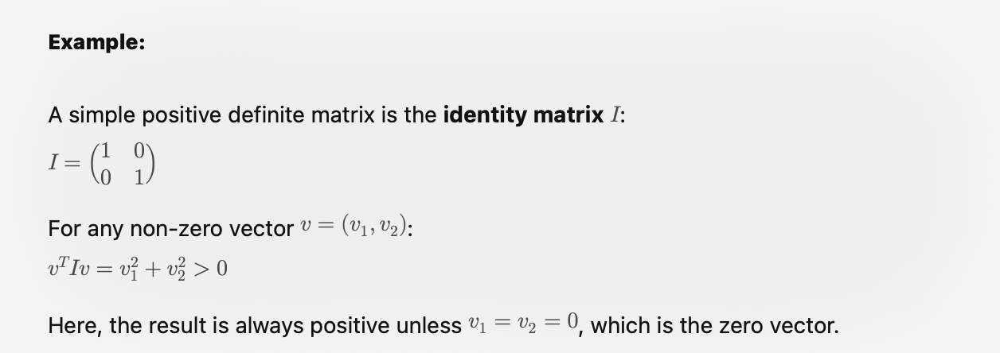
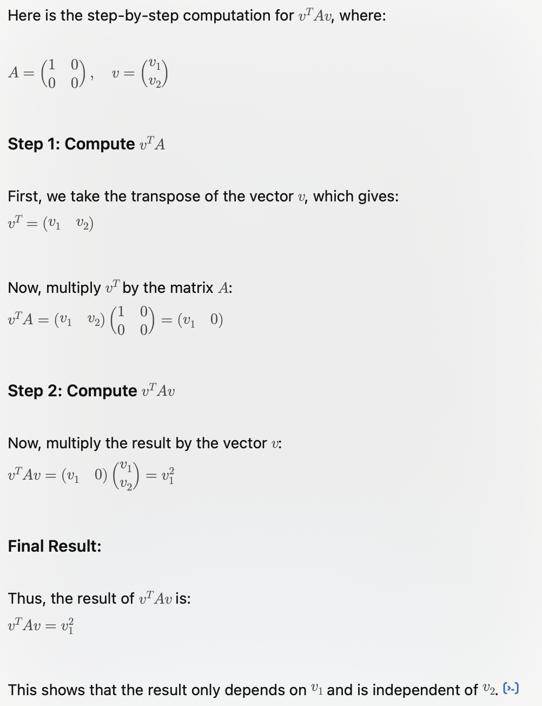

# General understanding

| Positive Definitite | Positive Semi Definite|
|---------------------|----------------------|
|A matrix is positive definite if, when you apply it to any non-zero vector, the result is always a positive number. This property means that the matrix preserves a certain “positivity” of the vector it’s applied to.|A matrix is positive semidefinite if, when you apply it to any vector, the result is never negative. The result can be zero or positive, but it can’t be negative.|
|Example:Imagine a ball lying on a flat surface. If you push it in any direction, it moves up—no matter the direction, the ball always increases its height. This is similar to a positive definite matrix: no matter which vector (direction) you use, the result is **always positive.**|Imagine a ball lying on a flat surface that is c**ompletely fla**t in some directions. If you push the ball in some directions, it may move up (positive), but in other directions, it might not move at all (zero). However, the ball never **moves down (negative).**|

## Positive Definite

## Positive Semi-definite

## Step by step semi-definite
