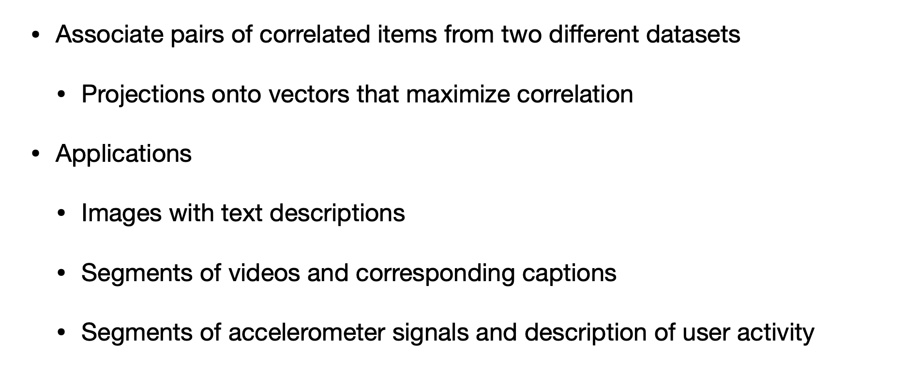
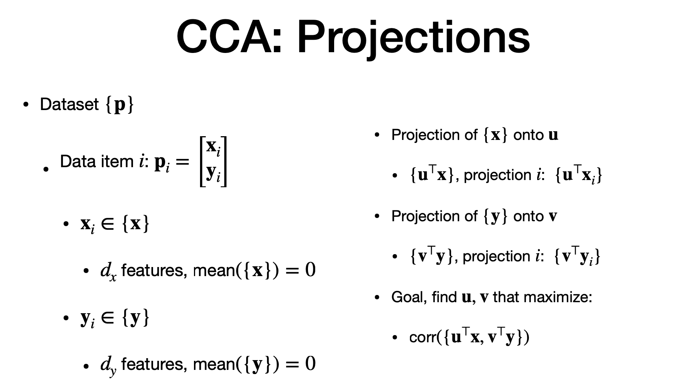

# Agenda

> - association of pairs of items (from different dataset) with some realtion
> - projection into vectors with maximise co-relations
 

# CCA - what is it?

- two different data set
- some way correlated
- project them as vectors to maximise co-relations
- e.g 
  - images with text caption  and vice versa
  - videos and caption

# CCA - projection

> - dataset = p
> - x = dataset1 , y = dataset2
> - happen at same time. so they share same index "i"
> - zero mean
> - pairing is essential for method to work
> - u = project of "x" and v = projection of "y"
> - maximise u and v that maximise correlation.

# Maximising - Lagrange

- co-variance of "p" has corr between "x to x", "y to y" and "x to y and vice versa"
- we see correlation on new set formed by projection
- we need to maximize correlation we use "Lagrange"
- max the numerator and redue denominator
- hard to solve as derivative as equate to zero. so we use "Lagrange"
- two vectors that solve the problem
- c1 and c2 are positive constraints
- we computer gradient of expresssion and equate to zero for both u and v.

# Maximising - Part - II

> - square root is manipulation 
> - lamdba is correlation
> - strongest correlation of x and y are through the first eigen vector and eigen value
> - meaning 1st of x correlate with first of y, second to second and so on
> direction = minimum between x and  y
> d(x) = no of features in x.
> projection are called "canoncial variables"
> corelation are called "canoncial correlations'

# Significance of Correlations

- CONS: many principal has small values , so through corelation is shown as correlation, they might not be corelated.
- we need a significance test
- that test is "Wilk' lamdbda"
- this is iterative process.
- "r" will start with "1"
- each iterative will compute wilke' lambda
- "smaller the correlation", beetter the co-relation
- we make several permuttaion of 'y" and computer through iterative process.
- if lambda of 'r' of original data set is smaller than the lambda of permuted dataset, then most likely the corelation are meaningful.

# The end
