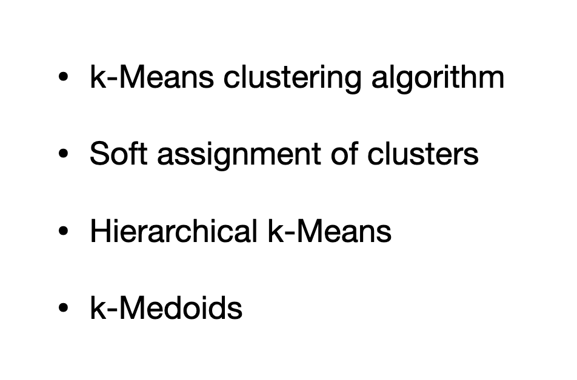
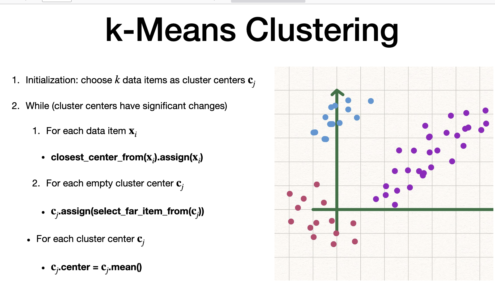
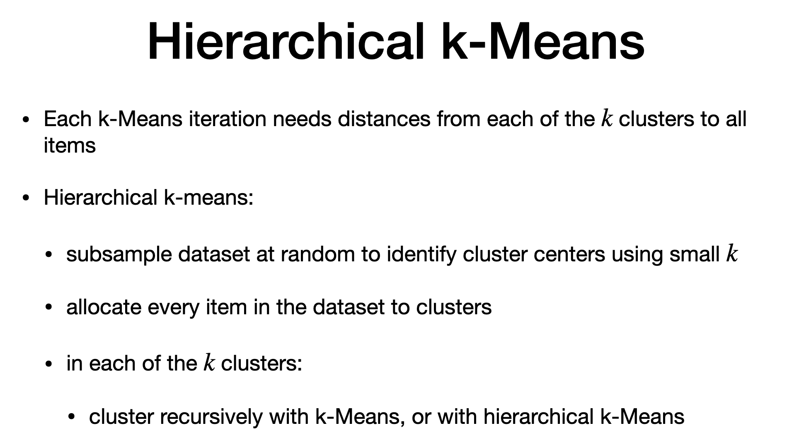

# Variants

> - soft => afinity  of center and data points
> - hierarchu k means - more efficiency
> - medoids - cluster center cannot be computed as "average"

# K means Clustering

# Soft Assignment

> - data items with similar distance to more than one clsuter
> - general one assigns to one of it (hard assignment)
> - "soft" => soft weight (w ij) are used.
> - soft weight is not binary
> - sum of weight for point (i) to different center is "1" atmost
> - weight associates "i" to center "j" should be **large when close and small when far**
> - weight is greater than zero. every itme assocaited to every cluster
> - "s" = affinity is e to power fraction.
> - denominator has scaling "sigma". weight ditance as numerator
> - numerator is distance. Longer the distance, smaller the affinity
> - when sigma is zero, this formula becomes hard assignment
> - weight is normalized against its sum of "affinities" at point i.
> - CONS: "There will be empty clusters" with soft assignment

# Hard Assignment vs. soft

> - if weight is more, even close to "1", it could be isolated cluster

# Hierarchical K means

## CONS of K -means: 
- 1. performance deterioties with large dataset as distance between data points and center needs to be calculataion
- workaround : hierarchical
- subsample data by random
- allocate data points to main clusters and then recurisive multi level tree
- PROS of Hierarchial: very pratical

# Medoids

> - dataitems that has "distance" instead of absolute
> - medoids uses "data items" as center,instead of average/mean
> - random initialization of center and works iteratively.
> - allocate data point to each medoid

# The end