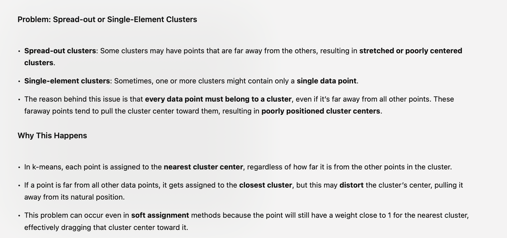

# CONS of K means:

1. It often produces clusters that are either too spread out or contain just a single point. 

# Problam

# Solution

# Why not?

# Cons of vector quanntization

- phenoemes order is important
- "cat" vs "tac"
- instead of tik- tac-toe , it can be tic-cat-toe

# Cons of vector quantization
# Cons
Two Major Limitations:

	1.	Loses information about arrangement: Vector quantization doesn’t capture where in the signal the patches appear. For instance, **it can tell you if an image has spots or stripes, but not their exact location.**
	2.	Loss of detail: Replacing patches with cluster centers results in **some loss of detail, w**hich can lead to classification errors. However, this loss can be mitigated by using multiple dictionaries and applying a voting scheme to improve classification accuracy.

---

# From lecture
# CONS ok K means:
- covnerge to local minimum
- Not global minimum . (as result is dependant on initialization)
- frequenyly prodcues single element cluster if "k" is large
- produce spread out clusters

# Workaround
 - use temp cluster to assign anamoly item that is too far into temp cluster so it doesnt pull the cluster center too far.
 - reassign it back to original center only the center is fixed.
  

# More CONS ok K means:
- poor initialization. execute k-0 measn multiple time with different initialization and pick the best one
- K Means ++ => choose rndom point , then select (k-1) randomly selected from probability distributoion
- x - center . distance to center x.square sum

# Key points of K - means
- selection of number of clusters (k)
- k is too big, many isolated clusters
- k - too small - spread cluster with high cost "phi"
- phi during initializaton is high and gradually reduces with more "k"
- **"ELBOW CHART"** -elbow is the best point

# CONS of K Means Soft assignment variant: 
- "There will be empty clusters" with soft assignment
- workaround: check if weights are small or zero.

## CONS of K -means: 
- 1. performance deterioties with large dataset as distance between data points and center needs to be calculataion
- workaround : hierarchical

## PROS of Hierarchial: very pratical