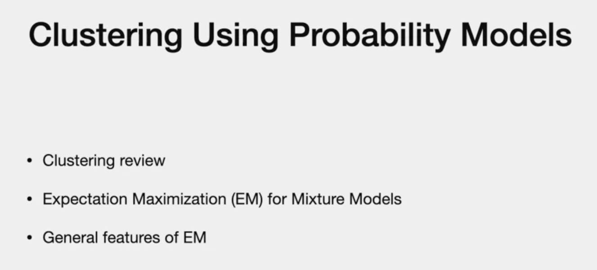
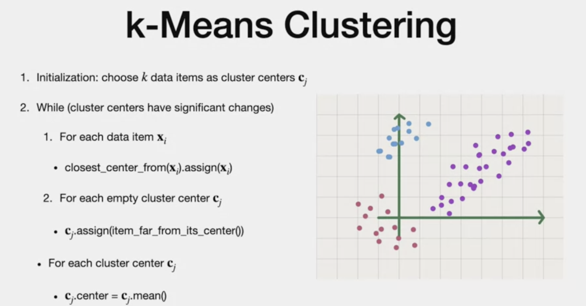
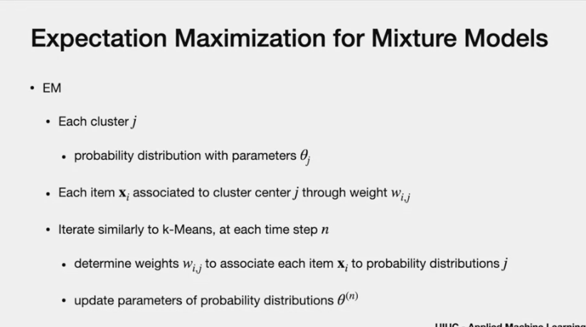
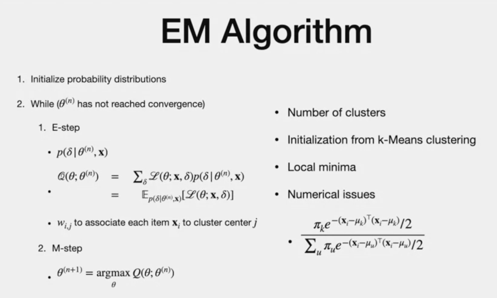

# Clusterin using Probability distributuon

# Agenda

- Clustering context of prob model instead of distance
- EM for mixture model
- model cluster using probability dist.

# Previous lecture : K means

- cluster is mean of datapoints => center
- if we know all data points, assignment and recentering the center
- iterative process
- distance is one way to measure similarity
- two points woith similar probability can be considered similar
- we consider soft weigthts, assignment to a cluster based on weight. 
- Weight can come from probability distribution

# Expectation Maximization (EM)

- EM used to determine aprameter of dist.
- assignment of associated item to the distribution
- each cluster is proability distribution
- later, will learn about each distribution and weights involved for each.
- multi nominal - topic and mixture of distribution (later)

- each item "x(i)" has center "j" through weight w(ij)

> CONCEPT
> - when we know the probability distributions, we can determine what is the **specific distribution or the specific cluster that each point belongs to**. 
> - When we know all the points that belong to a probability distribution, we can determine the **parameters** of that specific distribution. 
> - Iterative process like k-means
> - theta is parameter at step "n"

# Algorithm

> - step 1: initiazation
> - start with k-means
> - Step 2: iterative process until covergence
> **2.1 - E -step:**
> - **Given: ** data points and estimated paramters
> - find the "probability assignment of data items"/log likelihood (weight sum of values of deltas)
> - weighted by log likelihood  (Assiign weights)
> **2.2 - M Step:**
> - next estimate of theta (find parameters)
> - that maximize the log likelihood
> - customized accordingly to pronbability distribtuted(multinomial or gaussian)

- Number of clusters 0 can be chosen
- pick number of cluster based on performance of other process if this is going to be input to other process
- "Initiazation:" through K-means
- mixture weight - fraction of points in each cluster
- CONS: "local minimum" , not global (given parameters)
- (there may be many local minimum, depends on initiazation)
- use k-means to find best initiazation
- Cons : potential numeric issue (Fraction) - negative exponents gives problem for points away from cluster means (use logarithms)

**Why EM is useful? PROS**
- better than k-means when many points lead to many clusters
- weights are approximations. Good approximations
- good when missing data

# The end

