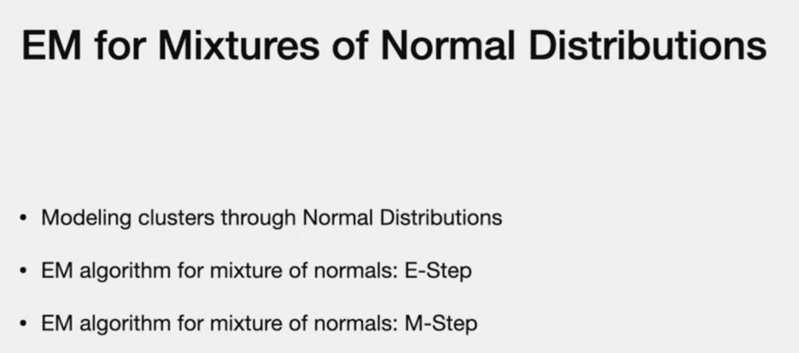
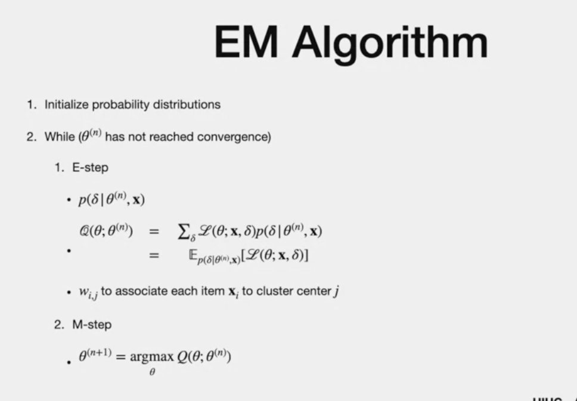
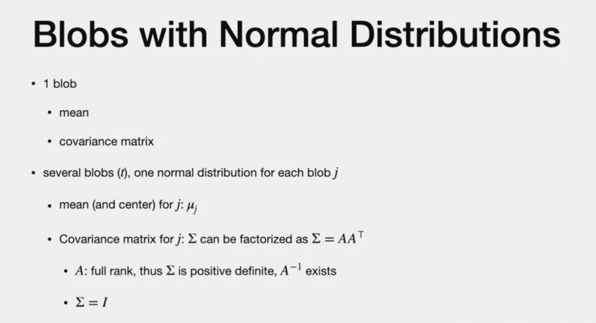
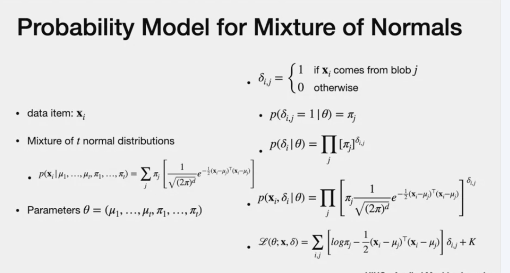
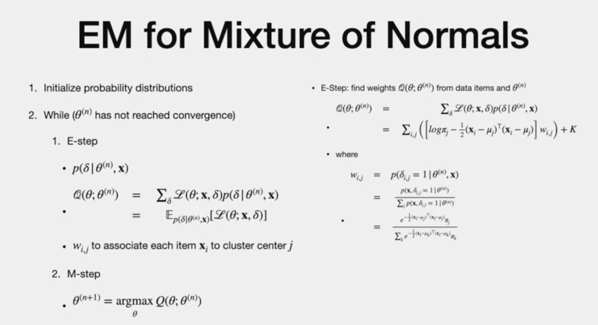
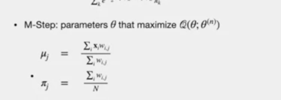
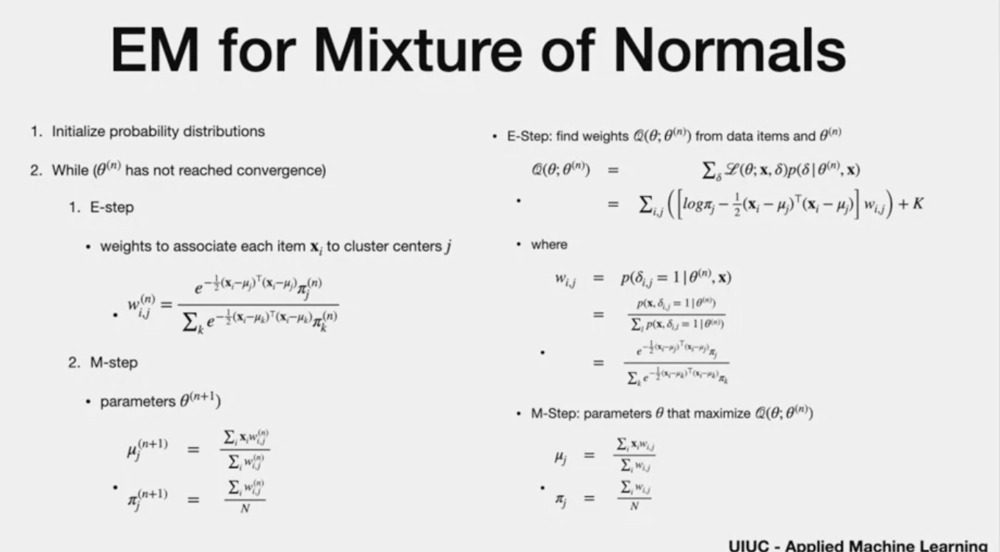

# EM for mixture of normal distributions

# Agenda

- mixture of normal

# EM Algorithm

- specific to normal distr
- model blobs with normal dist.
- log - likehood to customize EM
- M step - parameters tha max. loh likelihood

# Blovs with normal distribution

> - one normal distr. per blob
> - covaricen is known
> - mean is unknown
> - covariance of each blobs is identiy matrix
> - co-variance is positive definite

# mixture of normal distr

- t different blobs
- weight sum of blobs =  p(i)
- weight  by "i" => mixing weights
- Blobs with many points have "high mixing weight" and blobs with "few points" have "low mixing points"
- once we have shape of distribution, we find model parameter "theta"
- "Theta" is based on mean "mu" and pi("weights")
- co-varianbce - assumed as identiy variance
- vector "delta (i)" = indicator
- it is "1" , when item "i" comes from blob "j", else "0"
- This vector "delta" has one "ones" and (t-1) zeros."t" is number of blobs.
- probability of "delta" is given in the figure
- log likelihood - convert product to sum
- "K" - constant for normalising constant - independant of parameters

# general EM Algorithm

> - E-step : sum of log likehood.
> - This step gives delta that is conditioned on theta
> - it includes "weight"
> - K - normalising constant (no impact to maximization, doesnt depend on weight nor parameters)
> -"w(ij") - item i assignment to model "j"

# M - Step

- we replace E and M step using normal 

# Comparing general and EM using norm dist

NOTE
- no need to compute actual value of log likelihood- jsut last step once.