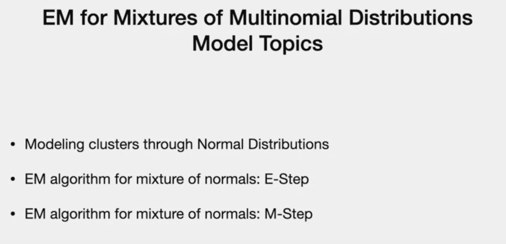
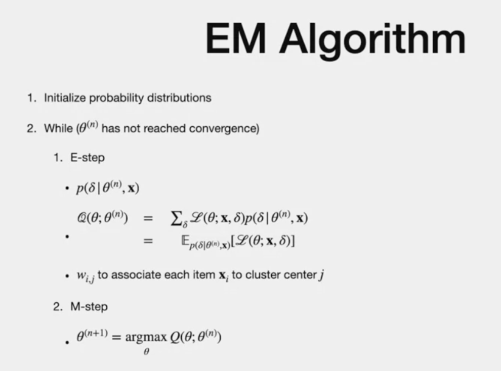
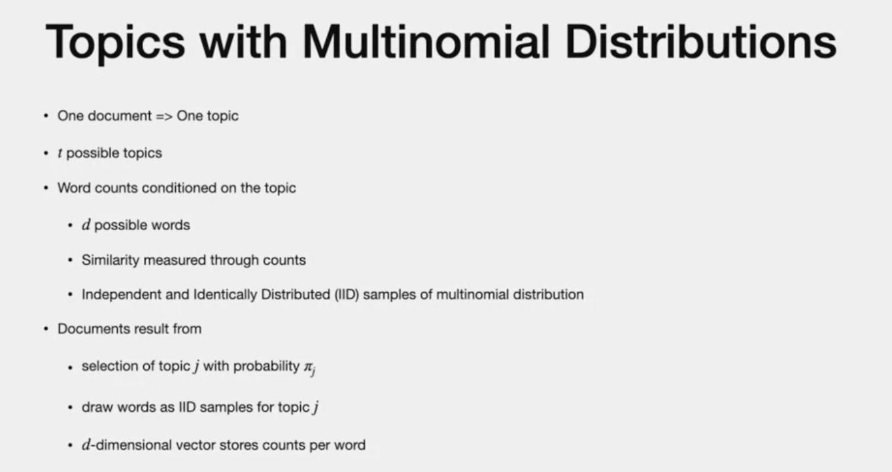
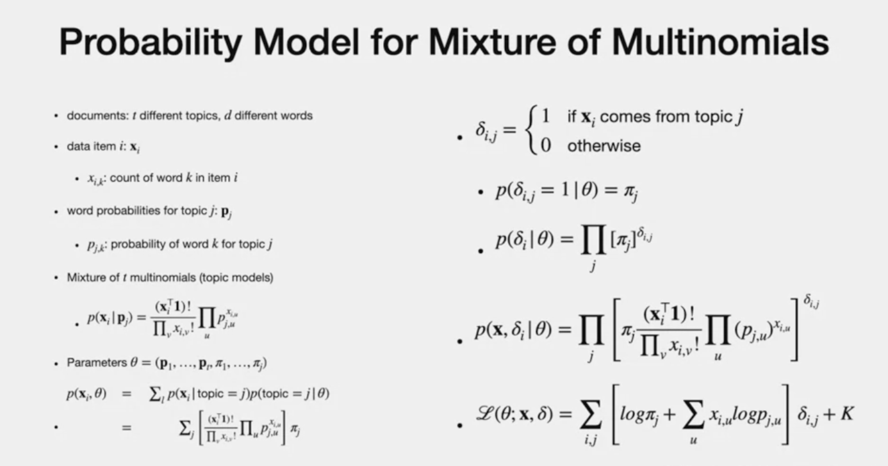
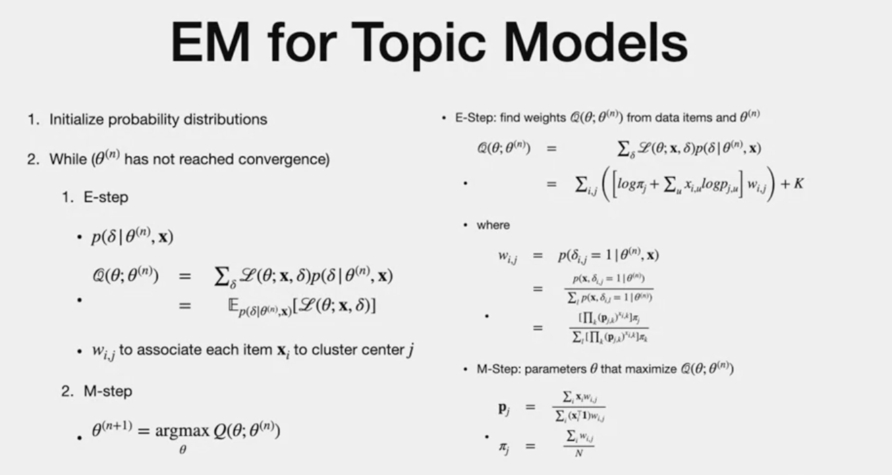
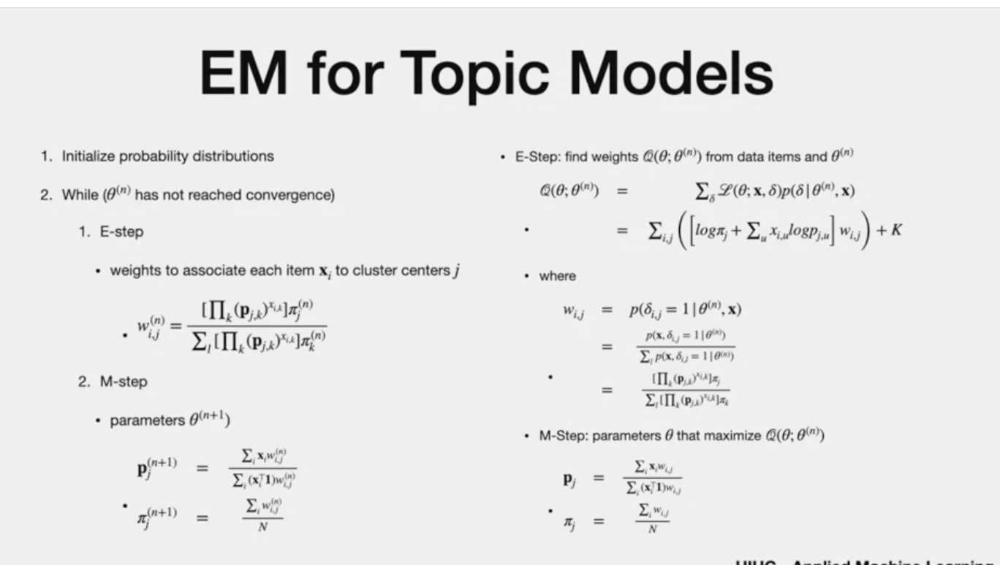

# Agenda

> - Topic model
> - start with general M model
> - "Topics"
> - multinomial disribution

# General EM 

- Topics of documents based on word counts
- Topics as normal distribution

# Topics with multi nominal

- Assume one document has one topic (not usual case)
- Assume : "t" possible topics
- for each topics, words are "conditional identified"
- "d" possible words
- similirty measured through counts
- practical
- "order" or "relative position" is not considered
- documents are generated through
- count each word in histogram/vector
- result in "d"dimesnional vector"
- each topic is multi nominal distribution

NOTE:
- we can **estimate the word probabilities for each topic through counting. **
- Alternatively, if we know the word probabilities for each topic, we can compute the **probability that each topic generates a document**, 
- and then we can select the **topic that yields the highest probability.**

# Probability model

- numerator = total counts of word
- den = product of counts
- theta is function of prob ability and weight "pi"
- indicator "delta" - indicator
- same info from previous lectures

# Comparison of Topic Model vs. EM

# replacing them to give full picture

 M step is two parameter - theta with respedct to "P" probability and "pi" weights
 E step is just weights

 # The end