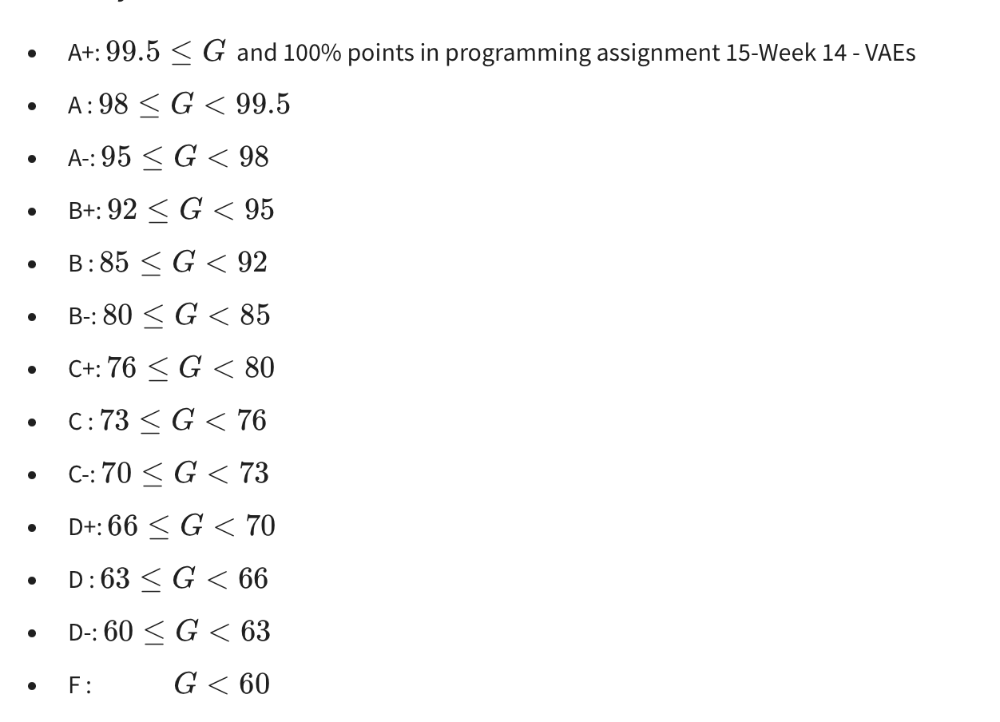

# Book

https://link-springer-com.proxy2.library.illinois.edu/book/10.1007/978-3-030-18114-7

# 
> Instructor: Prof. Marco Morales Aguirre

# Course Description

Welcome to Applied Machine Learning. This course is intended for students who want to apply techniques of machine learning to various signal problems. The topics of this course are:

- Introduction
- Classification
- Regression
- High Dimensional Data
- Clustering
- Graphical Models
- Deep Neural Networks

The course is intended for students who wish to apply machine learning methods with a focus on tool-oriented and problem-oriented exposition. Application areas include computer vision, natural language, interpreting accelerometer data, and understanding audio data.

# IMPORTANT SUBMISSION

**Programming assignments and quizzes can be submitted as many times as wanted before the deadline without penalty**. The highest grade achieved in assignments and quizzes is kept regardless of the number of times they are submitted.

Most programming assignments have the same weight for grading with the f**ollowing exceptions (located at sections 14 and 15):**

14 - Week 13. Programming Assignment 13. CNNs: This assignment has twice as much weight as all the other programming assignments. Also, it is required to pass this assignment in order to pass the course.In order to pass the course.
15 - Week 14. Programming Assignment 14. VAEs: This is a required assignment only for students eligible to get an A+ and it will only be graded for students in this category. Its deadline is May 5th, 2023, the last day of instruction.
15 - Week 14. Programming Assignment 15. HMMs: This is an optional assignment that does not count for grading.

# Grading
