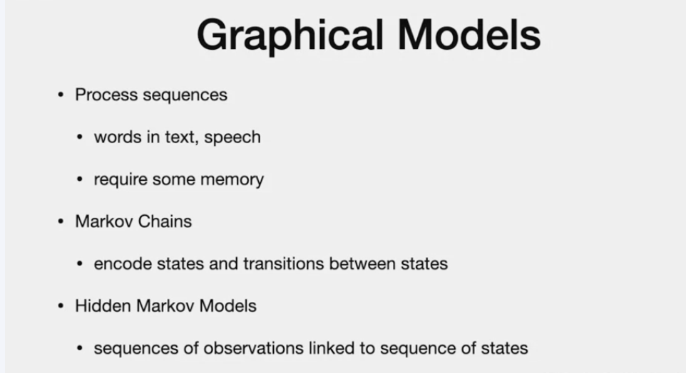
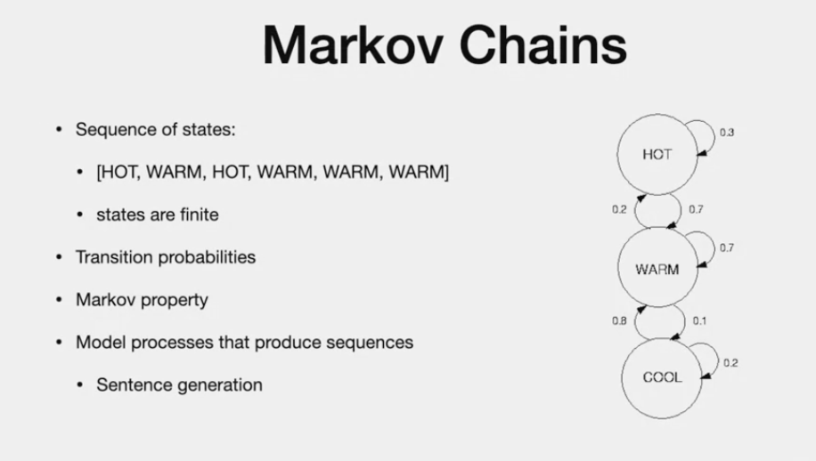
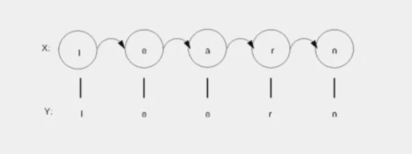
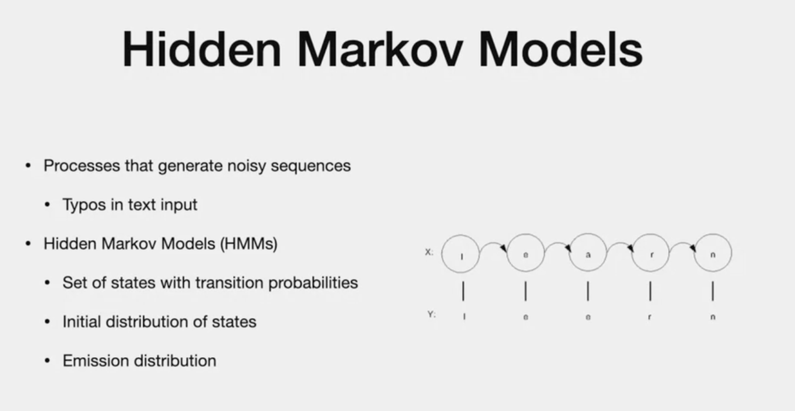

# Graphical Models

# Agenda

- we usually dont think of sequential dependencies
- during vector quantization, we thought of patterns. But we grouped those dependencies together
- Graphiscal - daa set sequence
- exacmples: auto-completion, suggestion when writing code
- we have sequence of charaters, predict next words
- determine whether wrong words. missing words
- if we choose based on frequency of words, we will get it wrong
- we need whole sequence of words
- "encoding of states"/mempry of system is important
- other example : speech to text or handwritten to digital text
- "they come with noise"
- two graphical models to deal with
  

1. Markov
- sequence of states, transition between states

2. Hidden MM : sequence of observatiob linked to sequence of state
- state is hidden
- deal with noisy 

# Markov Chain

> - consider model to show changes in temperature
> - show sequence of change in temperature
> - states are **finite, discrete**
> - some potential transition - each labeled through some probability
> - chains - meet markov property
> - one state depends on previous state (ONLY)
> "trasition property" - probabilities of going frok one state to state
> - this type allows to proeduce sequence - such as , sentence (predict next word, sequence)
> - basic block for HMM

# Hidden Markov model

> - sequence come s with "NOISE"
> - example: input text via keyboard. typo can change text
> - sequence of letters that should produced.
> 
> - "x" is what is supposed to be ..
> - "y" is observed with "typo"
> - we need to add "model" for "noise"
> - "state in markov" is hidden from observation. that is hidden markvo model

- Emission is observed probability

---
# The end