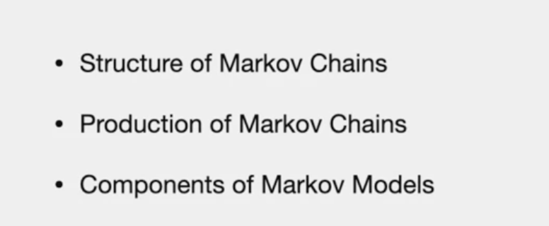
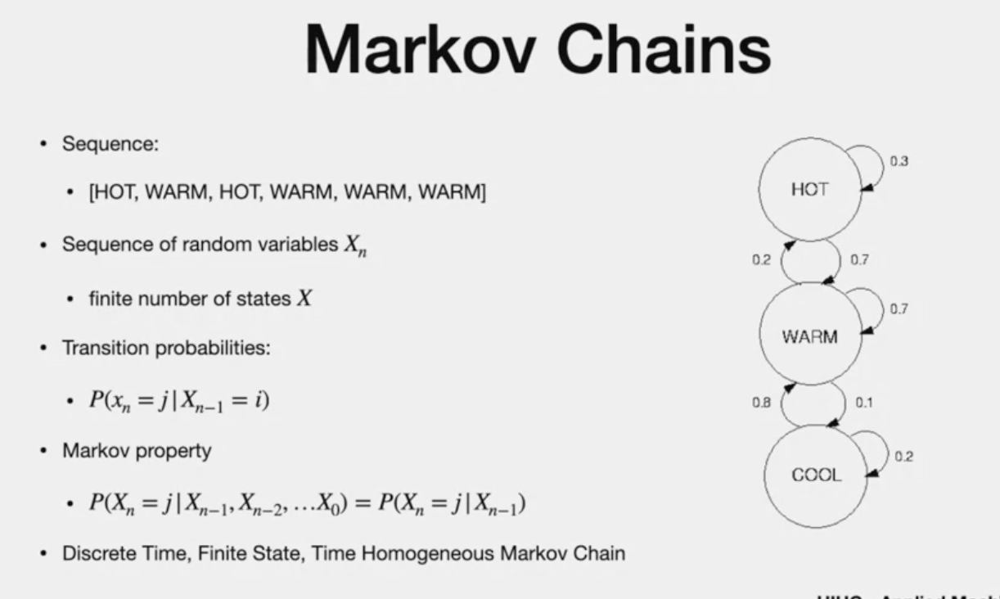
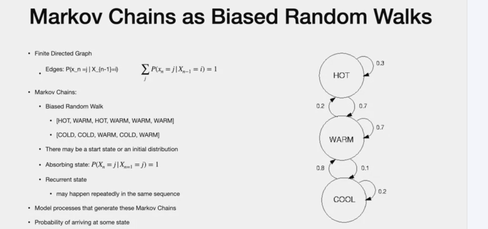
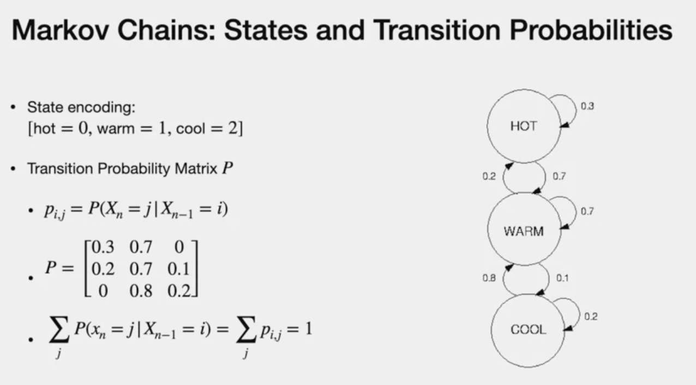
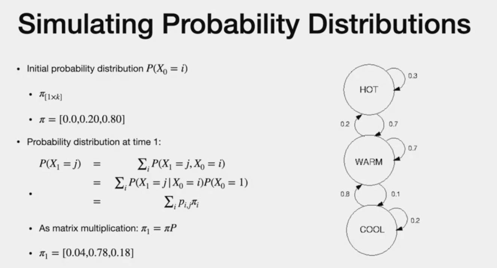

# Markov Chain - I

**Agenda**

# Intro

- temperature in some place changes
- sequence of observation in temperatur
- sequence of random vairable "X" => STATE
- "n" => Time step
- states are discrete and number is finite
- "Transition" between states happen accroding to some probability,
- (n-1) and n are consecutive states
- Note from "HOT" -first state -"Sum of going out of this state " =0.3+0.7 =1
- to generate probabitlity of transition , we need many observation
- "model" in figure is not same for different places.this is for one particular location
- transiiton prob - doesnt depend on specific time frame
- Property: Markov Property
- Prob. of some some "state" in time step "n" conditioned on x(0),...n(n) - in other words, value of "x" in one step is ONLY depeendant on "previous" step.

# as Biased Random walks

> - model to generate Markov is **finite directed graph**
> - edge are directed
> - Edge - state "i" to state "j" 
> - Biased random walks
> - more than one biased random walk - produced by same model
> **instead of single start** , we can have "initial probability ditribution"
> Walk may end up in
> 1. Absorbing state - "No way to get out from it" (no rtansition  prob outside of it). has one edge goes to itself with label as "1" or "No edge at all"
> 2. Recurring states  - happen repeating in same sequence

The above two random walks are recurring walks. Not in consecuytive way. they are visited again and again.
- There is a chance to wroite recurrence state. Closed form representation 
- "START states cannot be RECURRENT"
- model to produce spec ific chain
- new text that matches model can be predicted
- "intersting question" - probabiity of arriving at a certain point - we will use "SIMULATION"

# Transition

> - encode state with number
> - transition prob = matrix
> - This matrix is known as "STOCHASTIC MATRIX"
> - sum of probability of outgoing edges =1

# Simulating models to generating Markov
- initial probability stored as row vector "i" for each STATES
- This is intiial state "Pi"
- After one time step,(prob of transition matrix multiples by initial distr.)
  

  - Note for second time step, we use pi(1) is used to caculated the next probability step

---
# The end

