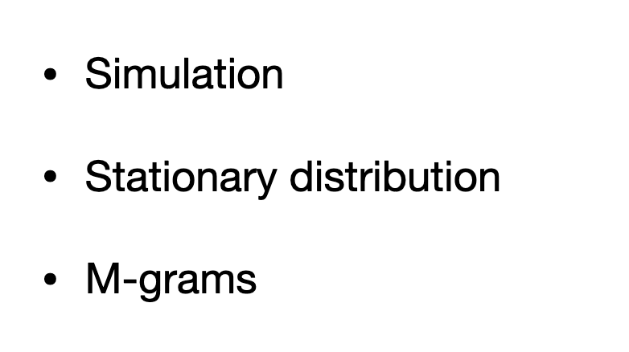
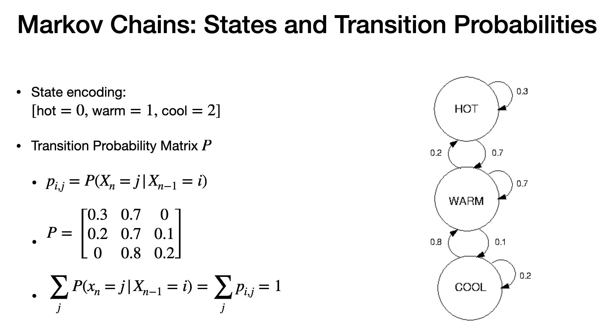
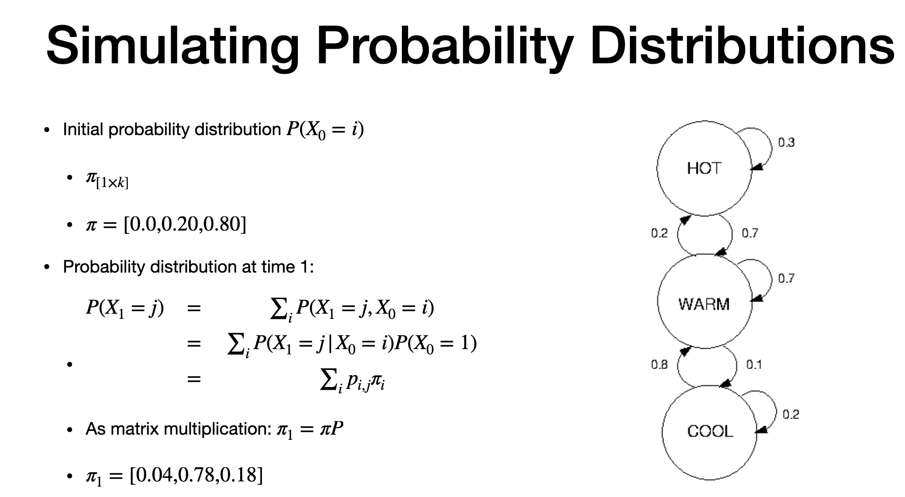
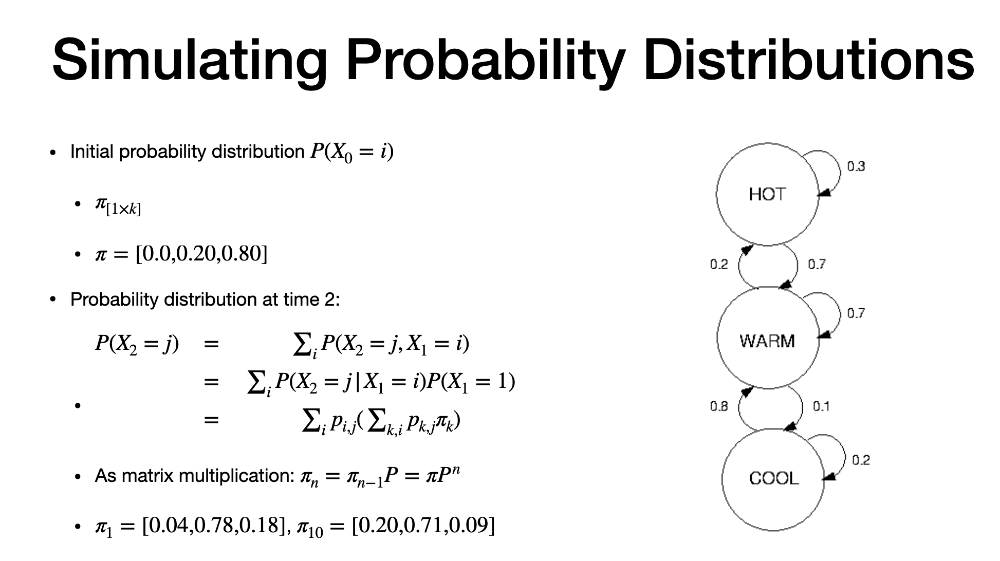
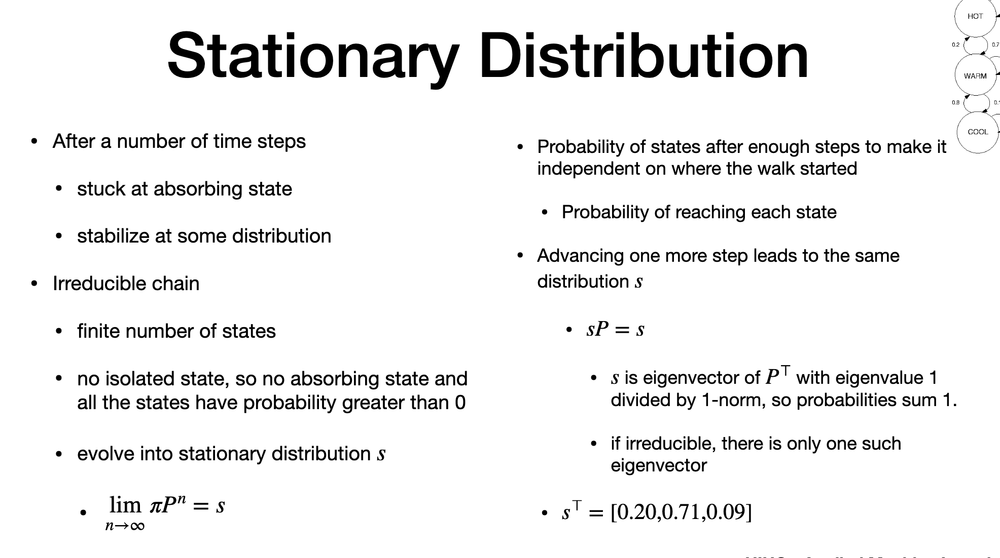
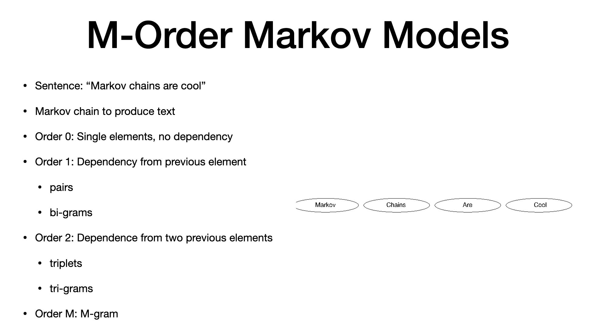
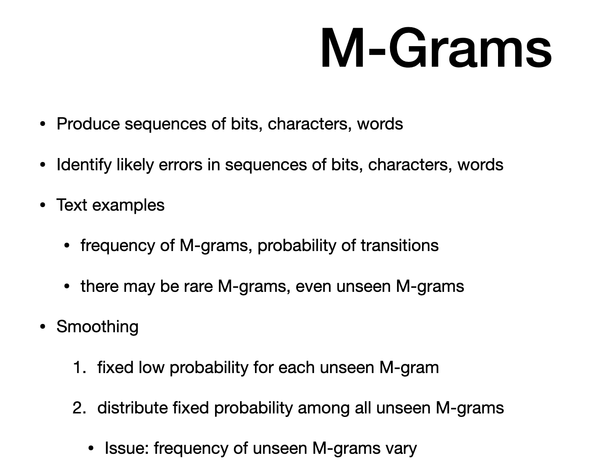

# Markov Chain -2

...Continuing from previous topic

# states and transition [probability
]

- prev lecture
- recap here

# Simulating Probability distribution - time 1

> - this is for time step 1

# Simulating Probability distribution - time 2

> - this is for time step 2
> - we use prob. dist. from prev step
> - p => Transition probability
> - Prob. at step 10  is noted. at step 10, probabibilty is more towards state warm,

# Stationary distribution

> -  dist reach absorbing
> - independant of initial state  (then stationary )
> - irredcible - finite number of state, no isolated state (any state can be reached from any other state)
> - all states with probability > 0
> - stationary dist = "s"
> - "pi" is initial. limit when "pi" is infinity
> - "Virus mutuation"
> - indicates "prob of reaching a state"
> - after stationary , advancing to next step is same as "s" ()"sP =s")
> - "s"- eigen vector with P transpose with eigen value =1
> - resulting is column vector
> - chain is irreducible, one eigen vector with eigen value =1
> -  (0.71 - warm state) - value at step 10 is similar to later

# M- order Markov

> - how to produce markov model
> - example: text
> - model order 0 = each word depends only on frequency. no dependency on previous word ."Unigram model"
> - "adding transitining probability" and generate "order-1"
> - order 1 - bigram - depends only on previous word
> - order 1 - look at frequency of pairs
> - order 2 - trigram - triplet frequency
> - Order M - sequence of characters, words, sentence

# M grams

> - "auto - fill" option
> - example : DNA sequencing, Text and more
> - to model "text", we need frequencies of M-grams
> - extract frequencies from dataset
> - also should have transition prob.
> - Larger the "M", harder to get the frequencies
> - When M-grams are zero/unsee, two "Smoothing" options available
> 1. assign low prob. to unseen M-gram
> 2. distribute fixed prob. to unseen

# CONS of both Smoothing alogorithm
- freuqncy of unseen M-gram can vary
