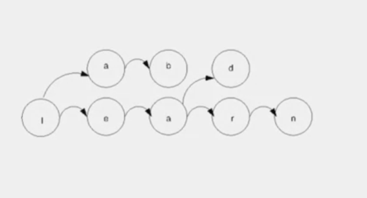
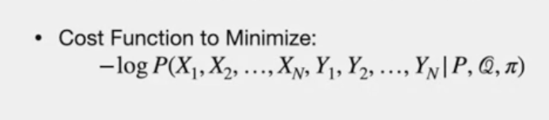

# HMM

# Agenda

- cost function associated to it as well
- inferecen and cost function

# HMM

- simple model that has **noise** observations
- typo in keyboard
- example : flipped bits through noisy communication
- speech to text (each person has different pronociation)
- recognization sign launguage from video
- HMM has
- 1. set of states (states are hidden due to noise) with transition probability (in markov chain as well)
- 2. Initial distribution (in markov chain as well)
- 3. Emission  (New one only in HMM)

> - adding additional chain (L-A-B)

# HMM-2

> - "S" states
> - "X (n)" - Hidden state at time ste p "n"
> transition prob - i to j
> initial prob - "pi"
> New one (Emission)
> X(n) is hidden. what we observe is Y(n)
> prod (y) depends on "x"
> "Q" => Emission. depends on state "i"
> Assumption: "Emission" - same over time

# Speech transcribe

> - markov model for Phonemes - atomic sounds that together form a full sound
> - "Q" - vector quantization to produce features
> - "pi" - uniform distribution

# HMM Inference

- already have HMM
- we want to estinate hidden states based on observation
- This is called inference
- Assumption "Y" - generated by "x"
- "MAP : - Maximu A Posteriori"
- maxiumum the sequence of the posterior
- same as minimising negative log of the posterior

- Cost becomes function of hidden, observations conditioned on prob P, Emission Q and initial "pi"

- Cost is sum of pairs )(conditioned on previous state)
NOTE
> - One of the terms in each pair is the probability of a state in the Markov chain conditioned on the previous estate, which comes from the transition probabilities in the matrix P.
> - other term in each pair is the probability of an observation in each state, which comes from the emission distribution in matrix Q.
>  - this sum can be arranged in data structure called the Trellis, which is weighted directed graph that has copies of the Markov chain model at each time step
> > - trellis - used to find hidden states

----
# The end