# Inference

# Agenda
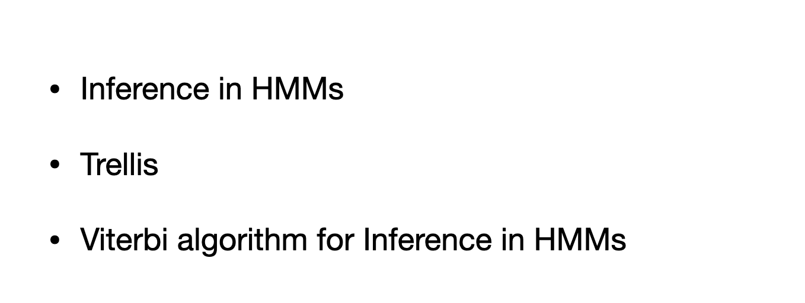
- trellis from parameters of HMM

# Inference
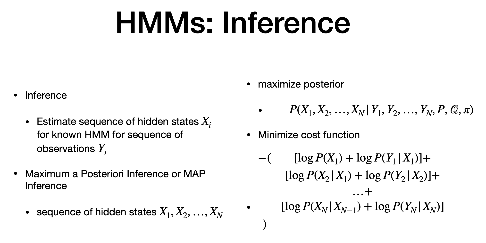
- prev lectures
- using MAP,minimize cost function
- cost = sum of pairs of log
- each pair , one term , one is prob conditioned on prev. state (P), prob of observing some output "Y" in each state "x" (get from emission dist Q)

# Trellis
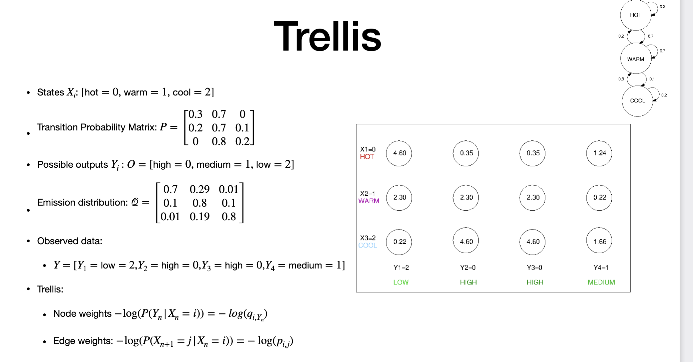
- use markov model to get trellis
- Given
- states, transition prob
- assume undergroung spring, we cannot directly get it, we use humidity sensor 
- "Y" is hymidity indicator
- Emission: Row = state(X) | column is humidity(Y)
- Y = sequence of observation

> TRELLIS
> -  weighted graph
> - nodes = states 
> - 4 observation, so 4 columns, 3 states hot, warm and cool(X)
> - "n" states and "m" observation, trellis has c * m
> - negative log of probability is the weight of the node
> - if prob is zero, we can remove the node
> - negative log is from Emission dist
> - 0.7 = 0.35(negative log)
> - 0.1 = 2.30 , 
> - 0.01 = 4.60
> - first row in "Q" corresponds to high humidity. This corresponds to column 2 and 3 in Trellis
> EDGES
> - corresponds to transition prob.
> - come from transition prob. matrix.
> 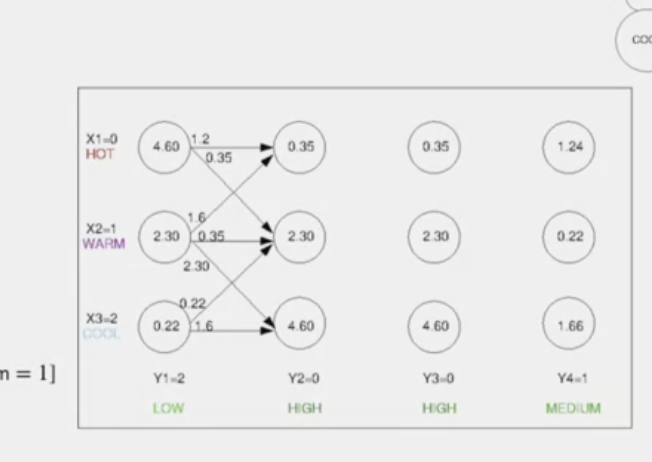
> -  0.3 = 1.2(negative log) - from hot to hot
> - 0.7 =0.35 (from hot to warm)
> - zero transition is not represented as it is infinity(negative log)
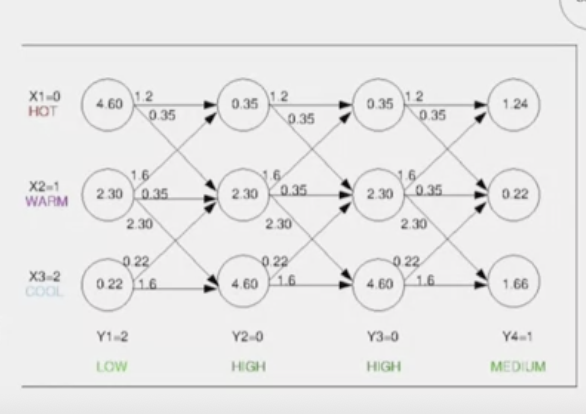

NOTE:
1. NODES = negative log of Emission Probability
2. EDGES = negative log of Transition Probability

# Vitrebi Algorithm
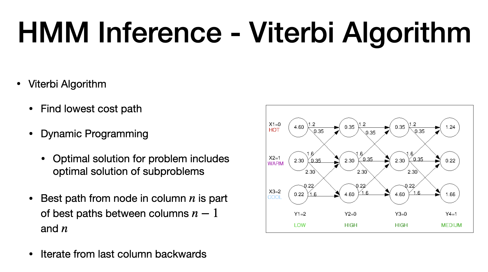

> - find from different combination, the best possible path
> - cost for each path = sum of all cost (nodes +edges)
> - do piecewise calculation to find sequence of path that has minimum path for each "LANE"
> Viterbi - used for error correction
> - find lowest cost
> - break the path for each time step
> - Go backwards. Start from last column/time step to previous one (gives subset of the path)
> - Dynamic programming rely is simpler sub problem and get optimal path for each subset
> 

# Vitrebi - II
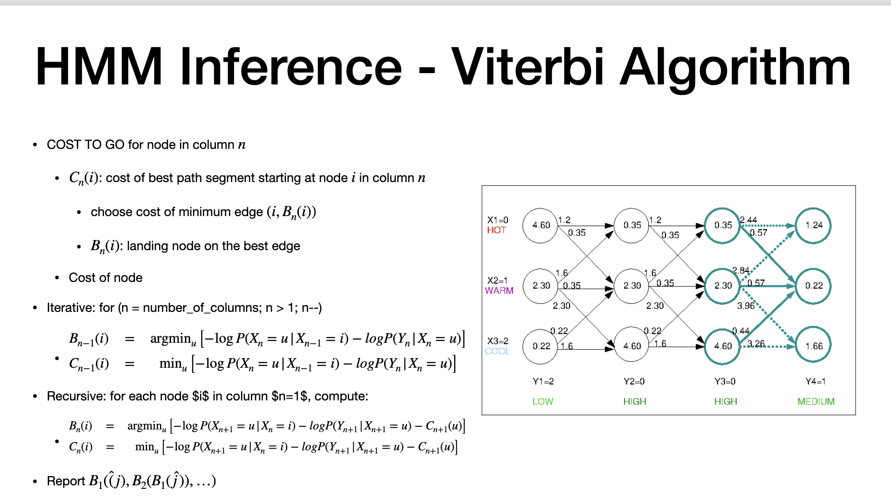

> - In edge , we update with aggregated cost(cost of edge+cost of destination node)
> - note 2.44 = 1.2 (Edge) +1.24 (DEst node)
> - dashed arrows are high cost
> - only the optimimal cost(less cost) is in solid line
> - Now consider only solid line
> - cost of second to last Node:
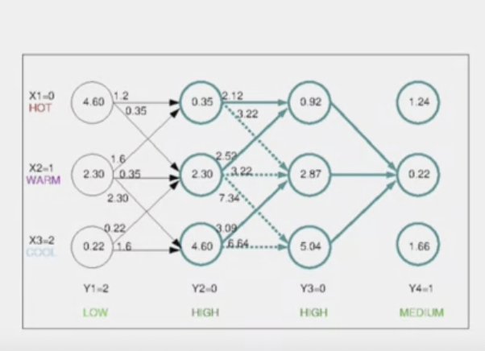

- walk = cost of all minimum cost edges (solid lines)

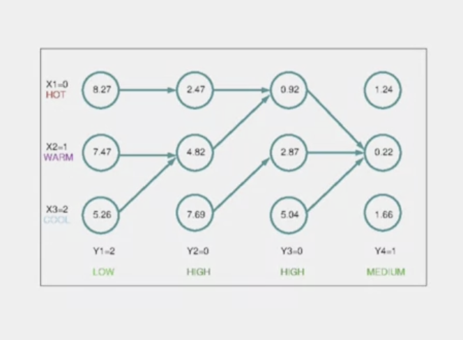

- In the first column, select the lowerst cost 
- from there, follow the solid line
- Parameter "B" and "C" for different time step iteratively.
- Best path:
- 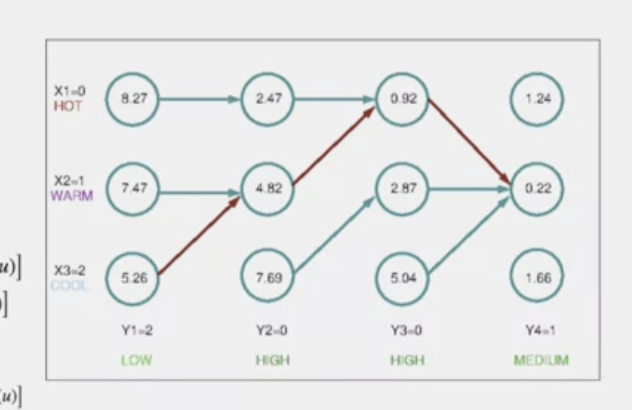

# Vitrebi - III
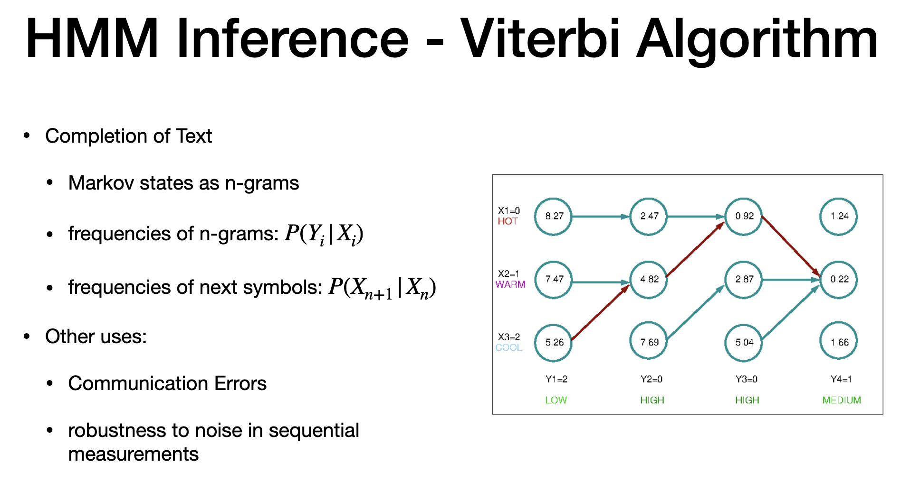
>- used in connection error/communication error
- split into euqally sized and calculate prob for Y given X
- 

# Fitting HMM
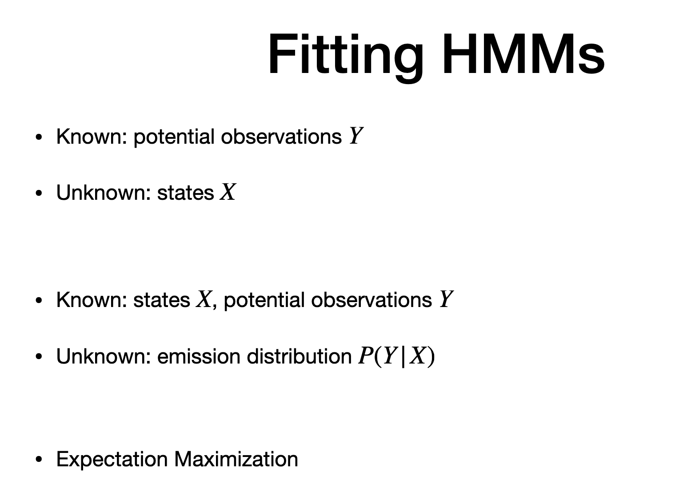

- observe sequence and predict
- use EM, prob using graphical models.
- given X, Y , we dont have probability

---
# The end