# Page 305 - 306
# Example 1: Umbrella

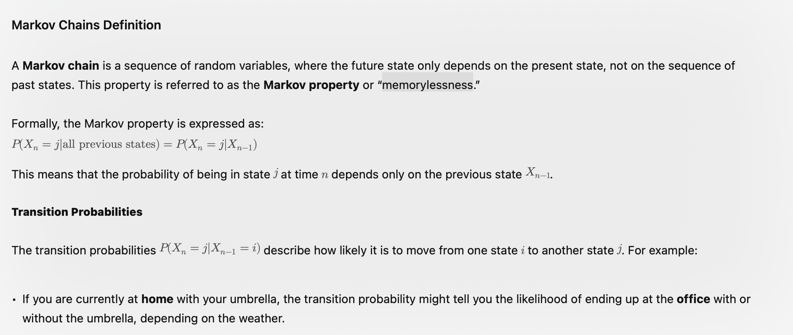

# Properties

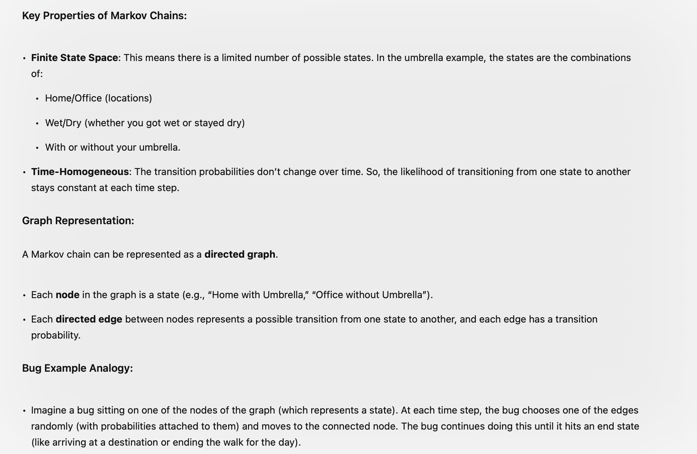

# Umbrella 
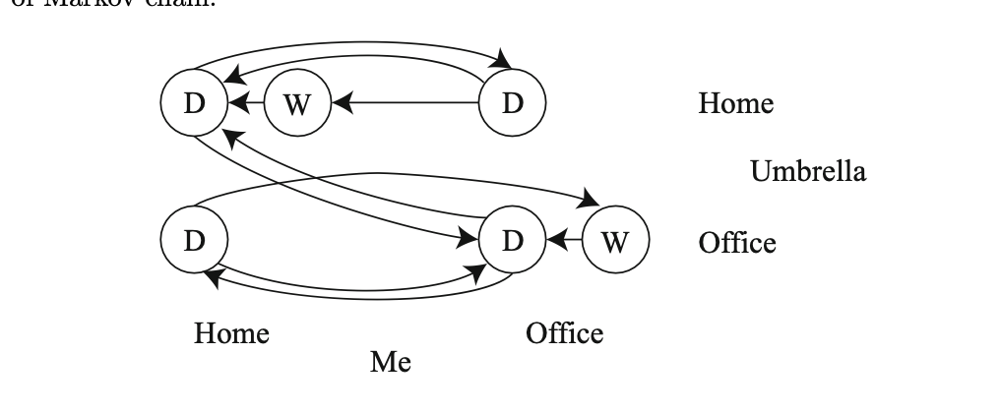
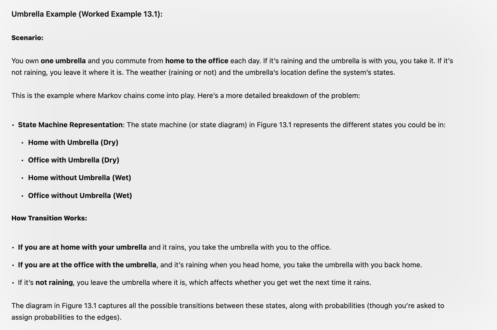
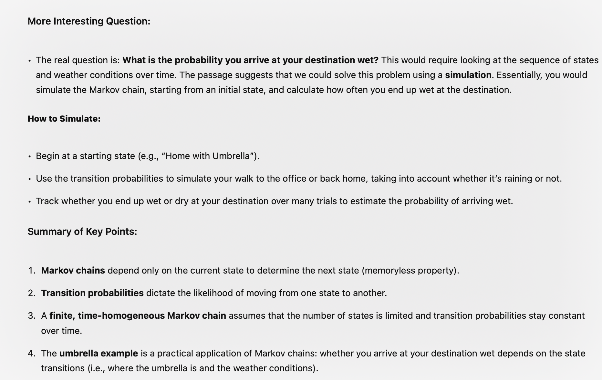

---
# Page 307 - 309 (Example 2 and example 3)

# Worked Example 13.2: The Gambler’s Ruin 

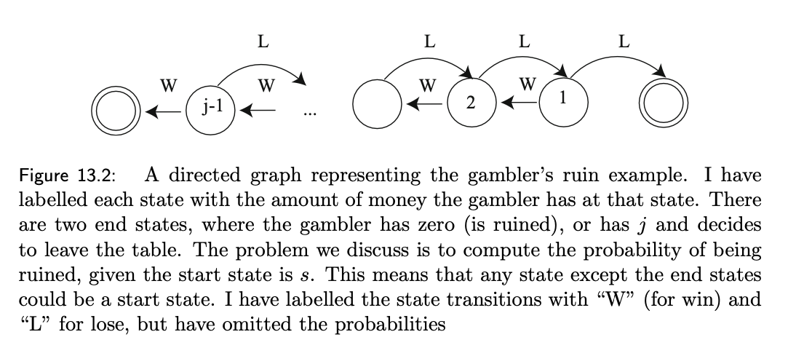

# Explanation
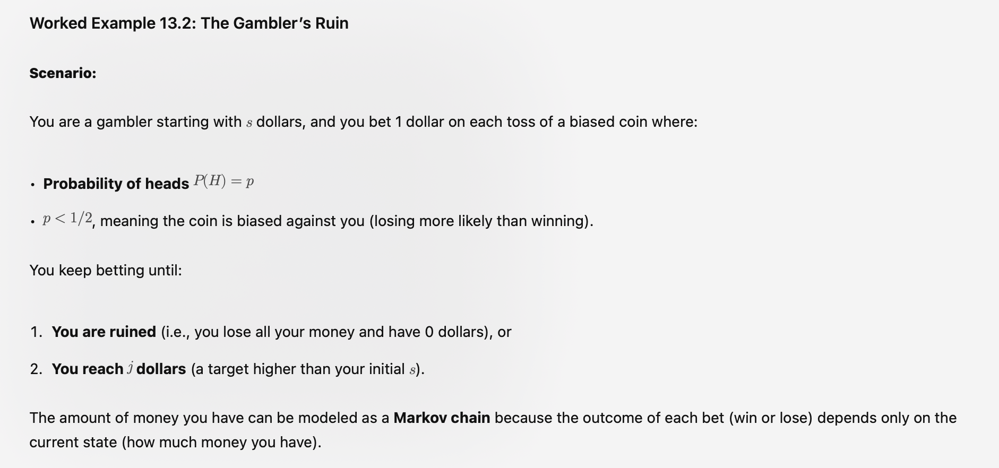

# State and recurrence
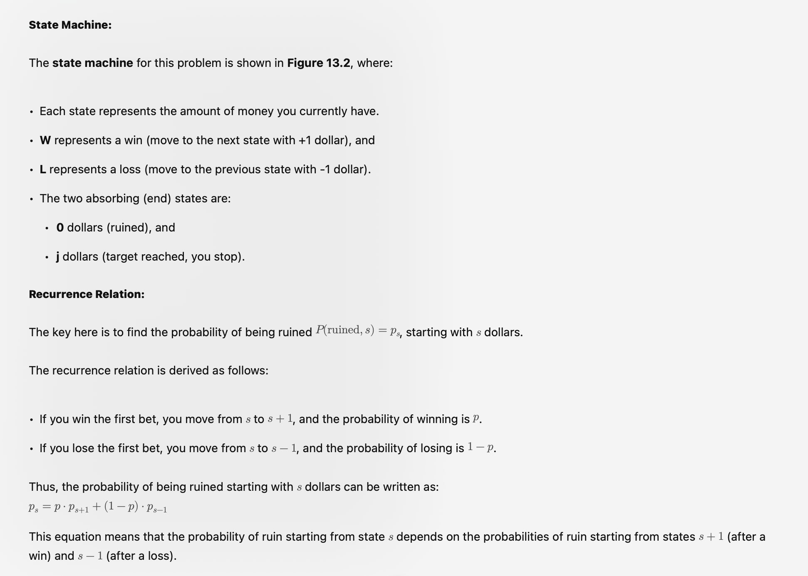

# Absorbing vs. recurring states
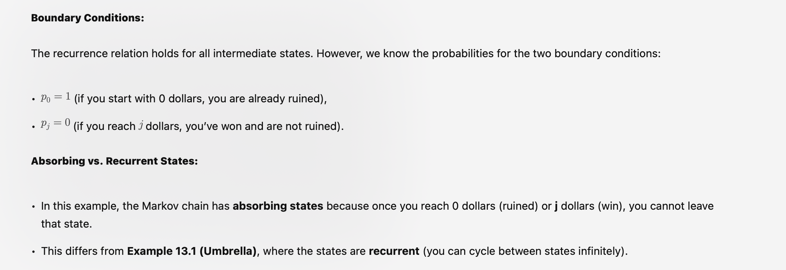

---

# Example 3
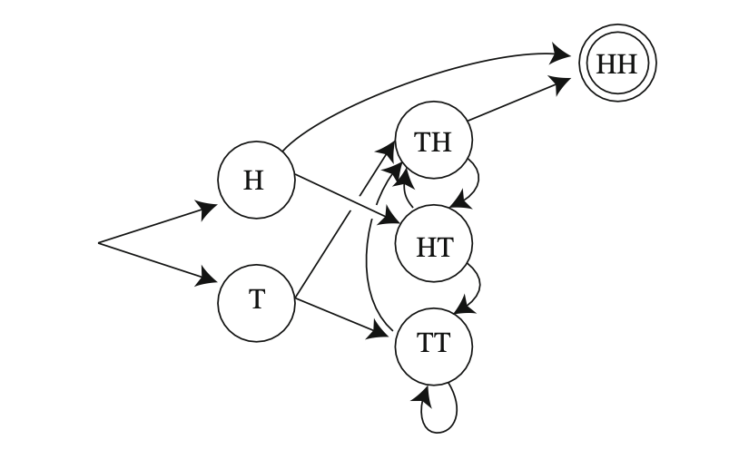

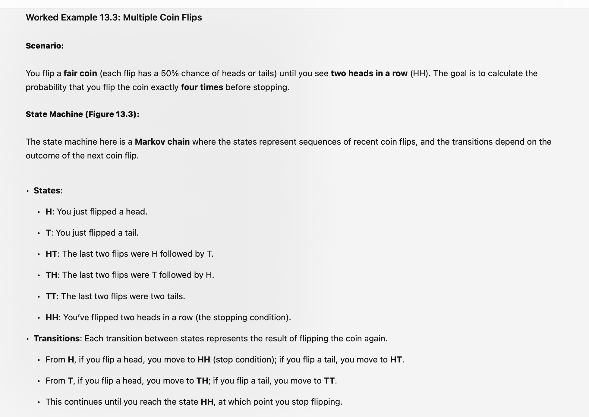
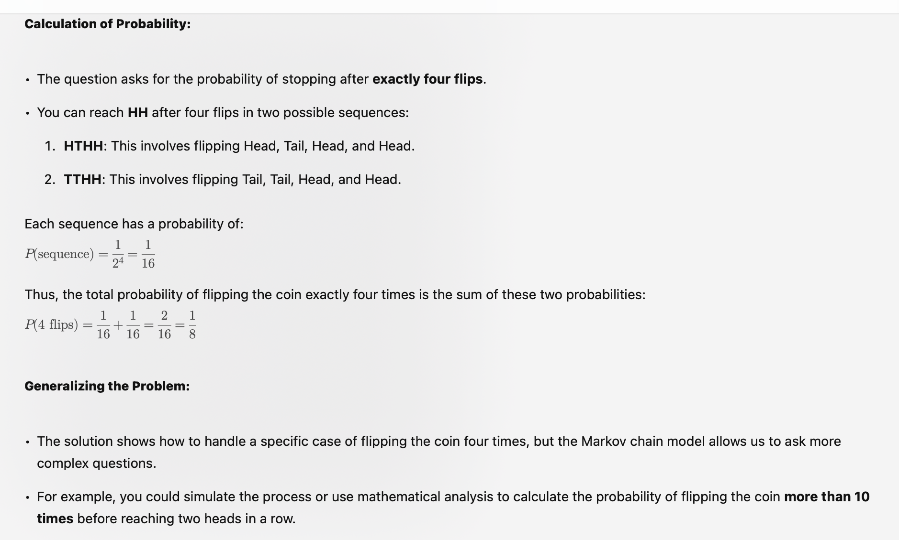

# Summary
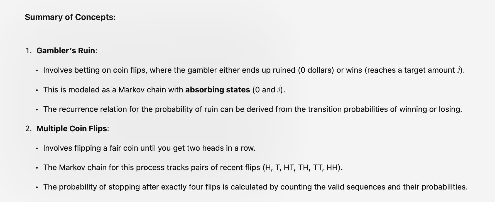
---
Start from page 309
---