# Stationary
Page 311-312

# Explanation
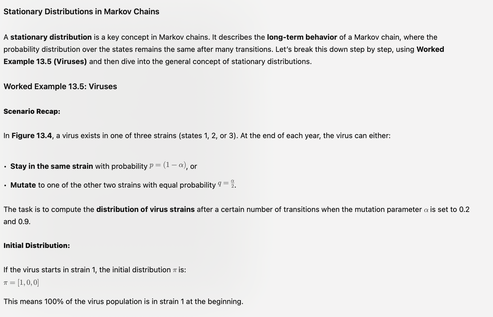

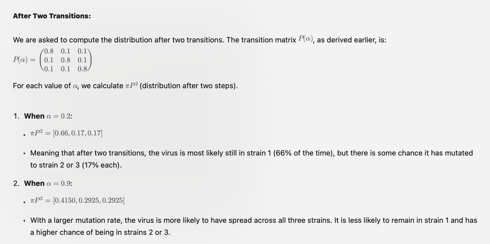

### Math of 2 transitions
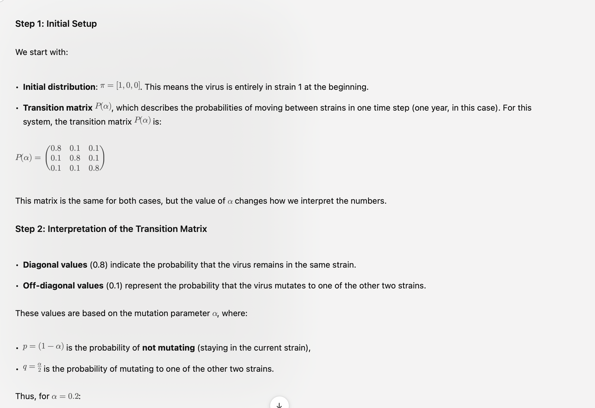
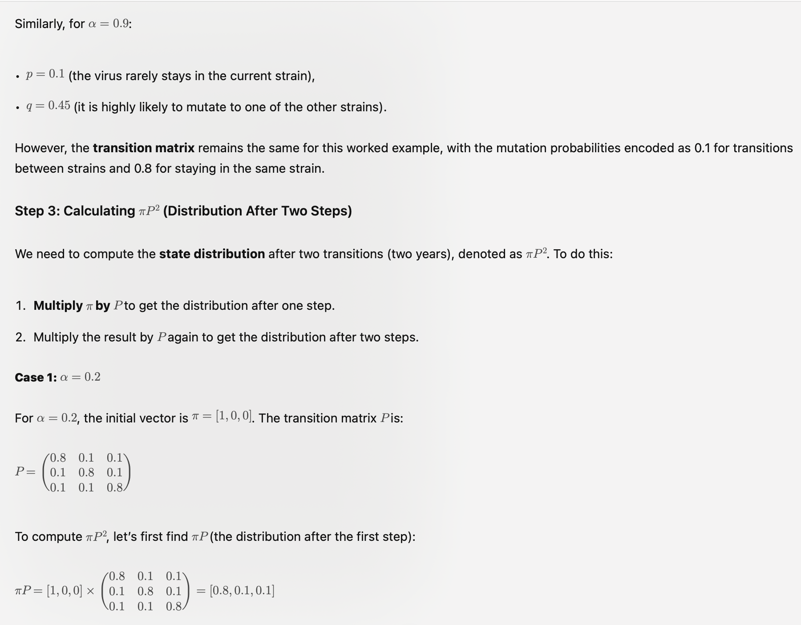
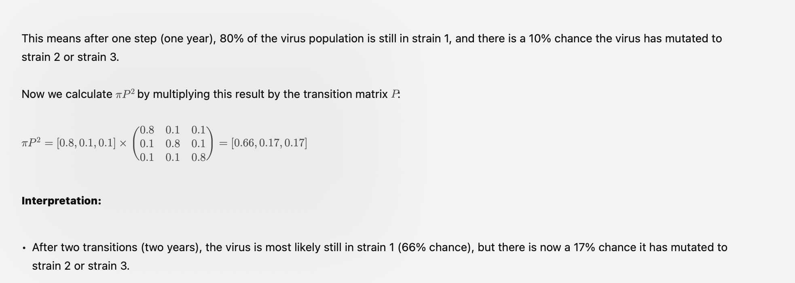

#### Case 2 = 09 two transitions
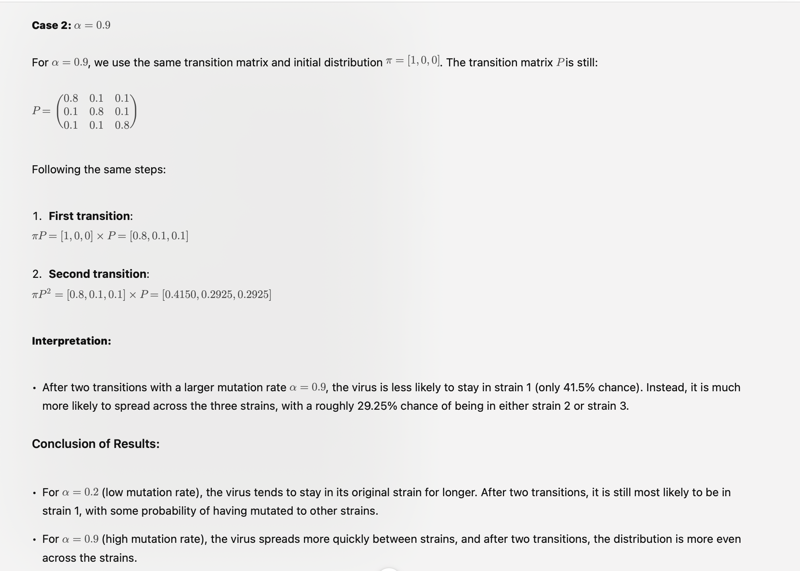

# Resuming what happens after 20 tranisions
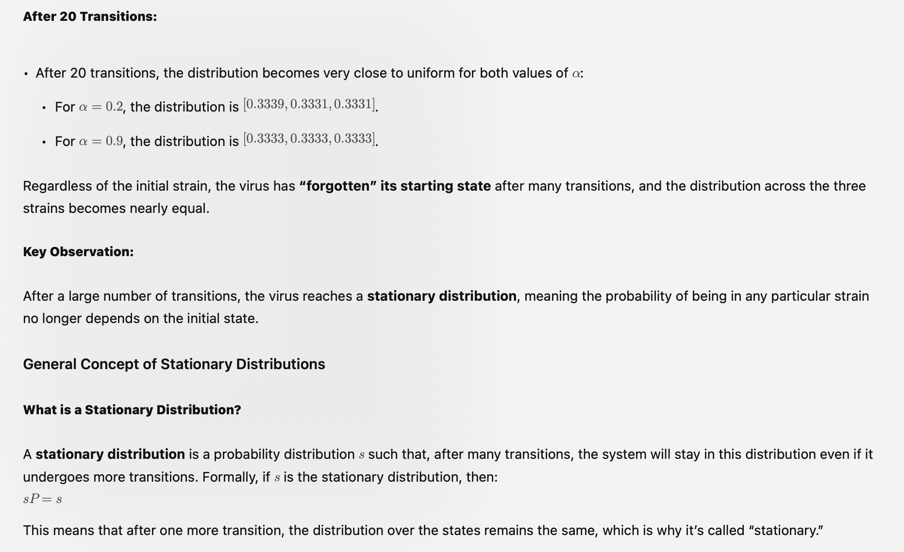

# Properties of stationary distribution
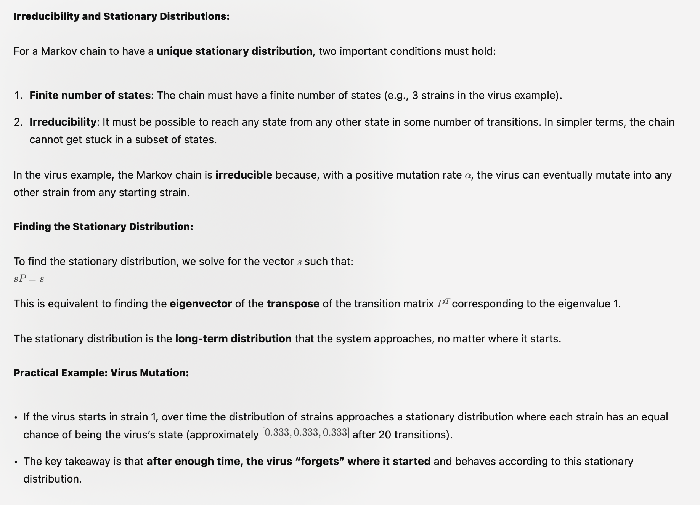

# My understanding
(Will transition become stationary over time?)

## What is stationary and transition?
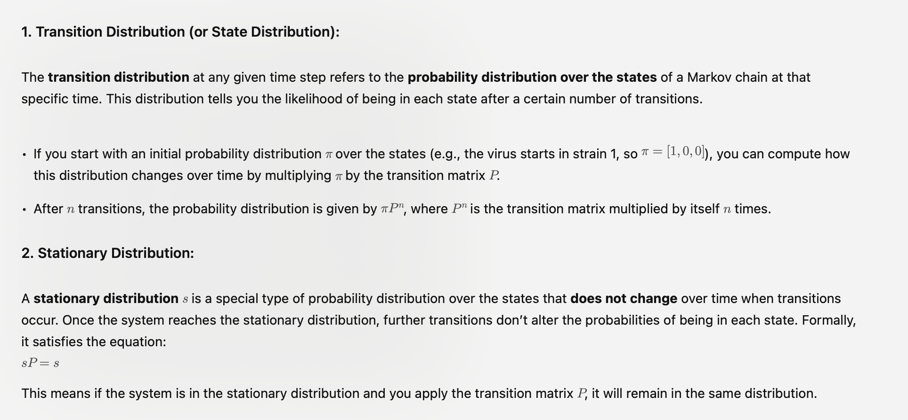

# Will transition become stationary over time?
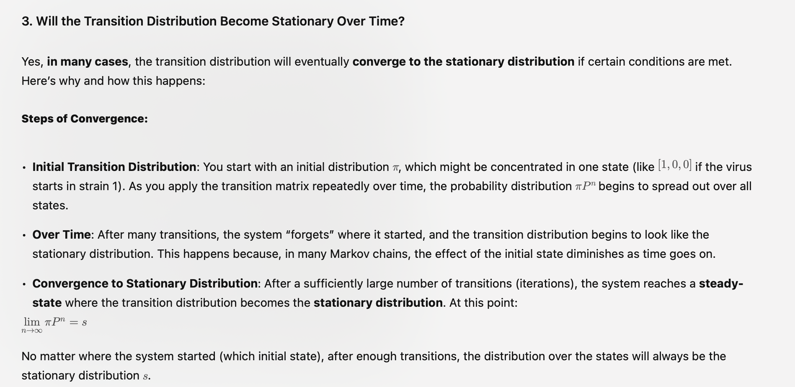

# Convergence
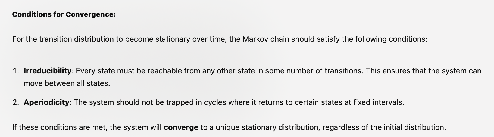

# Example
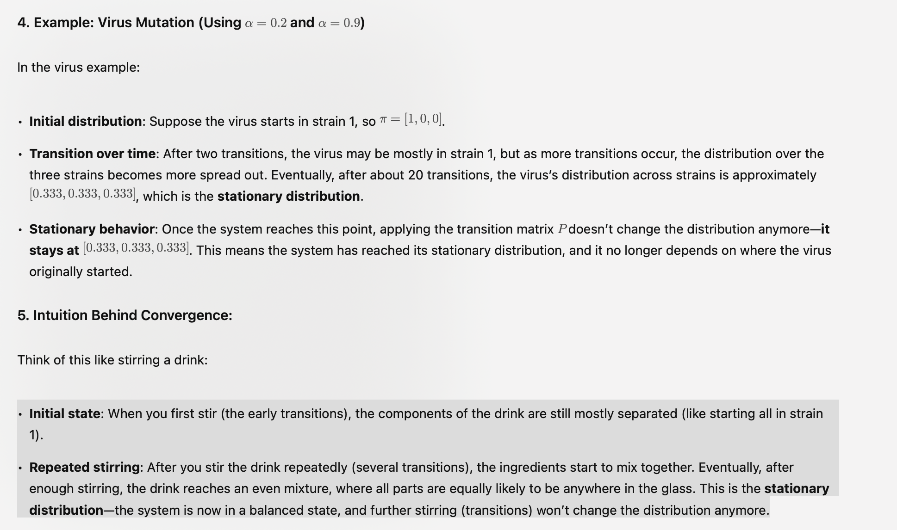