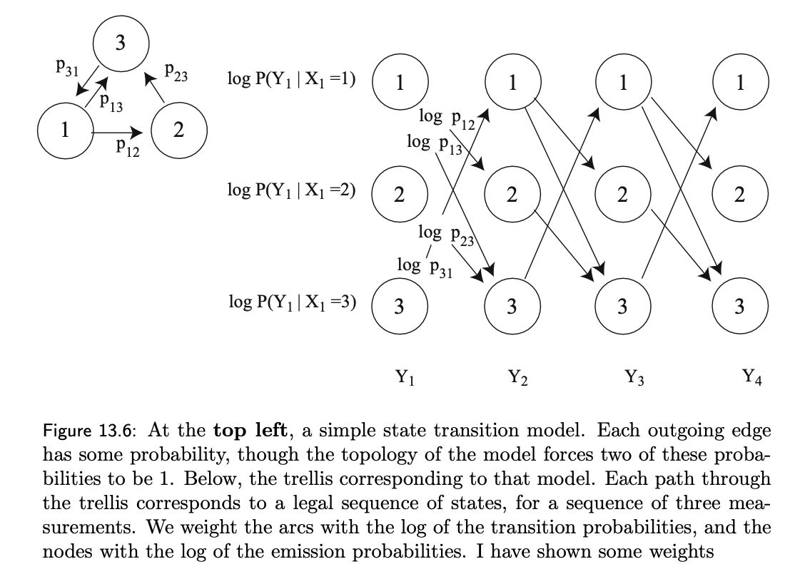
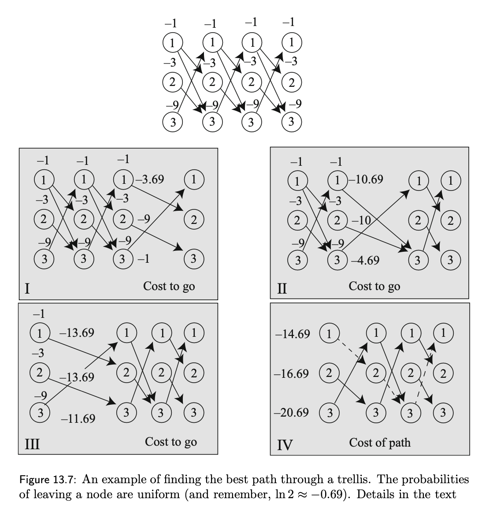
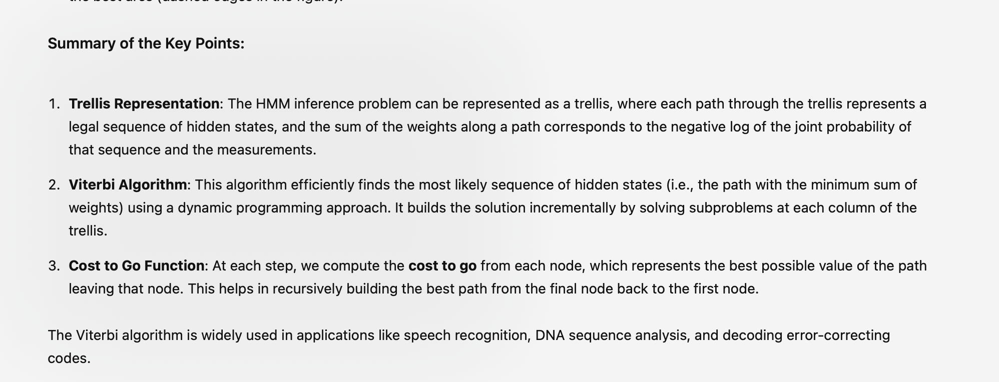
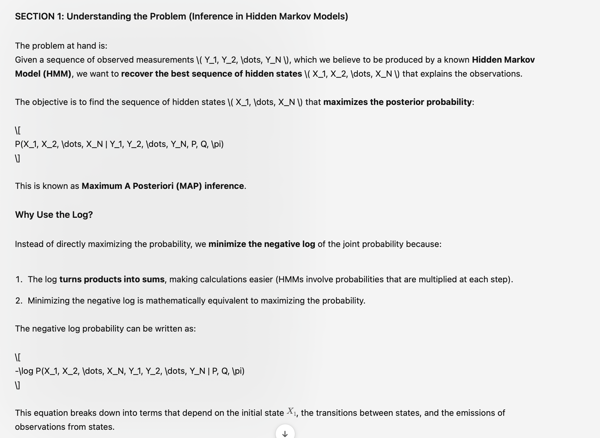
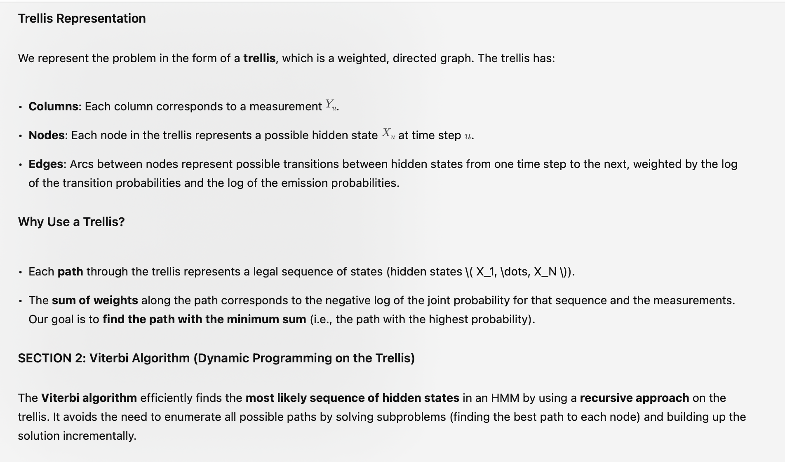
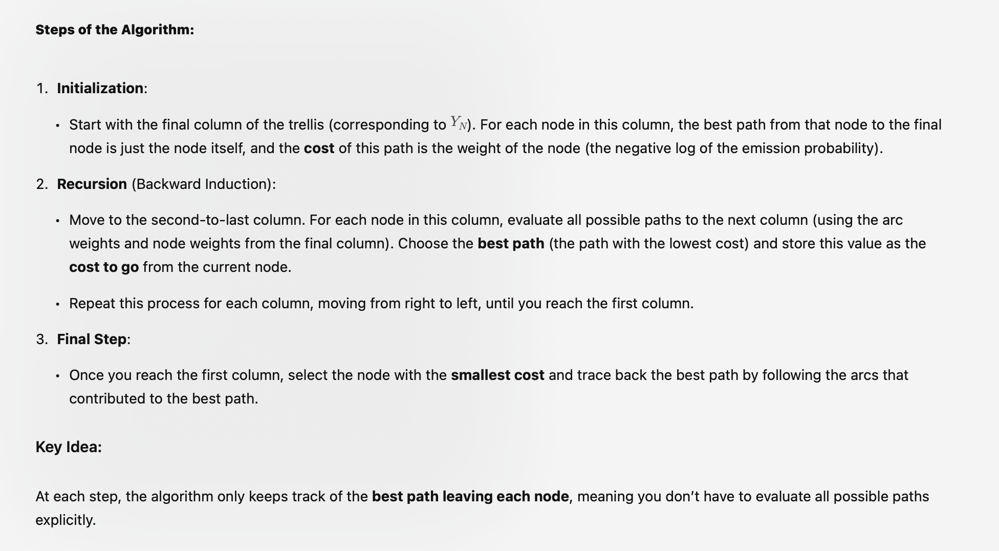
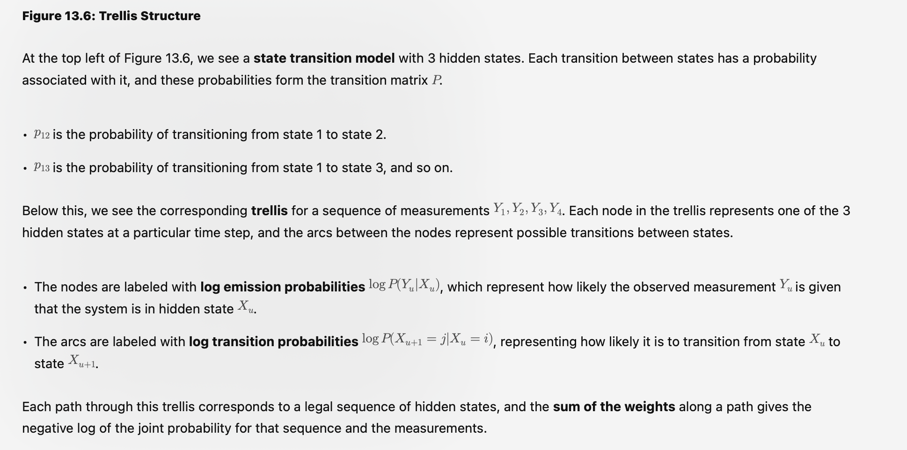
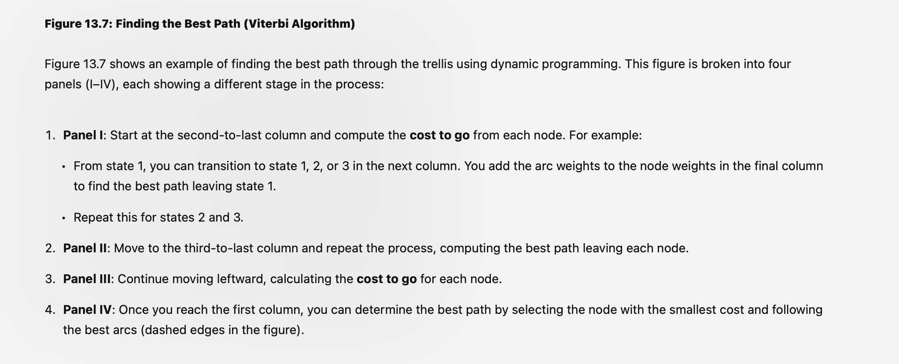

3 Paeg 317 - 320

  *FROM BOOK!

**Example 1**

**Example 2**

# Explanation:
This explanation is good in Lectures "HMM INFERENCE FOR 35 minutes"

# Algorithm

# Emission and transition prob

# Best path

---
# next: dyanmic programming