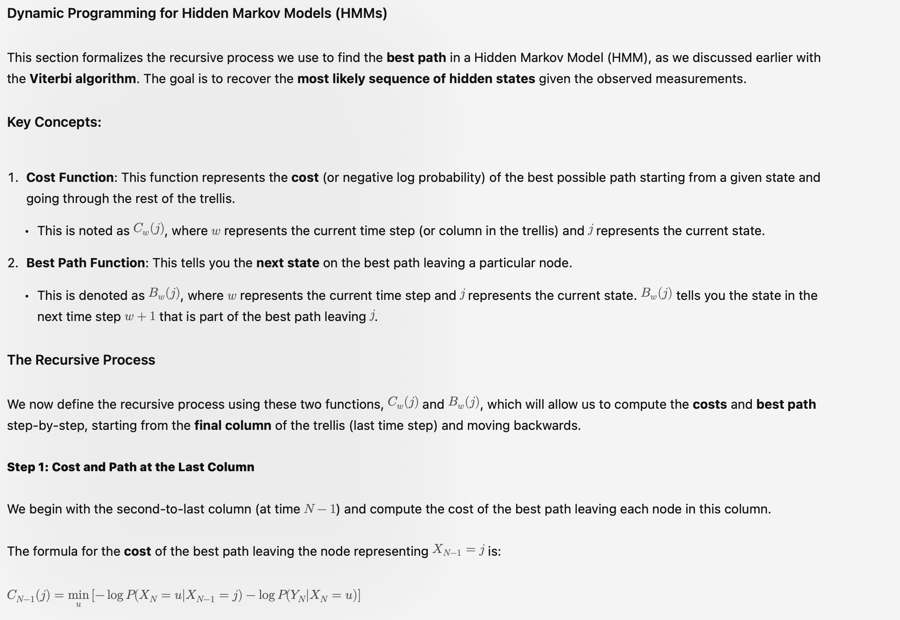
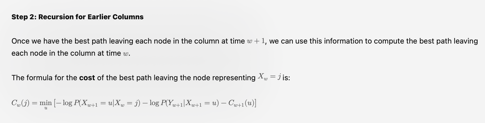
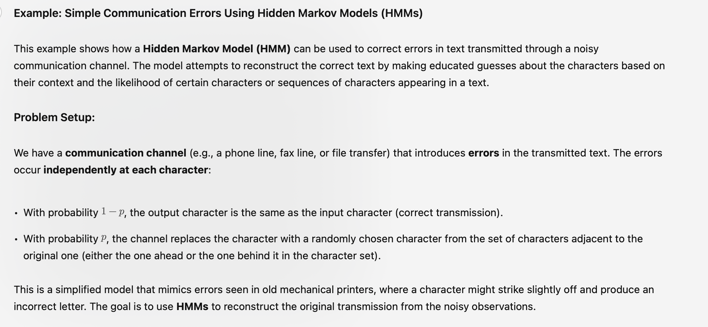
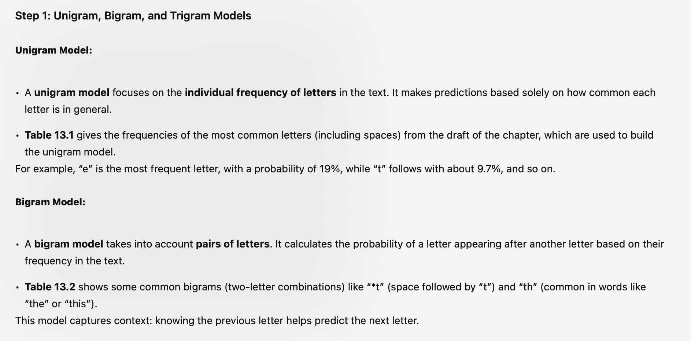
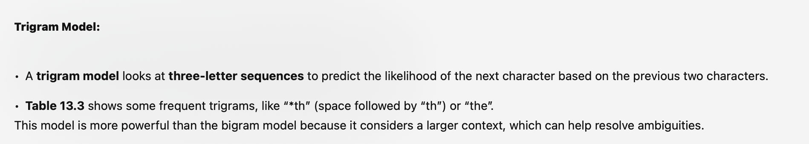
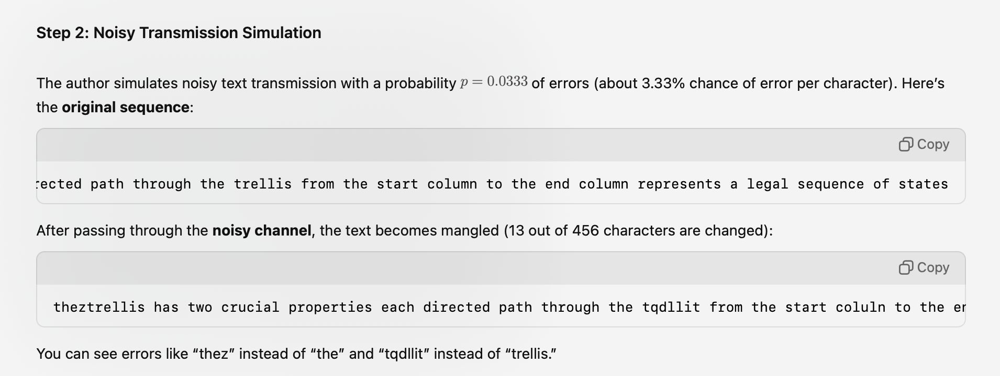
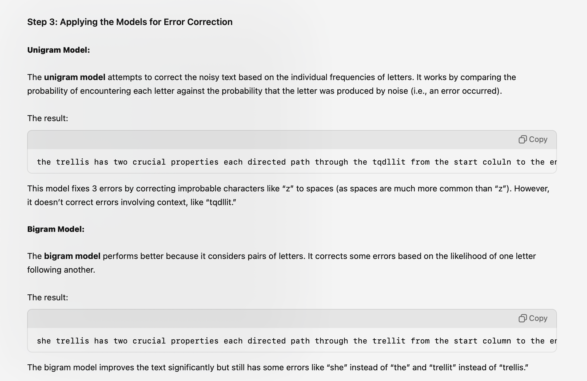
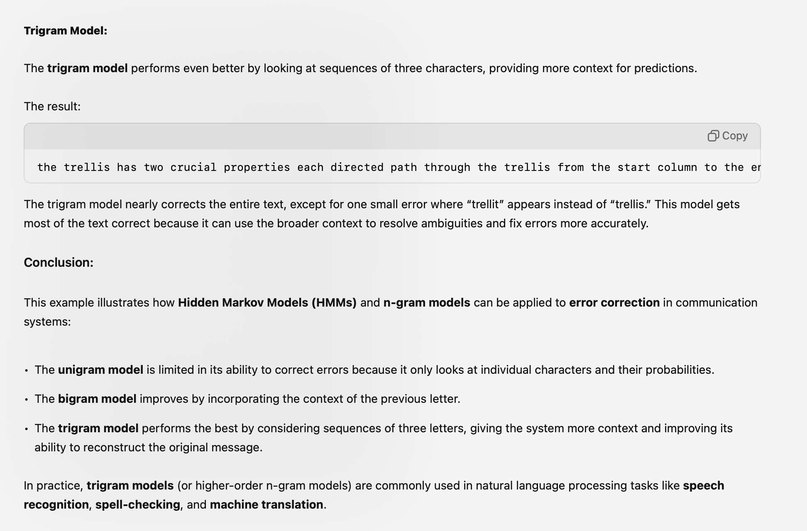

# Page 320 - 

# Ste 1 - dynamic programming

# step 2

---
# Example  0 communication
# HMM + N-gram models

# Step 1 - n-gram

# Step 2 - simulation

# step 3 - applying model for error correction

