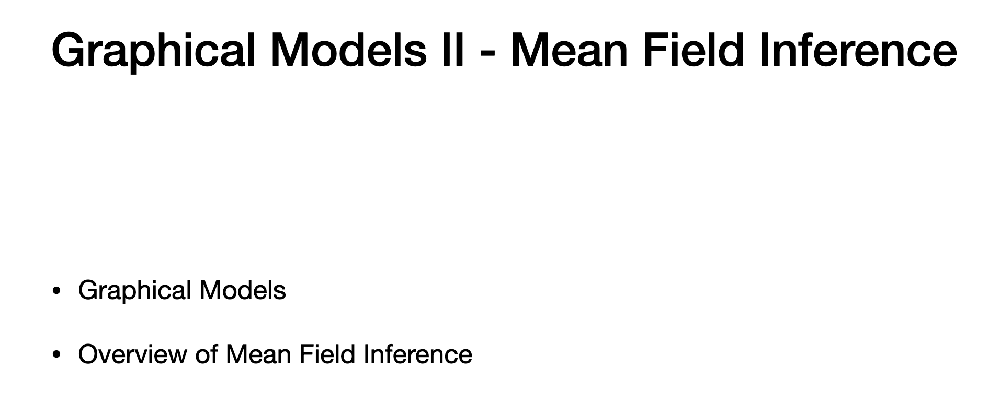
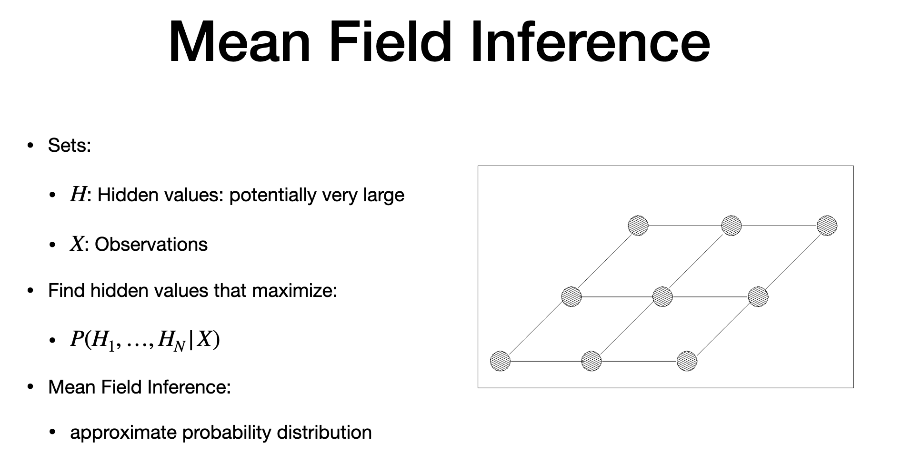

# Agenda

> - prepare to relate prev. graphical model with Boltzmann machie

# Graphical Models

> - prev lecture
> - 1. Markoc chain - Characterize sequence, transition based on probaiblity
> - 2. HMM - noise vs. observation
> - in this - mean field ingerence - set of observation, set of hidden values without noise
> - goal is maximize likelihood 
> - similar to markov models. - in mean field, we are not modeling chain

# Mean Field Inference

> - many real time appl, hard to find the prob of hidden conditioned on observations
> - H => Hidden values (large set)
> - X => Osbervations
> - netword nodes - each is one hidden values
> - one hidden has one observations
> 
> - connectivity can be in different structure
> - goal - find hidden value that maximize hidden values conditioned on observation
> - number of "H" - large
> - reduce search space and find hidden - but if not possible, we cannot find probabilbity
> - "INTRACTABLE - hard to find 
> - Mean field interfence - works with apprximate prob. dist. to maximize prob. dist

# Mean Field Inference Overview

> - WHAT we learn here?
> - Practical case of Image denoising
> - Boltzmann machine - use variation inference - for approx. version
> - then provide Mean field inference Algorithm
>
---

# The end 
