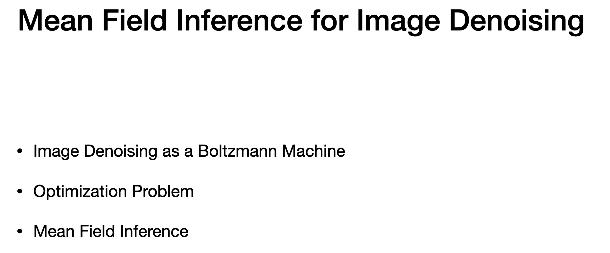
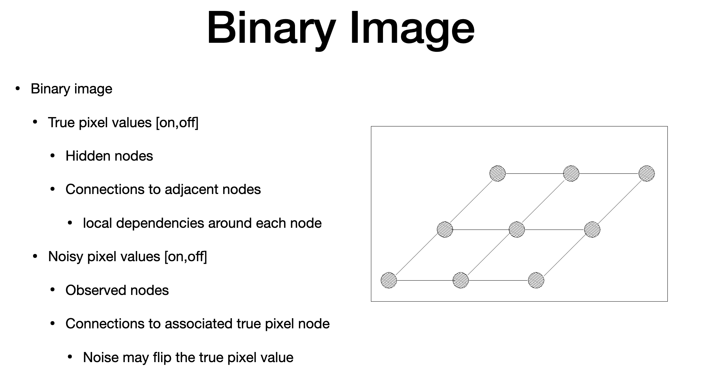
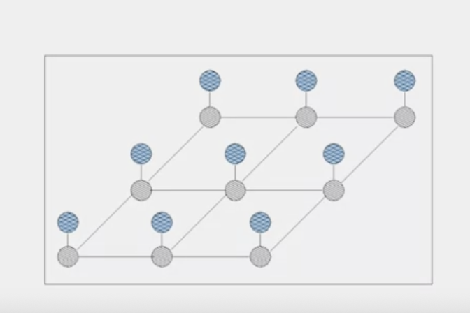
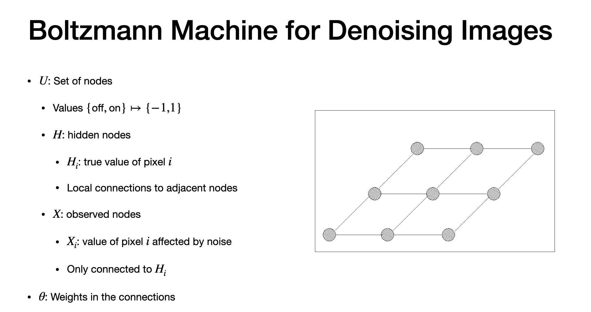
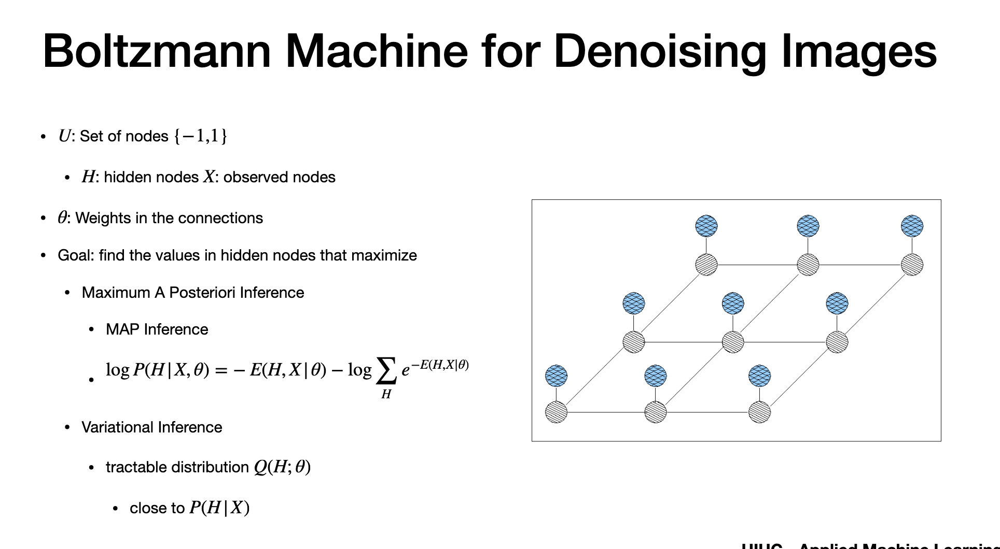
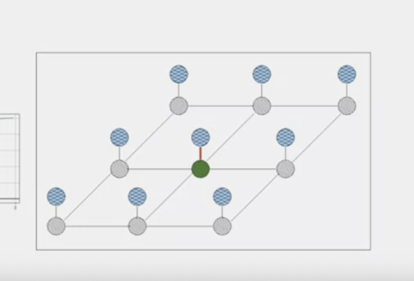
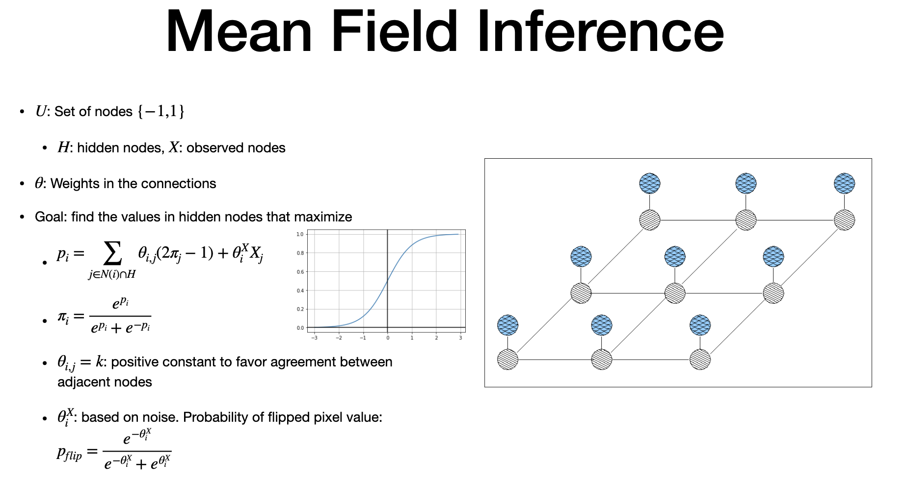
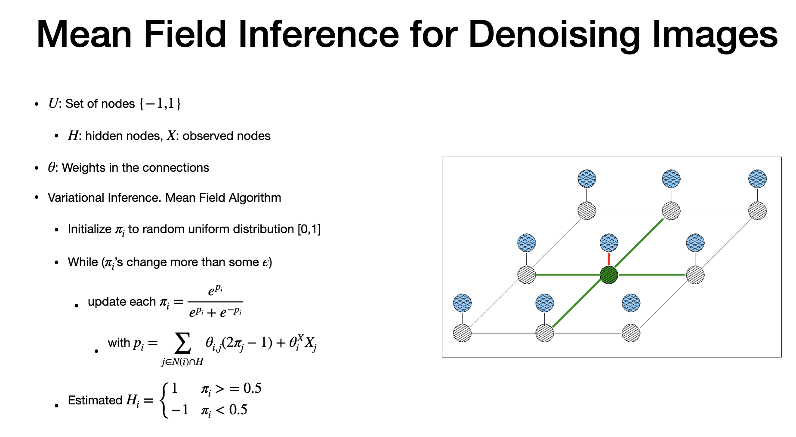

# Mean Field Inference

# Agenda

> - prepare image denosie as Bolztamnn
> - intracable through MAP

# Binary Image

- grey node -> Pixel
- Hidden: 
- They are "true" pixel values - ON or OFF
- Each observation has true hidden
- Hidden is connected to adjacent hidden
- "X" - observed
- affeced by noise
- "Noise" may flip true pixel
- Observed value is "NOISY" version of TRUE(Hidden)  value

> - fig. shows grey hidden connected to other hidden
> - blue is true and connected to  obesrvation

# Boltzmann

- Goal - remove noise
- predict values of hidden nodes
- how? likely value of hidden nodes
- through - Bolztamm machine
- observation depends on "true hidden" value

# Math

> - "U" - set of nodes, 
> - two values possible (+1 and -1)
> - U is split into hidden and observed nodes
> - start with hidden nodes
> - hidden - grey nodes
> -"H(i) = corresponds to pizel "i"
> - each hidden has atmost 4 values (when seen in planar graph)
> - pixel can be influenced ONLY by its neighbour
> - "X" - observed
> - blue nodes
> - each observed has only one connection to hidden
> - weights - theta - edges
> - MAP - if we do that,(used for HMM) - we need to solve negative log posterior - Energy - nodes between all nodes are used - so it becomes impossible to compute - very expensive - intractable
> - we can solve by Optimization - But expensive
> - so we use variational inference (Q close to P)
> - adjust theta to find parameter values of new distribtuon - closely matches "P"

# Mean Field Inference

# Mean Field for Denosing

> - Hidden in green
> - "red' is conenction between hidden and observation
> - parameter is determined through "pi"- sigmoid function - used to find proability of hidden nodes
> - theta can be determined by +1 and -1 for "pi"

> ALGORITHM
> > - Initiaze pi intiial dist. between 0 and 1
> > - Enter a loop , number of iteration or reach equilibrium
> > - until pi with sigmodi function , we can find true hidden value for "X"
> > - we do for all value.
> > - using prob or pi > 0.5 or -0.5, we can find probability of Hidden pixel

---
# The end