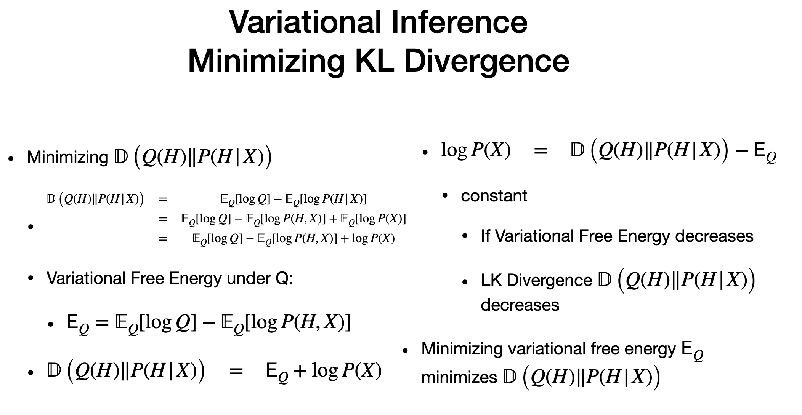

# Difference between Mean Field and Variational Inference
## Similarities

## Differences

---

# Agenda

> - prepare to describe BM (Boltzmann machine)
> - minimize KL divergence (by minimising Energy)
> - heavy math

# Boltzmann - 1

> - prev lectures
> - Stochastic way
> - solve optimisization of set
> - values are -1, 1
> - we use hidden and observe same way
> - some variables are "couple". no independence
> - "N" is neighb our (for green, N=5)
>  edges u(i) and u(j) - density theta ij
> - energy - each node and adjacent neighbour
> - variable are same, coupling is 1 and different it is -1
> - couplign is multiplied by density (weight of the edge)
> > - If weight is positive, sum will increase, energy will decrease
> > - if weight is negative,sum will decrease, energy will increase 
> > - WEIGHT proportinal to SUM | INVERSE to ENERGY

# Boltzmann -2

> - RIGHT SIDE
> - Higher the energy, lower the probability
> - Z(theta) - noramlising constant - hard to predict
> - Hidden "H" that maximised prob of posterior condition on observervation
> -  "Z" disappears as in both num and den
> - MAP inference - vitruvi algorithm - values of H that maximisees posterior P
> - division becomes subtraction
> - Large set is involved. MAP will be time consuming
> - solution is a "combinatory problem"
> - this can be "MAX- CUT" which is "NP- HARD"
> - To solve , we use "Variational Inference"

# KL Divergence

> - we choose "Q" that is close to Original prob "P"
> - find parameter of "Q" and use that
> - KL Divergence (Similarity Metrcs) gives the difference of two distrbution (Q and P) - two dist. are not compared by distance, but by distance
> - "Integral is KL divergence"
> - Some downsides of KL 
> > - Not symmtery
> > - Not triangle inquality
> - Non negative and P and Q are non negative
> - P and Q balance each other, one goes up, other goes down
> RIGHT SIDE
> - We dont have prob "P", we dont know Entropy. But Entropy is a constant
> - Integral is also expected value of Log P
> - prose Model "Q" for random vairable "X", IID samples from "P"
> - this assumption will help solve problem
> - two integral tersm, P and Q

# Variational Inference

> - From L to D
> - Entropy of P is constant 
> - P doesnt change
> - Log of theta and Divergence of P and Q abalcne each other for Entropy of P . Noted by H(P)
> - log likelihood increases, Divergence decreases
> - TAKE WAY - Choosing theta that maximises likelihood is same as minimising KL Divergence

# Minimising KL Divergence

> - minimise KL between P and Q
> - Here "Q" goes first anad then P, Order matters as KL is not a symmetric matrix (PQ is not same as QP)
> - log P(x) - unnwon constant
> - variaional energy p WE(Q) 
> - we replace this variational in divergence equation and solve 
> - similar reasoning as applied is Entropy, if variational energy decreases, LK Divergence (Not KL)
> - next step is to minimize KL Divergence

# Free Variational inference

> - Approx dist "Q" to Hidden variables (1 or -1)
> - Q (i) = product of distribiutuon of all hidden through "n"
> - Q - indicator function
> can select pi or (1-pi)
> - when H =1 , Q = pi
> - when H =-1 , Q = (1-pi)
> - parameters is prob of hidden variable H to be 1.
> - to solve, We consider each terms separately
> - find "q" that minimises variational energy
> - find variational energy,E(q) is product of Q and P
> - use P(i-1) and p(i)

# Mean Field Inference

- find Q that minimized
- associated values are P(i-1) and p(i)
- using Lagrange multiplier
- solve expecatation to solve P (i-1) and p(i)
- solve P(i-1) using P(u) and E(u)
- result is two parts. 1 over hidden nodes and other is (1 over observed nodes)
- When H(i) =1, we get results for P(i-1)
- for minimization, ignore the H
- P(i-1) = P(i)
- we can use single variable
- got the shape of sigmoid function
- allows compute all values of pi
- posiitive values of P, probability of 1 and negative values of P closer to "0"

# Algorithm
- enter iterative process and we iterate every hidden node H
- other hidden values are null
- may take long time to reach equilibirum
- number of iteration can be fixed(but prefered equilibirum is reached)
- then wecan may dist. of hidden. based on sigmoid function
- H = 1, when pi > 0.5
- TAKE AWAY " with new dist, Q..each H is idnetpendent of each other and we use approx and make a tracatable solution" - This is Mean Inteference

---
# The end