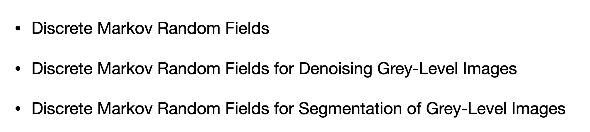
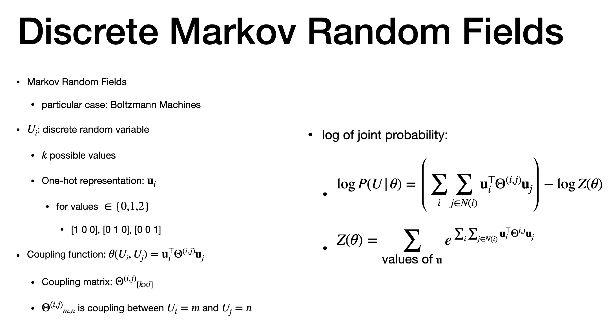
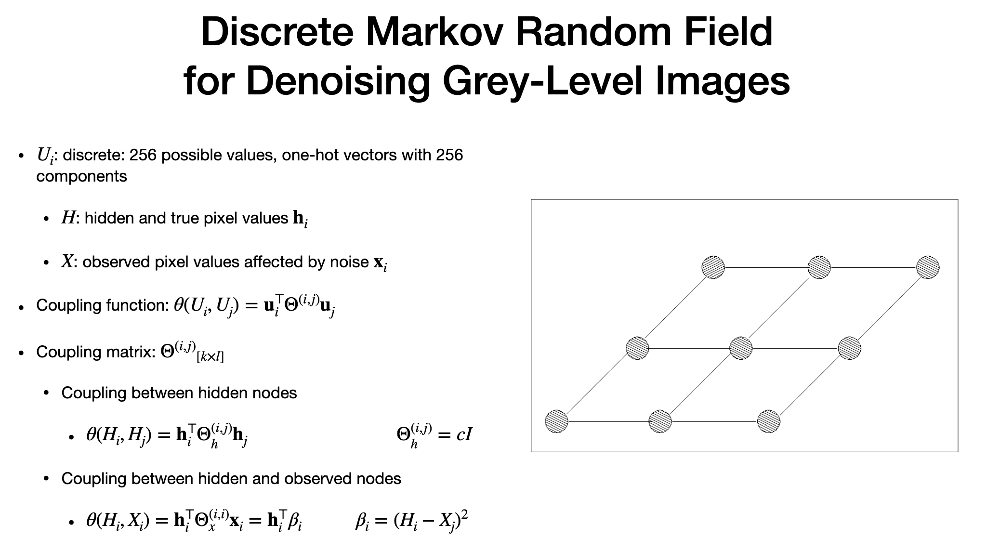
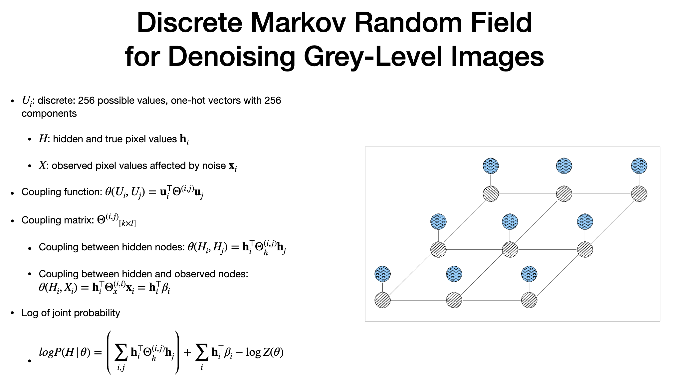
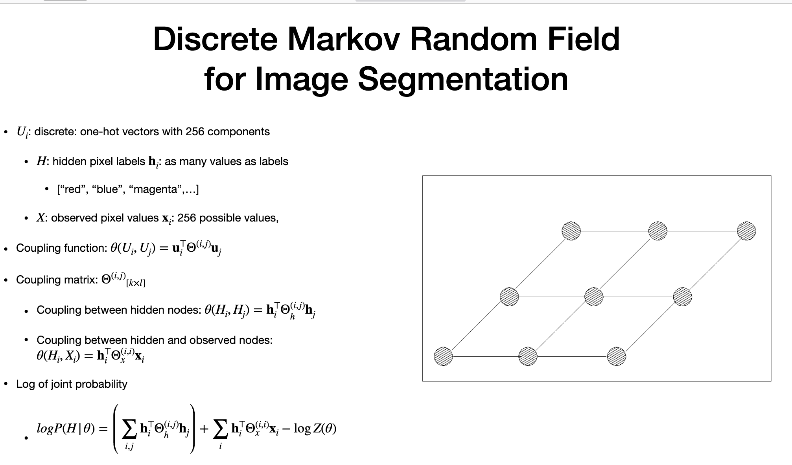

# Agenda

> - discrete markov and connection to bolztamann
> - extend -1 and +1 to more dicreate finite values

# Discreate Markov

> - BM - case of dicrete random fields
> - u(i) - discrete randon variables
> -"k" possible values (BM has only two)
> - "Ui of size k" - can be represented as "One-hot" vector
> -  only one value =1 in hot vector
> - for 0,1,2 values, they have three "one-hot" vectors
> - coupling function - Hi and Hj
> - function of Ui and Uj.
> couplign  weights as folow 
> - product of one hot vector tranpsoe ,
> theta is matrix - stores weights of aall combination of Ui and Uj
> - log(Z(theta) ) = normalising constant similar as BM
> - larger values of "U" , toug
> - "Intractable program"
> - we can apply variational approach as in BM

# Grey

> - Level of grwy
> - each pixel has combination has 256
> - for color, each pixel has one independent bits, ech go go between 0-255
> - Dicrete is build with finding value "U", stored in one > - only one hot vector, one value is true, others are false
> - split into two sets , hidden and observed value set
> - each of hidden - encoded in 'H"
> - each "H" has 4 neighbour (only immediate neighbours)
> - X  - observations - only one hidden value H
> - X is also encoded in one hot vector  (only compoenent associated to X is 1, others are zero)
> - couplign fucntion - theta - matrix theta i and J. (all weight all combinations)
> - two coupling function (a. hiddena  and other neighbour | B. hidden and neigh our)
> - z when different. positive when same
> - constant  * dientity matrix
> - b. only one hidden and obervation - it becomes distance between two vectors
> - hig cost when distance is larger
> - log of prob - maximum is goal
> - we can use variational inference

# Grey level - 2

# Image Segmentation

> - Image segmentation - segment regions of image that are similar
> - red regionm , blue region
> - we need to associate label to each region
> - split "U" into two 
> - 1. set of hidden label
> - 2. set of observations
> - label can still be planar grid
> - label - only influenced by immediate neighbour
> - X - simikar to noising - each label associated to mahy pixel
> - Couplign and log are same as denoising

---
# The end