# Page 353

# MRF Intro
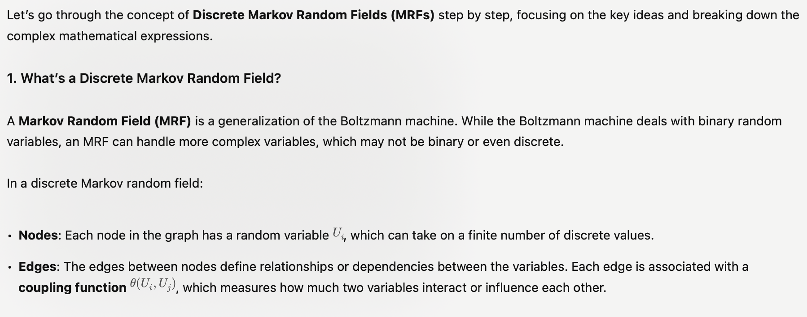

# One - Hot Vector

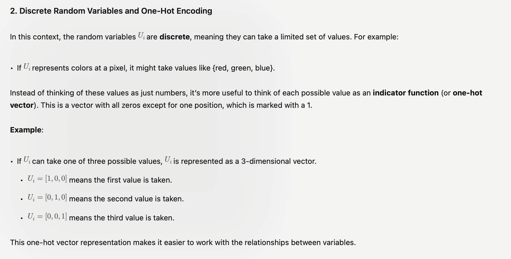

# Couplign
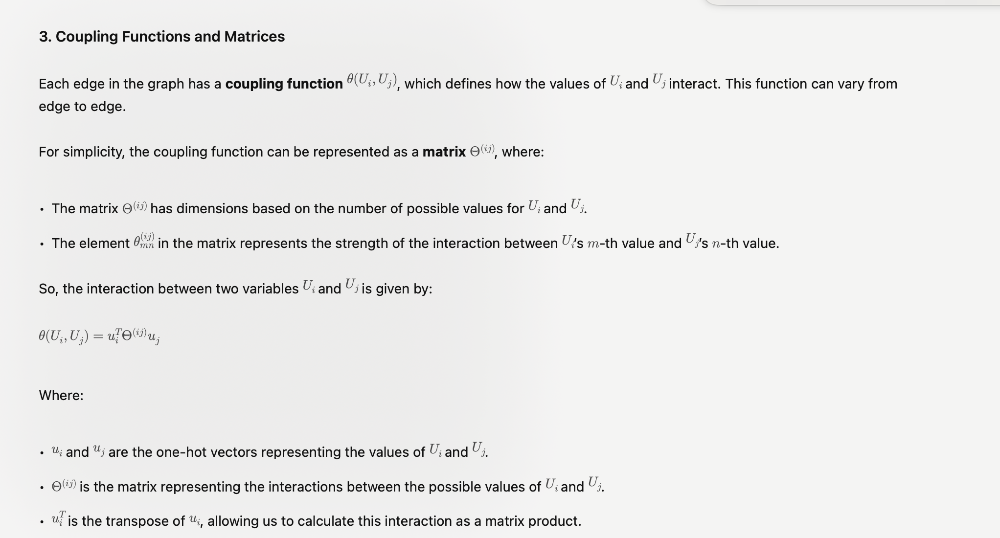

# Join probability and Normalization

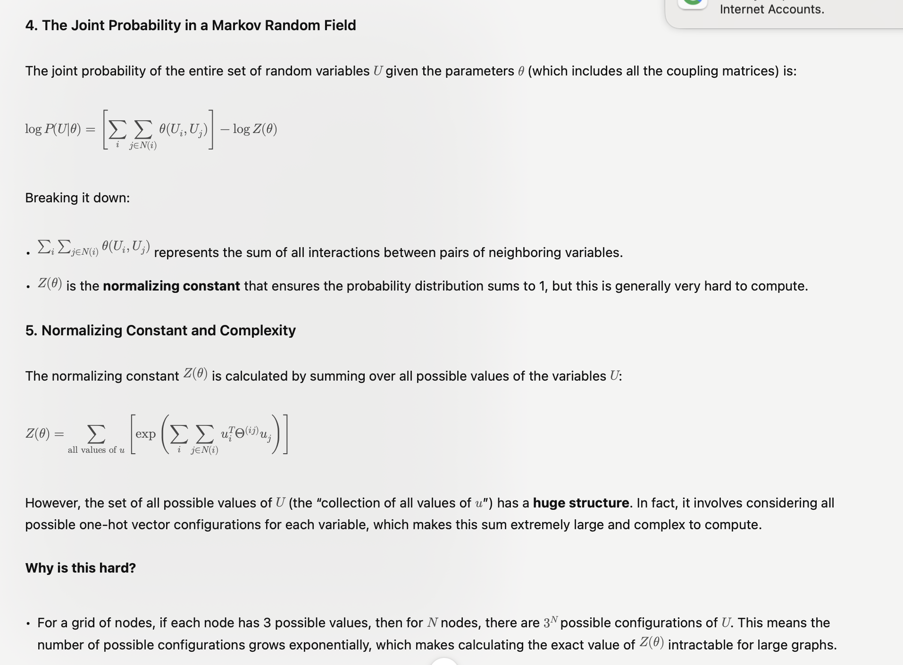

# Summary and Challenges
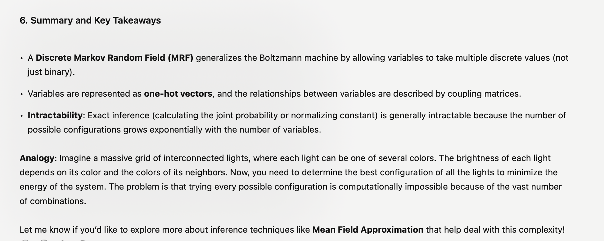

---
# More on Denoising with MRF
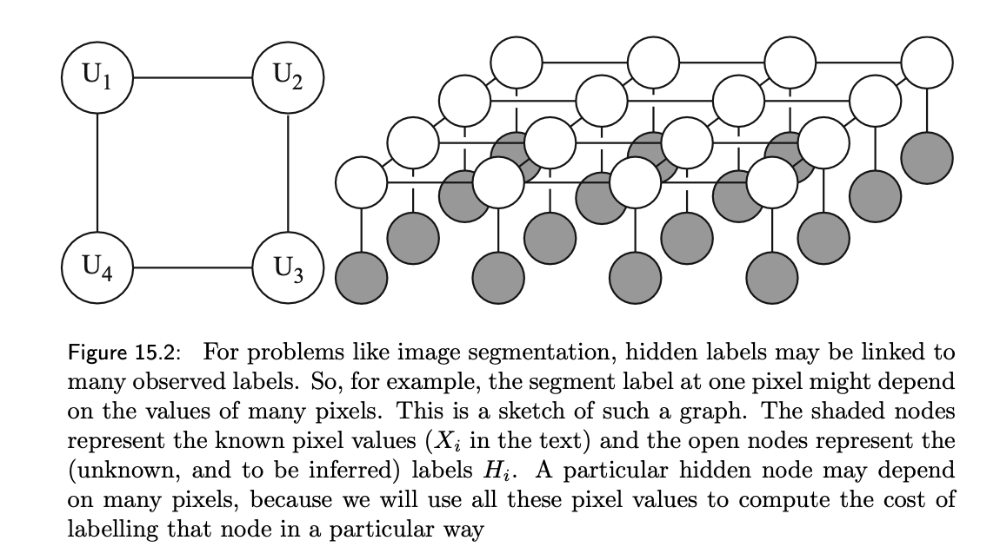

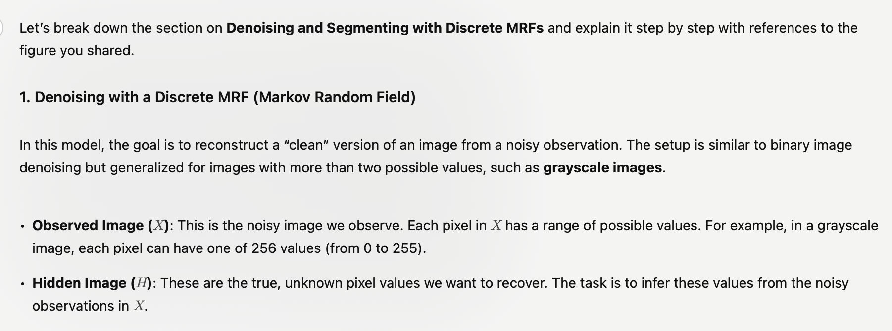

# Structures - link and components
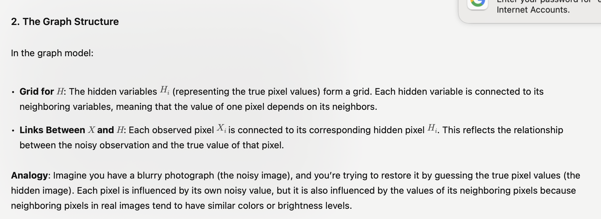

# Math

# Intractability
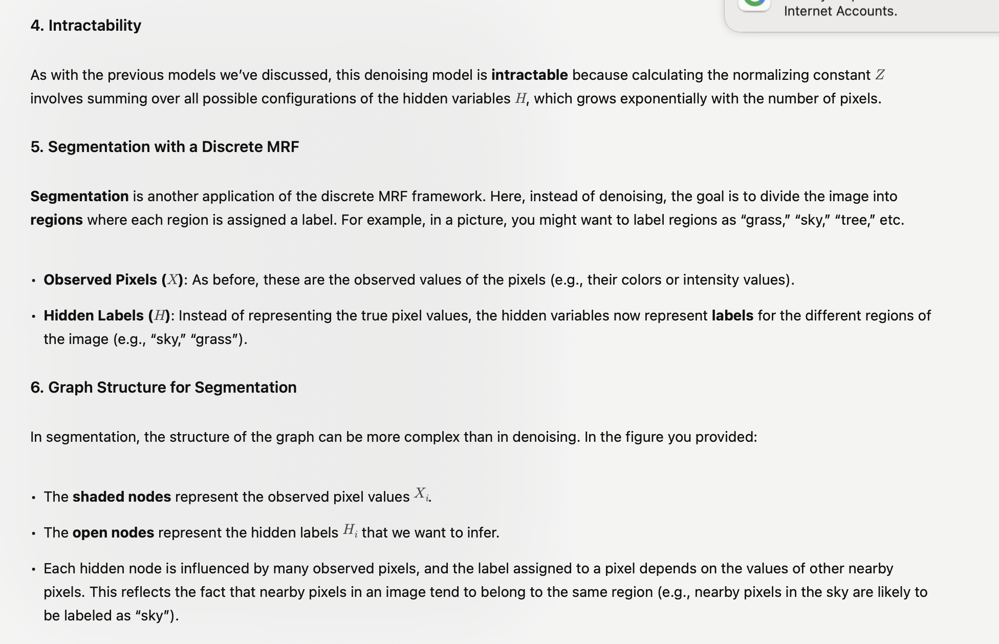

# Segmentation/Labeling
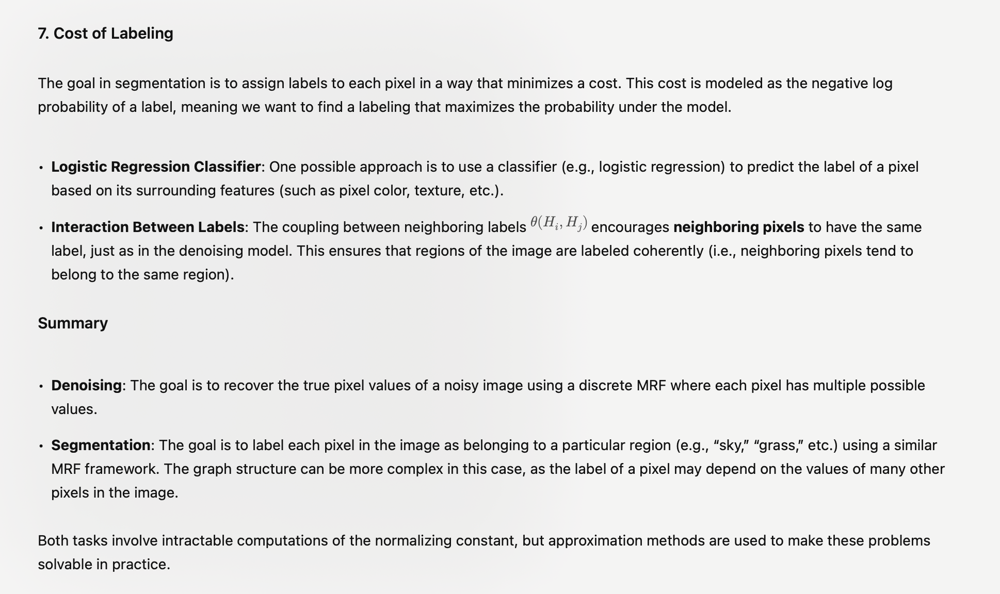

---
# Why MAP and Gradient is not useful?

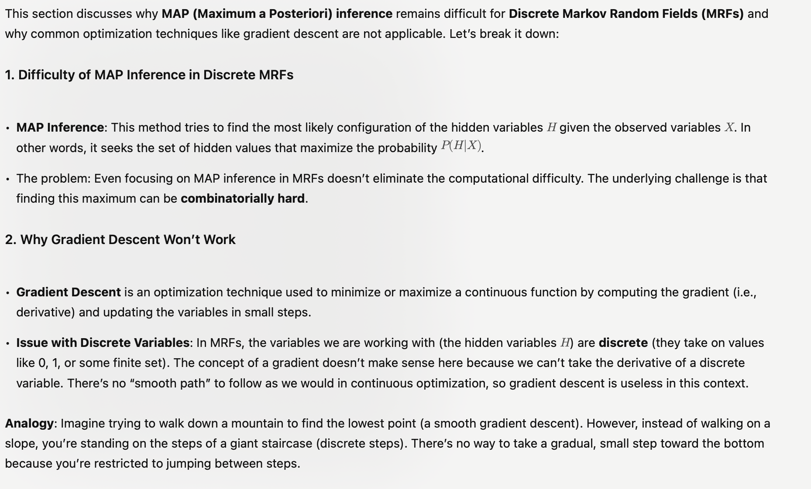

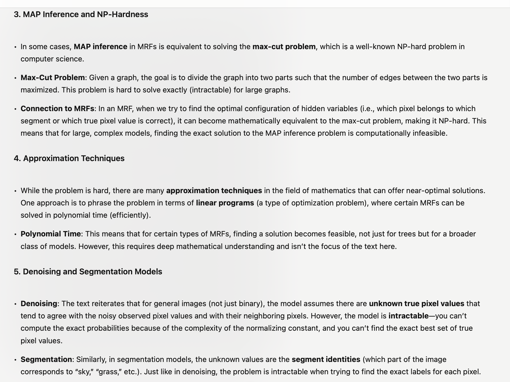

# Summary
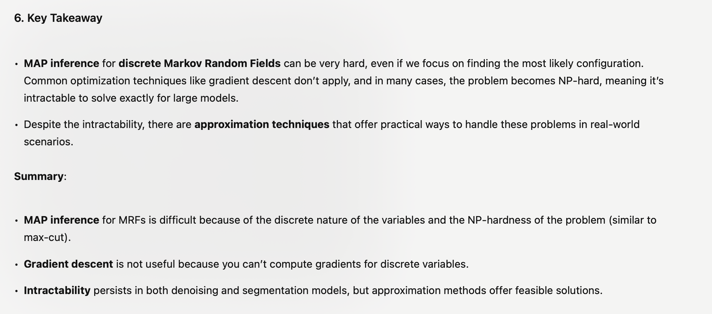

# The end