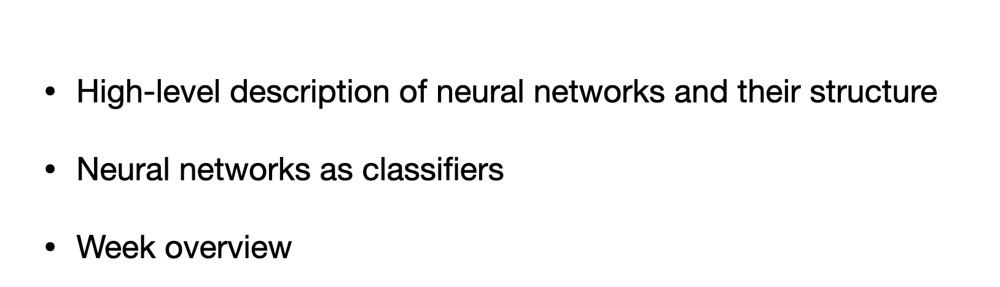
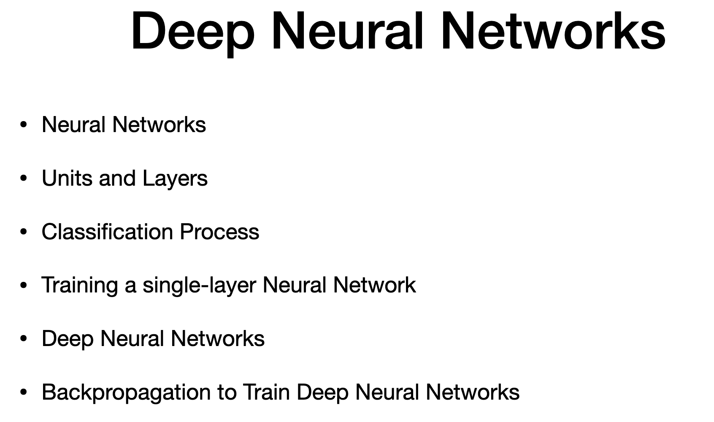
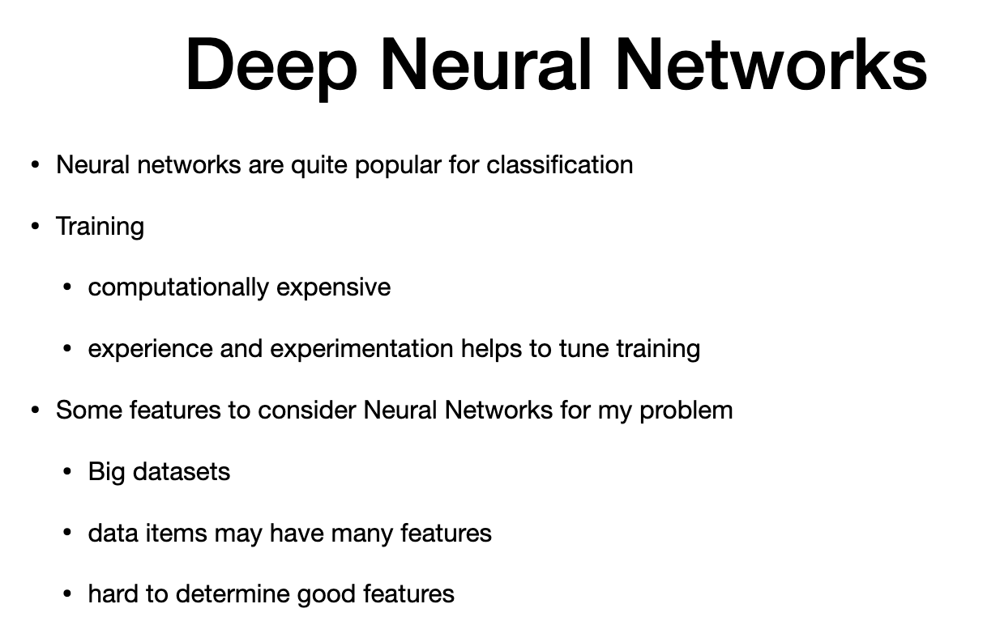
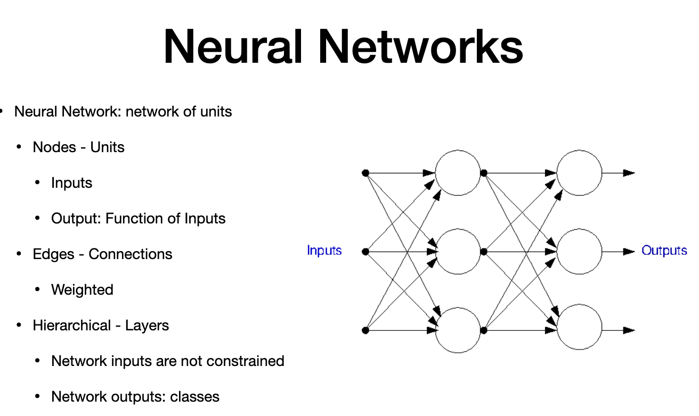
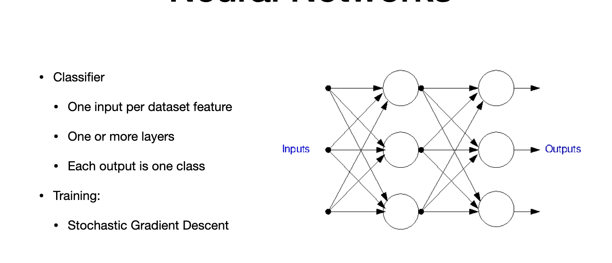

# Deep Neural network

# Agenda

> - desctiption of lectures this week

# 2. 

> - components - units and layers
> - how used in classification
> - cost function during triaining. how to determine gradient
> - extend to multiple neural network

# Uses of Deep Neural network

> - usage:
> - image processing
> - expensive training
> - lots of experience
> CONS:
> - big dataset
> - many features , not clear when features are useful and what arent
> - non linear combination of features

# Components

> - Nodes = neuron = mimic real neurons
> - we call "Nodes" as "Units
> - network of units - as graph
> - Inputs = weighted 
> - output -function of inout . many times non lin ear function
> Edges = connection from output from unit to other unit
> connections are weighted
> some inouts are external
> arranged in hierarchial structure with layers
> - inputs = not constraint - continuous or discreet
> - number of layers = no constraint
> - output of layer is input to second layer
> - OUTPUT of whole network is "CLASSES" - recognize classes

> - Classifer:
> > - several layers
> - each output is one class
> - trained through SGD 
> - semi supervised
> - key features are learned in unsupervised way and outputs are learned in supervised way
> - first proposed by 1940,after development of perceptron - neural network got to foot..in 2012, it showed improvement in image classification. thats when usage exploded.

---
# The end