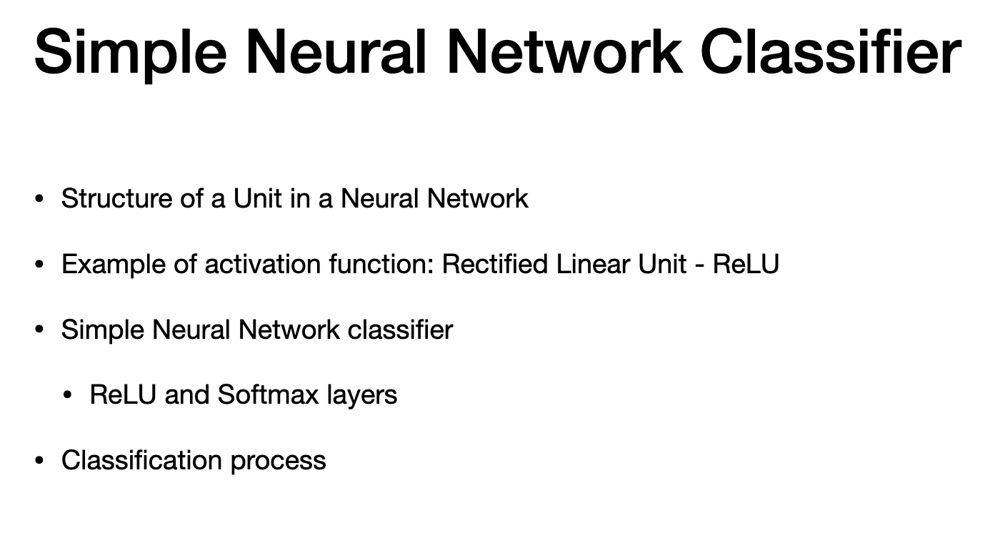
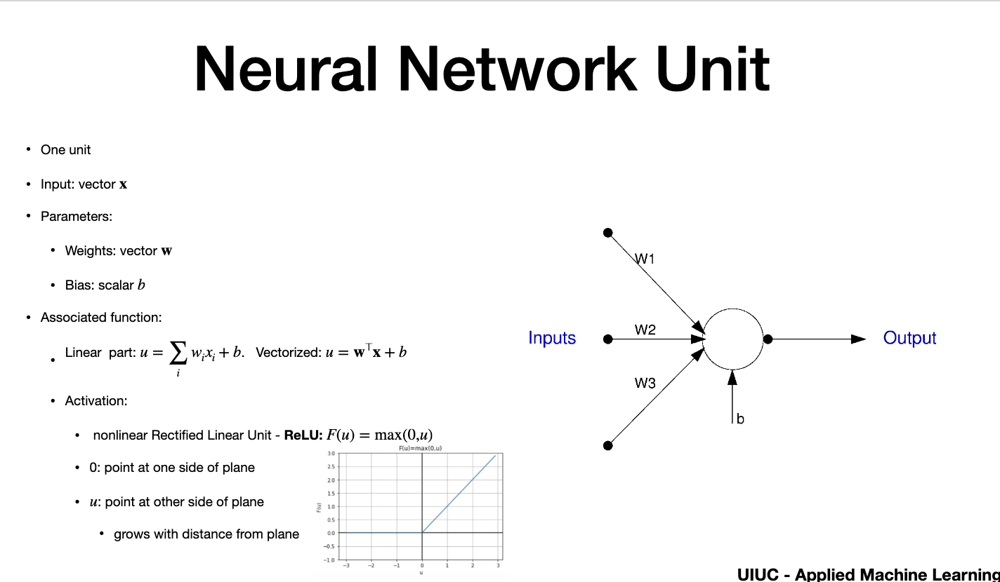
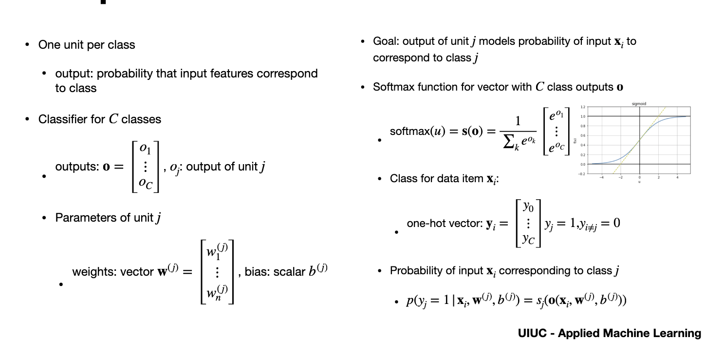
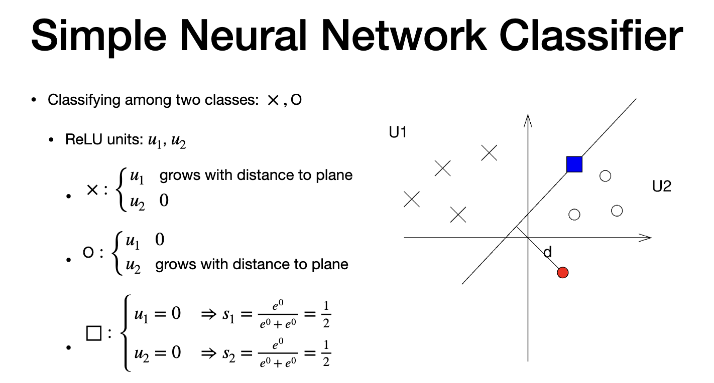
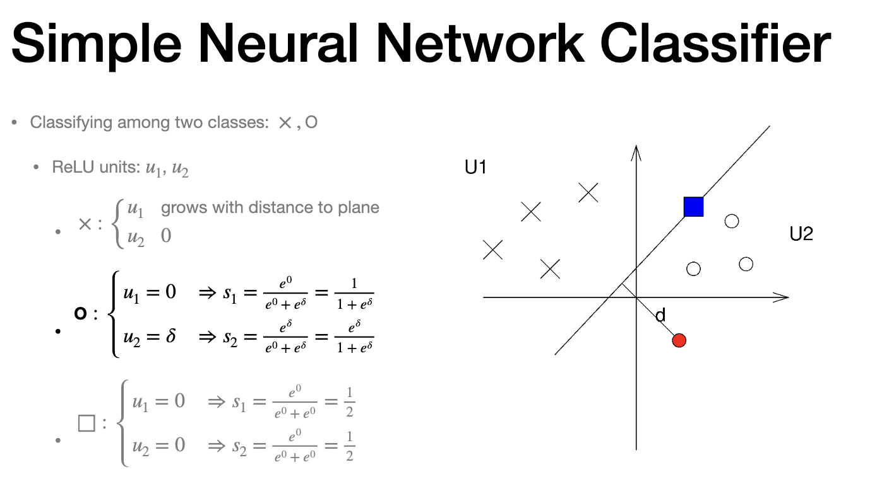
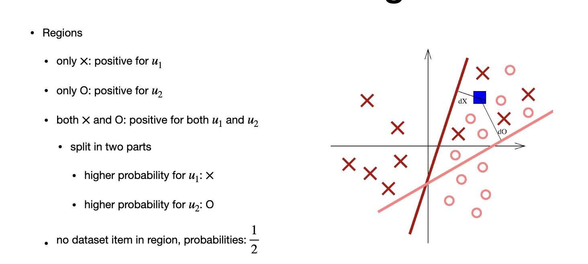

# Simple Classifier for Neural network

## Agenda

> - ReLU (Rectifiieed Linear Unit)
> - units into single layer ReLU network
> - softwar layers
> - then classification

# Unit

> - inout = vector of inputs 
> - 3 inpouts
> - inputs has weight (w)
> - parameter w is multiplied by parameter
> - Bias "b" is added later
> - function = linear 
> - Vectorizewd form = we use vector transpose * inputs + Bias
> - activation part = uses scalar "u" that results from linear part
> - this Non Linear function. max between 0 and 1
> - ReLU - Rectified Linear Unit
> - max(0,u)
> - Linear comb = neagtiove, output is ReLu =0
> - poisitive then results is copied to output
> -is inout is co-ordinate of points, plane vs. linear euqation . Its the same
> Positive output - grows with input point of the plane
> - same as SVM Hinge loss - boundary more complex with more unit

# Simple Neural network Classifier - 1

> - each unit is one class
> Each unit with output probabilty of class associated to that class
> - If we have 3 class, we have atleast 3 units
> - C classes
> - outout is vector "O"
> - One weight per inout (for vector W)
> - scalar B for bias
> - "unit j" = inout vector x that corresponds to j
> - softmax function = generalizess to higher number of variables (variational inference)
> - balance prob disctribution with softmax
> - each vector is between 0 and 1 and sum of all components =1
> - plot = one case - fucntion saturate for large negative values and saturdates at 1 for large positiuve values
> - One hot vecctor "y" - has c components, 1 per class
> - if y belongs to J, then y(j) =1 , others are zero

# Simple Neural network Classifier - 2

> - two clASS, X and O
> - U1 and U2 are units
> - X is recognized by "u1" that grows with place and "u2"=0 (vice versa for "O" class)
> - for sqaure, both output are zero
> - for squaren , both ReLU has equal probability 0.5
> - same unit, usually one is set as default for tie-breaker> - Red c

# Simple Neural network Classifier - 3

> - For red circle :
> - "unit1"=0 and "Unit2" = "d" distance
> - so red is labeled as "U2" (softmas is larger for u2 than u1)
> - softmax balances probability - sum =1
> - simple case is similar to SVM
> - two units has same boundary line (not genral)

# Classificaition Region

- each unit has different splitting line (more realistic)
- - red is boundary fo 'x"
- pink is splitting for "o"
- region where only "x" and region with only "o"
- positive value output for "u2" if in region with only "0"
- There is region in middle with both
- positive reLU for U1 and U2.
- points closer to red is more likely "x" and points closer to pink are "o"
- slope of boundary depends on weight on the input
- If weights of splitting line is equal, then "blue square" is "x"
- No point in low corner (0.5 for each units)
- they are NOT LINEAR, NN is PIECEWISE LINEAR