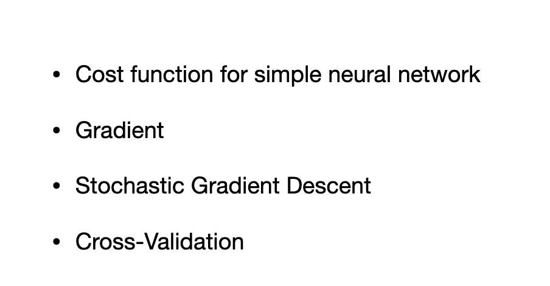
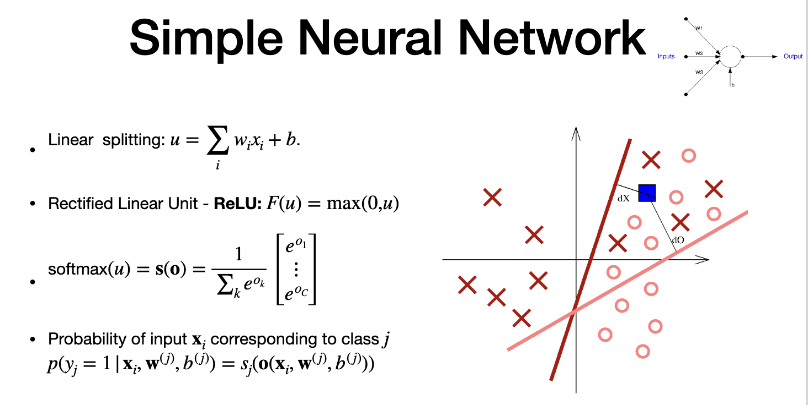
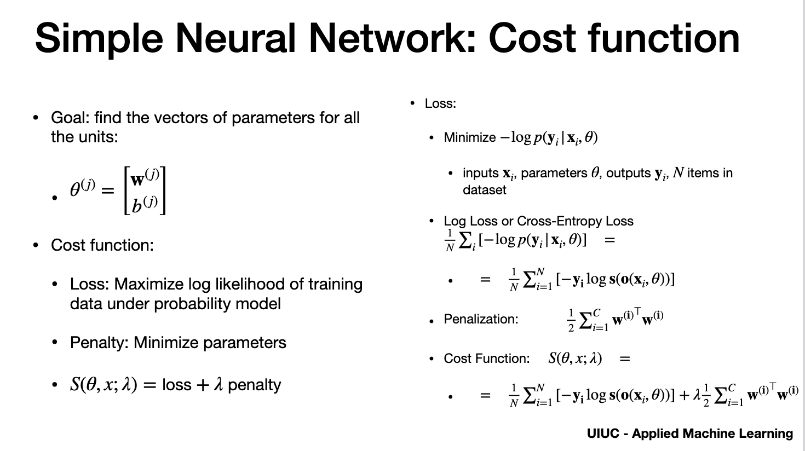
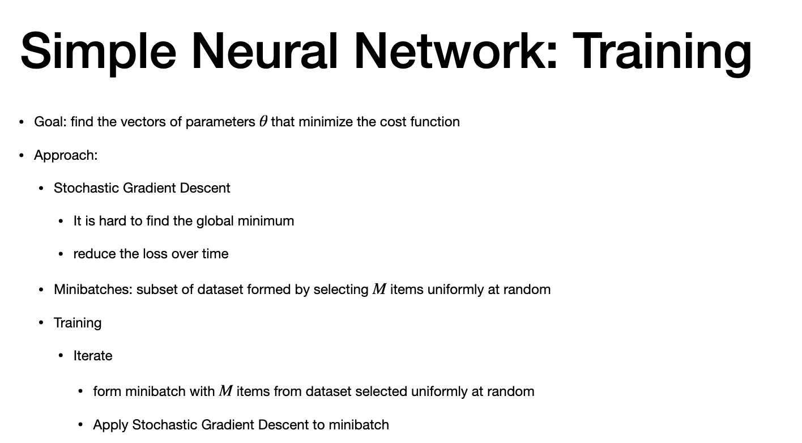
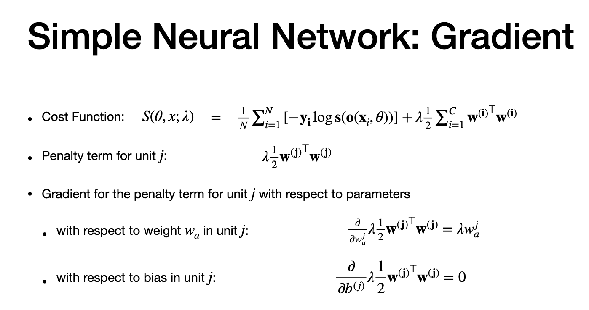
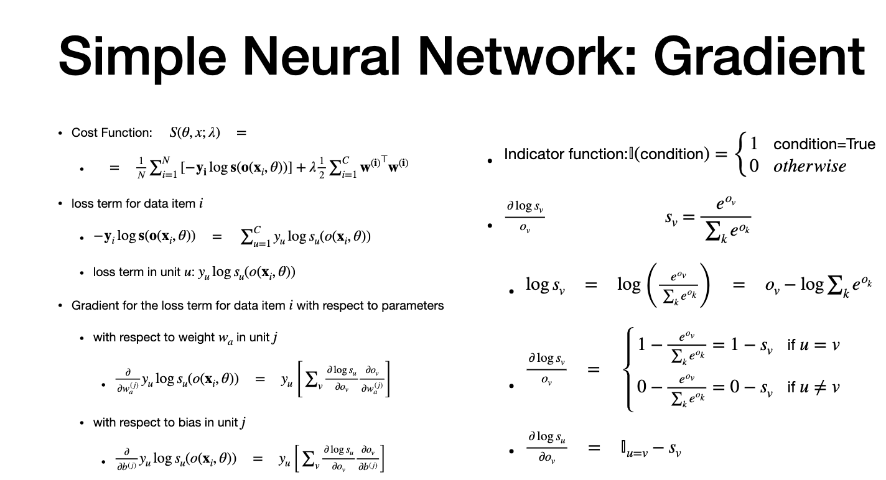
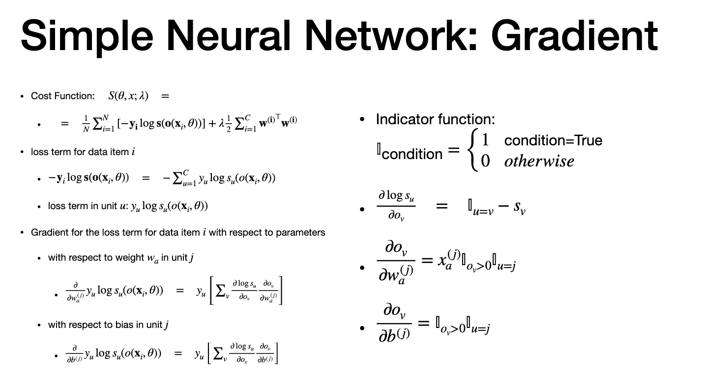
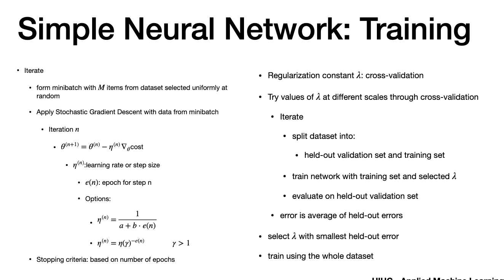
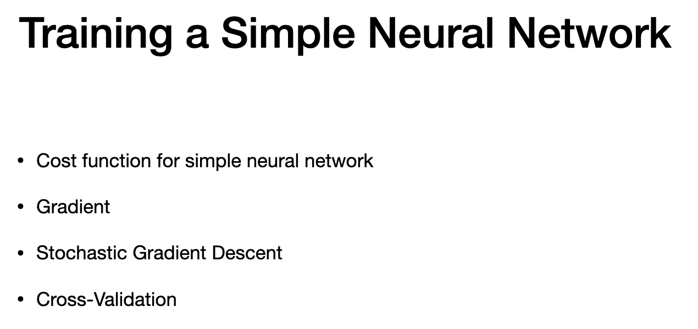

# Agenda

> - trining neural network
> - min batch SGD to train - to find parameters
> - apply cross vaolidation for regularization

# Simple Neuraal network

> - recap
> -Relu - for splitting
> - softwmnax- balance prob for units
> - we get piecewise linear

# Cost

> - training classifier - needs to find vector of paramerters - theta
> - theta - vector of parameters of unit "j" (weight and bias)
> - cost should achieve 2 goal
> - max log likelihoood (Loss term)
> - minimize parameters (penalty term)
> - LOSS TERM (Log Loss,Cross Entropy loss)
> - right SIDE
> - each unit - we want to min. negative log - under prob 
> -  Avg. loss of negative log
> - normalising by size of dataset will ensure the results dont depend on data set
> - one hot vector (y) - used as indicator vector
> - PENALIZATION
> - minimize size of parametrs - so we penalize large weigths

# training

# Gradient -1

# Gradient -2

# Gradient -3

# Training

# Recap

