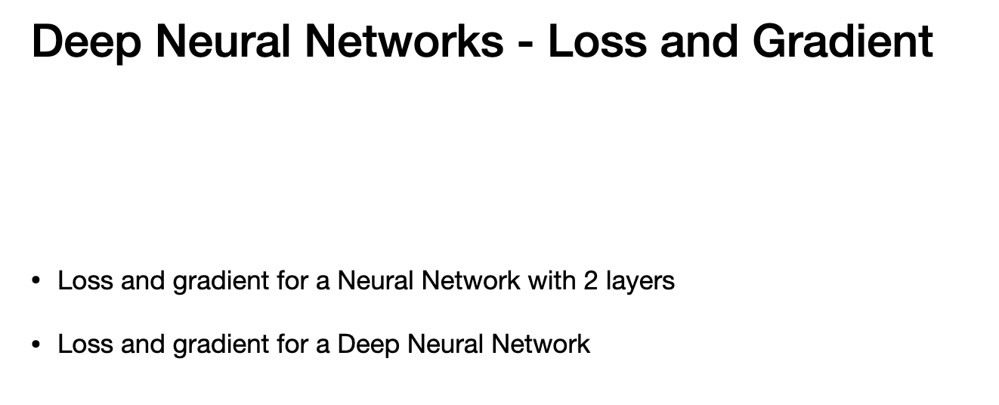
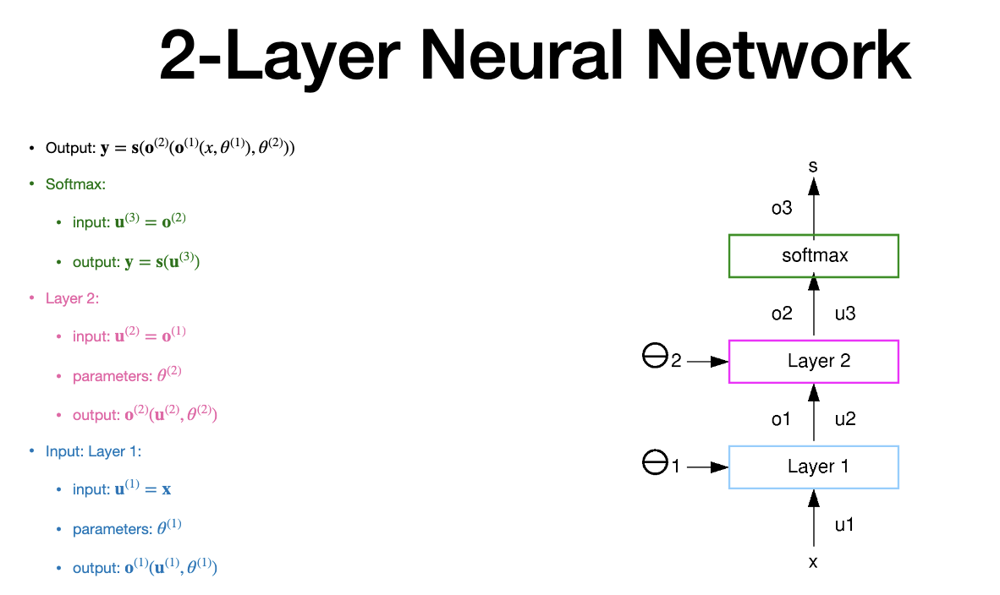
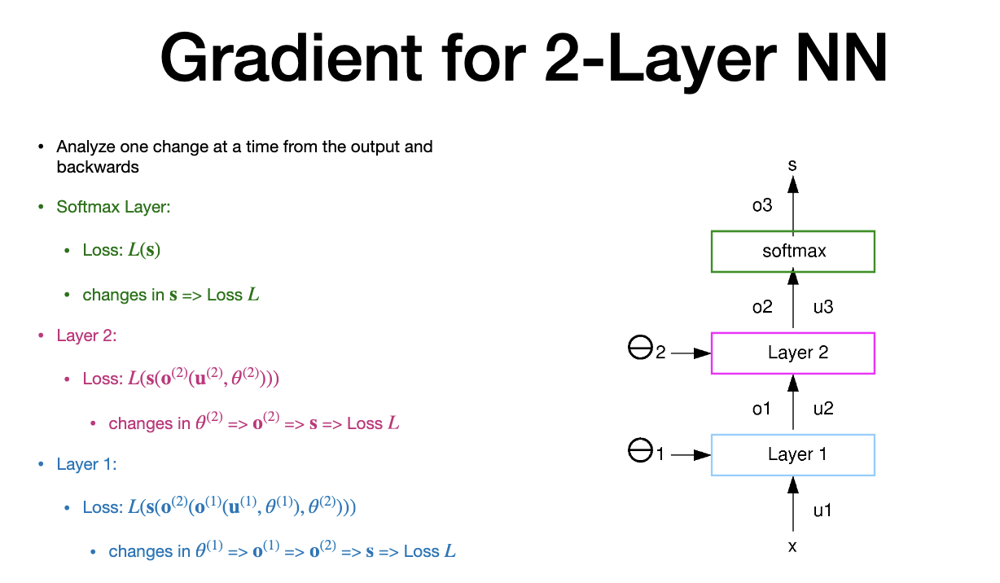
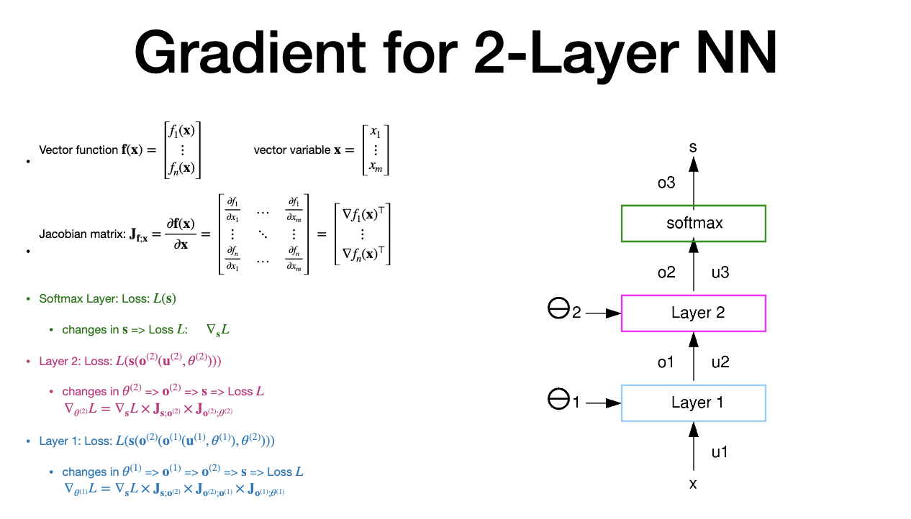

# Agenda

> - extend form 1 layer to multiple layer
> - loss and gradient for 2 layer and multiple layers(jacobians)

# Multiple layers

> - paramter - left side - theta
> - inoput and parameters used in linear combination
> - 1 layer is Linear + second is ReLU activation
> - enclosed in one layer
> - useful in computation of gradient
> Linear:
> - comoutes linear function using inputs and theta
> - second part if ReLU - activation function
> - two above are enclosed in layer 1
> - softmax is its own layer
> - output of softmax is output of the two layer network
> LAYERS - input, hidden and output
> any  number of hidden layer is possible
> sometimes input and output layer can be same
> - each layer can have any number of units, independant of the inputs
> - between layers, there is connection
> All inputs connected to ALL units - called "FULLY-CONNECTCED NETWORK"
> - **Abstract** - 
> 
> input = u | output =0
> o1 = u2 (output of 1 is inout to 2)
> 

# 2-Layer Neural network

> -  softmax - green 

# Gradient for 2 Layer Neural network -1

- Analyze one change at a time
- decompose starting from output and then back track
- we change one thing at a time to find Loss and move downwards to inputs
- when theta changes, output changes, then prorpaogates iteratively

# Gradient for 2 Layer Neural network -2

> -  Before chain rule application,consider jacobian
> - Jacobian is matrix  (J)
> - defined on F(x)
> - matrix holds first derivative
> - matrix with "n" rows, "m" columns
> - then apply chain rule to jacobian
> - parameters includes connection weight and bias
> - same as prev. slide
> - here we use Jacobian and derivative

# Multiple Layers -1

> - network with many layers is deep network
> - Loss = average of Loss + regulartization
> - output is function of porevious layer output and parameter
> - Note -the gradient of Loss(Nabla L) is dependant of gradient of Loss (prev. stages) + Jacobian of current step + jacobian of prev. steps

# Multiple Layers -2

> - 
> 
# REcap
