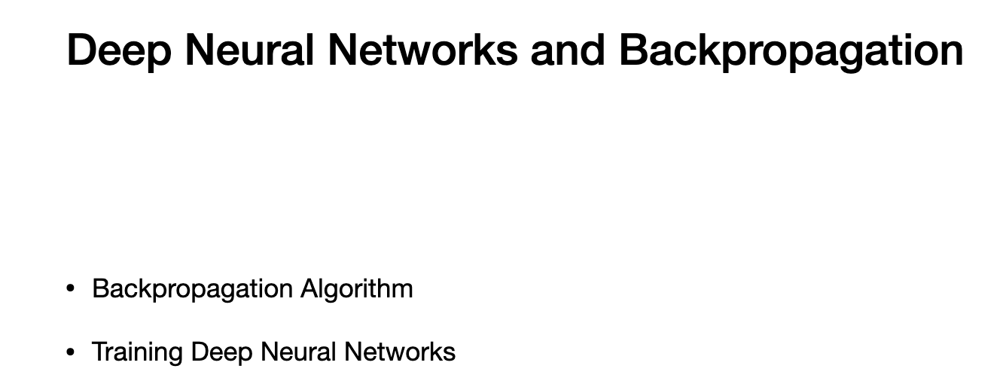
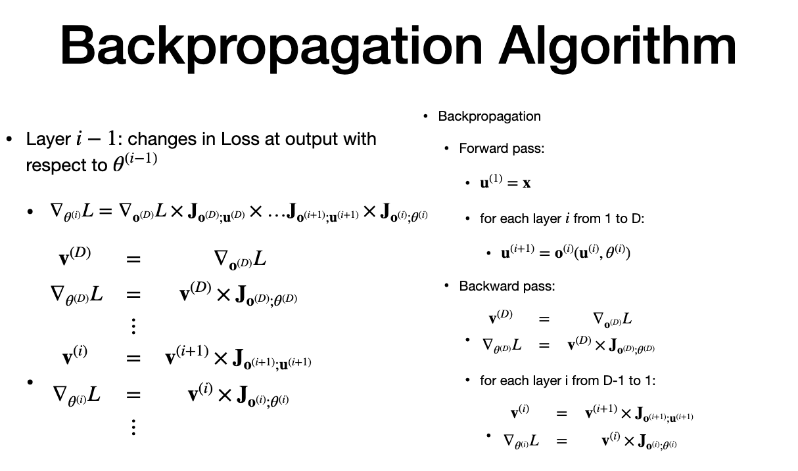
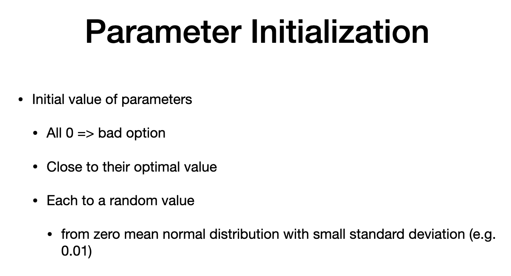
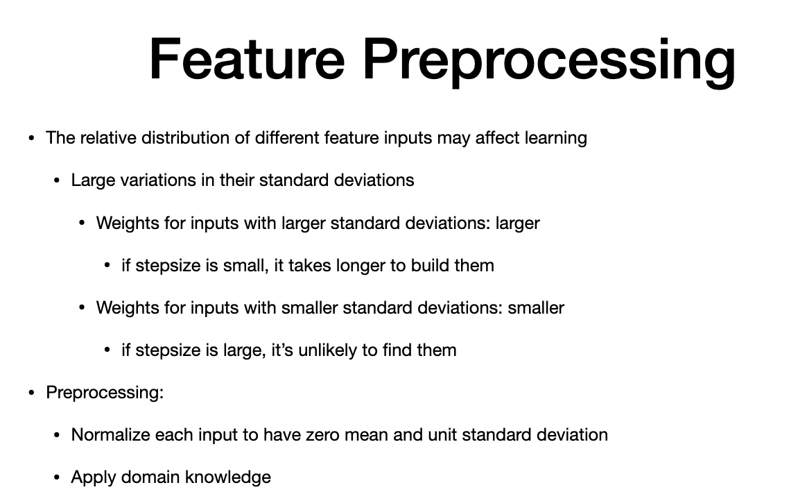
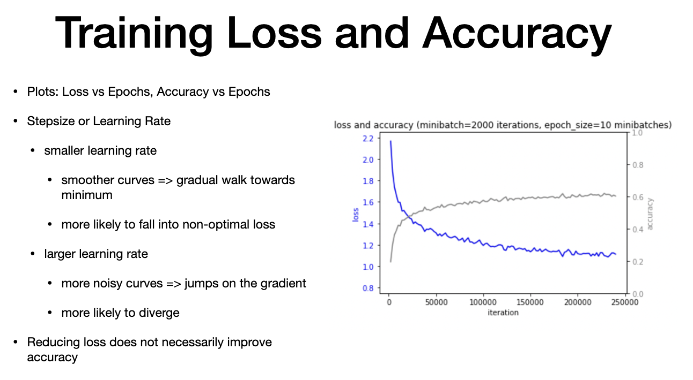
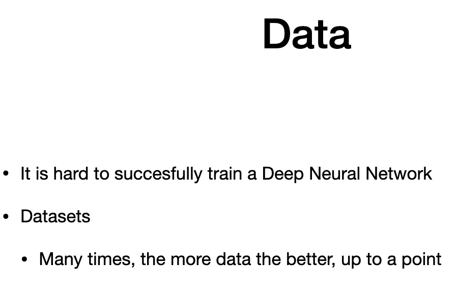
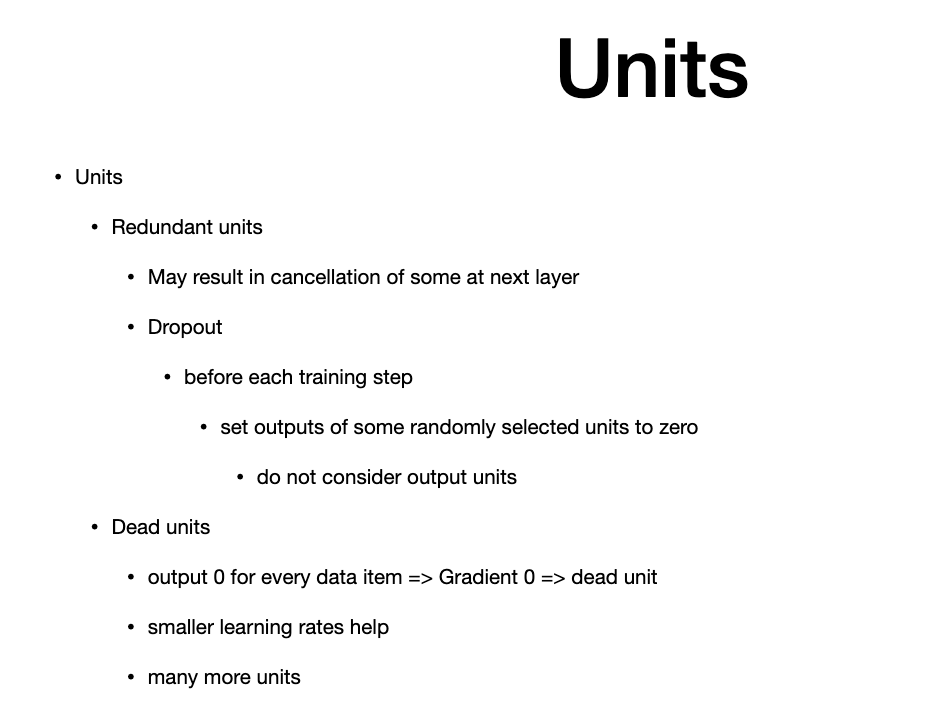
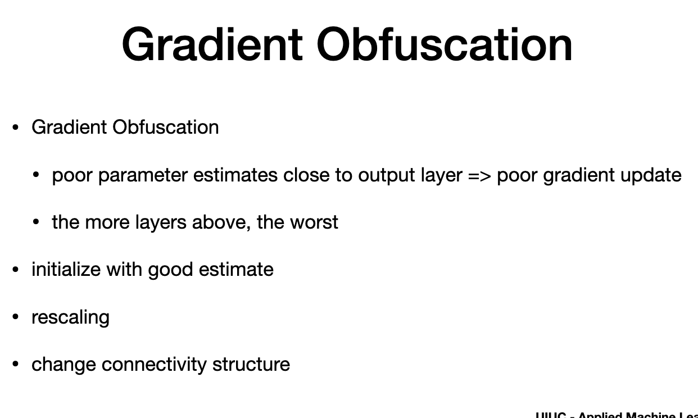
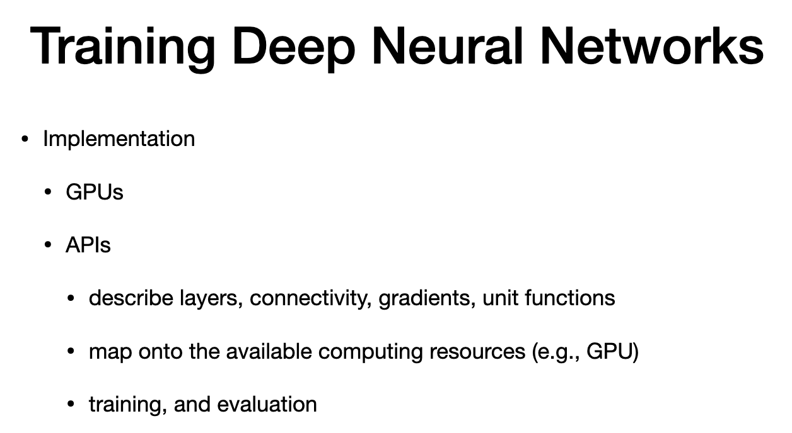
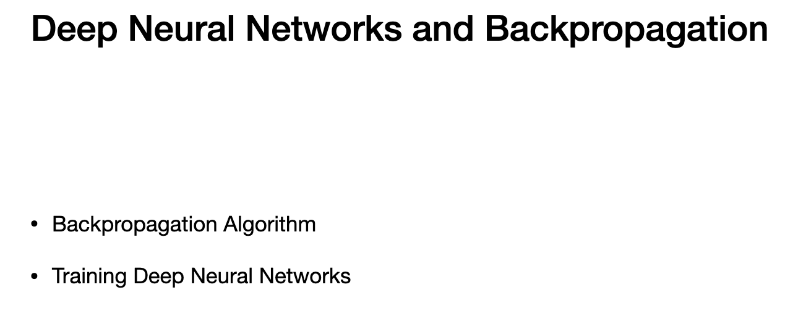

# Back Propagation

> - Deep NN and backpropagation
> - lkeep in mind -loss, accuaracy, parameter initialization, data, implemention in pratice

# Algorithm

> - recap
> - Loss nabla = upper to lower layer 
> - using v(i+1), compute v(i)
> - backprogation - 
> > - forward pass
> - starting from input and then move forward to output layer
> then backward pass - start output layer and then move toward inout layer
> - there is also convolutional layer latr
> - derivatives are based on parameters and inputs
> - then these derivatives are put in a jacobian matrix

# Parameter Initialization

> - for first minbatch
> - intial value impact speed and viability of training
> - if all parameters is 0, gradient =0 , means all inouts are blocked , as weight are zero, no bias
> - close to optimal to reach convergence
> if no inputs, we starrbwith random with smalls td. deviation 0.1
> 

# Feature Preprocessing

- input can be cont. or discrete
- if weights are initialiaed at small values,
- input with larger std. deviation larger weights.
- input with small std. dev, learning needs to have small weights and stepsize is larger
  

# Training Loss and Accuracy

> - training evalatued using epoch vs. accuracy or epoch vs. error
> - loss recuces fast and stabilisze around around 1.1
> - accuracy is grey - right y-axis
> - accuracy starts low and stabilizes around 60% (0.6)
> - diagonse learning rates 
> larger learning curves - more noisy curves - lead to training not to converge to good solution
> - so small lurning rate is preferred
> - right learning rate - by quick improvement followed by slow and steady improvement
> - loss can be improved by improving prob os right class(when comparing two models)

# Data

> - usually hard to training NN
> - more data is good for NN(up to a point)

# Units

> - there is redundancy in network
> number of units that produces same output 
> - so subsequent units may consider one and ignore others
> - "dropout" - method to give consideration of ALL units in the network
> - in dropout , some random selected units are made to zero
> - reweight others and take the step
> - we donot consider units in putput layer
> - train with some input being zero
> - "Dead units" - zero output for every input
> - prevented through lsmaller learning rates

# Obfuscation

> - parameter close the output are poor
> - graident donot help improcce perfformance
> - more stacked on top of bad layer will be more proiblem
> - POrevent -- initialize with good estimate
> - reschaling
> - change the conenctivity

# Training Neural network

- Grphic processing unit - due to parallel architecture
- most common practive - using API or tools that hide internal layer and graident computation
- progranmmer gives abstract descriptuon of the program
- trains network and evelaute
- several popular environment- some used in the assignment

# Recap

# The end