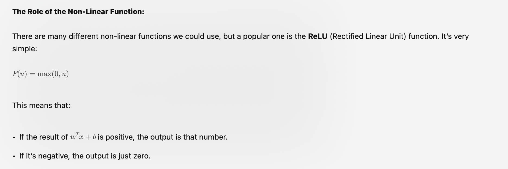
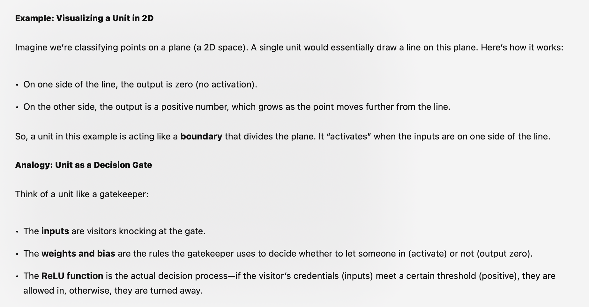
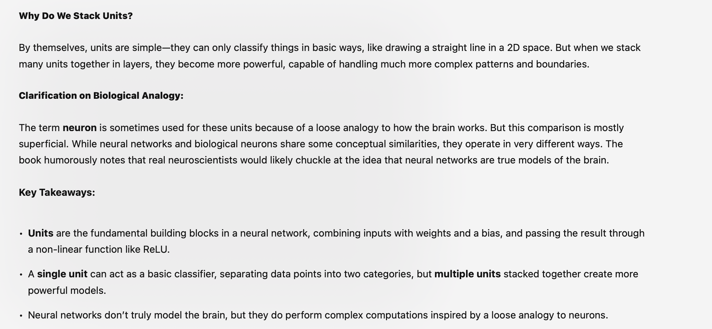
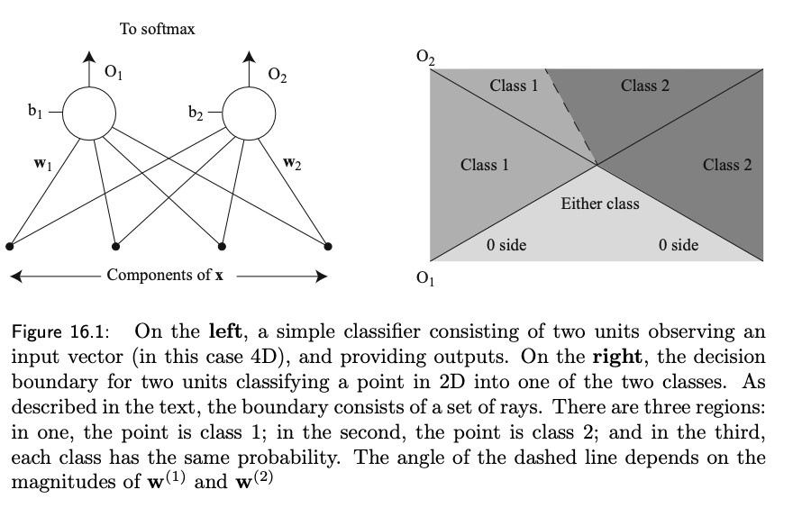
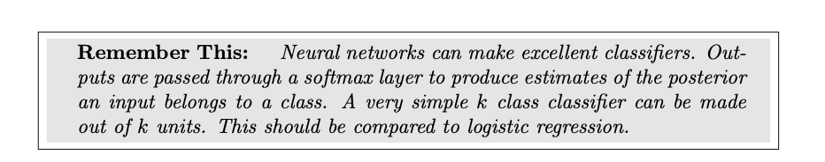
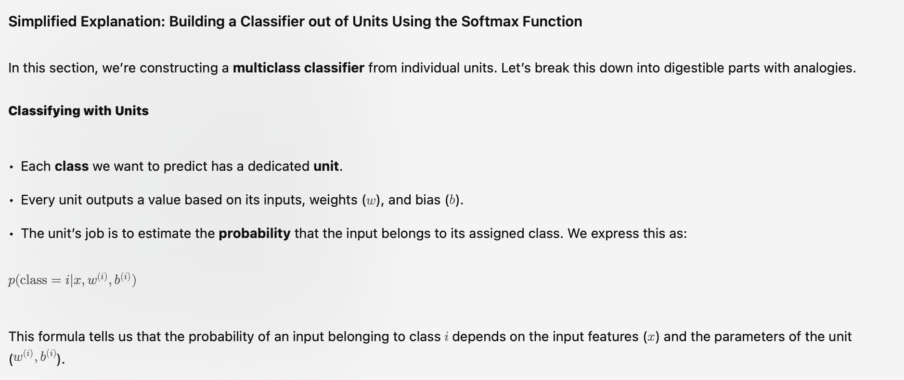
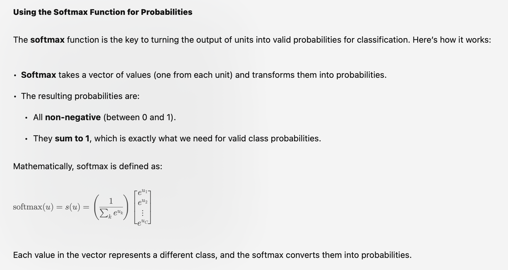
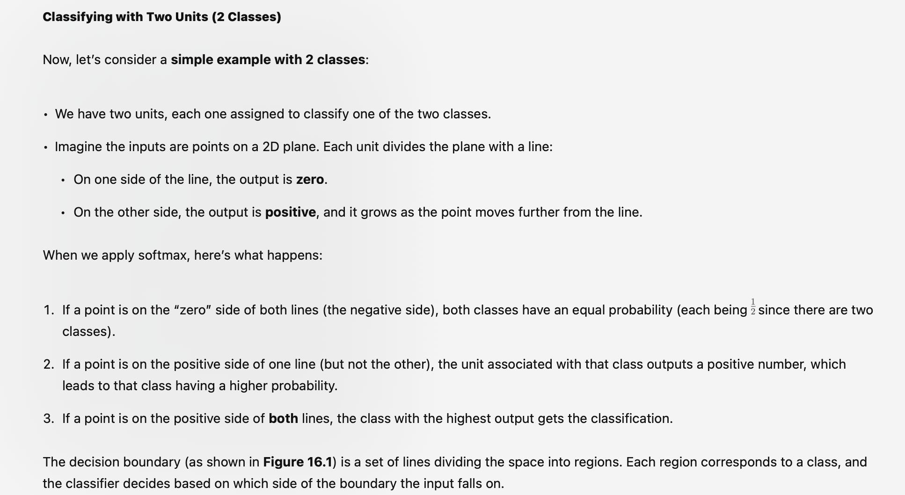
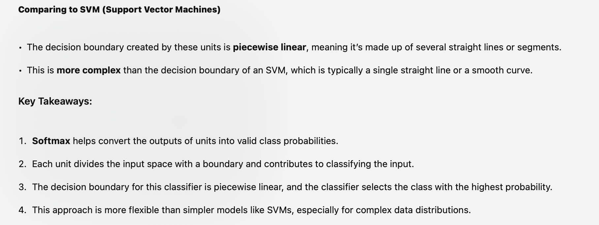

# Buildign Classifier of units - using Costs
 ### Page 367

 # Basics
 

# ReLU Math

# exmaples

# Why stack units

---

# Using Costs
#  from Book

# Notes

# Softmax

# 2 class classifier

# vs. SVM

