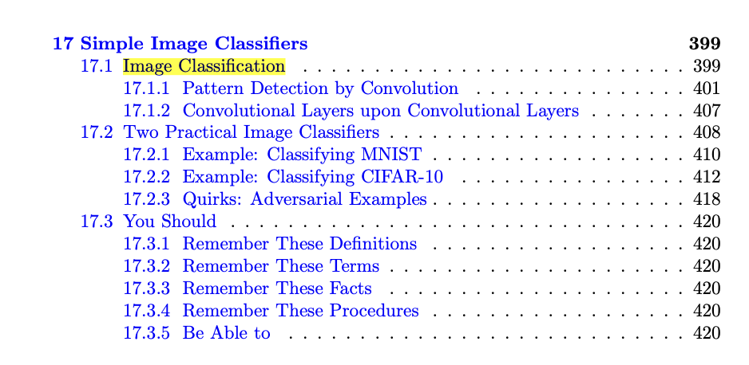

# Textbook References

Generally, the AML textbook's Chapter 17 on Simple Image Classifiers (Pages 399-418) covers this week's topic.

Specifically, see the following section breakdown for each of the lecture videos:

**Lec 13.1 **Convolutional Layers - Section 17.1 Image Classification (**Pages 399-408) **

Lec 13.2 Convolution for Images - Section** 17.1** Image Classification **(Pages 399-408)**

Lec 13.3 Convolutional Layer - Section **17.1** Image Classification **(Pages 399-408)**

Lec 13.4 Convolutional Neural Networks 
- Section **17.1.2** Convolutional Layers upon Convolutional Layers, 
- Section **17.2** Two Practical Image Classifiers (Pages **407-418**)

