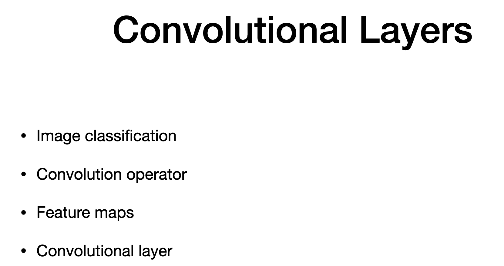
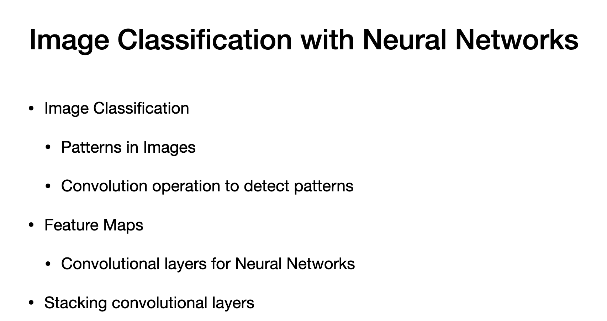
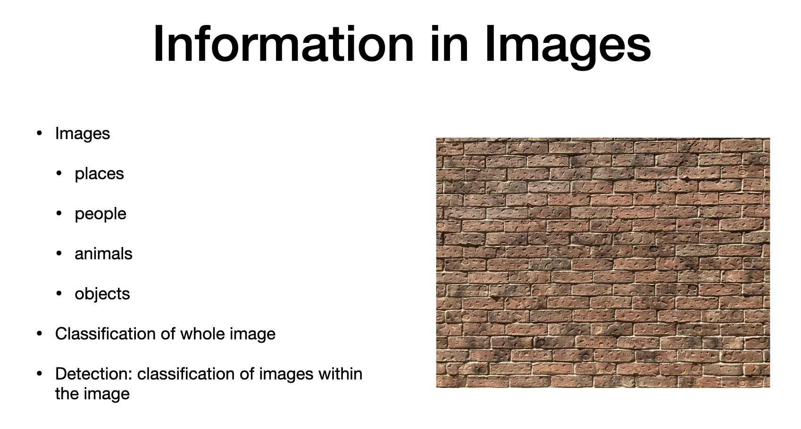
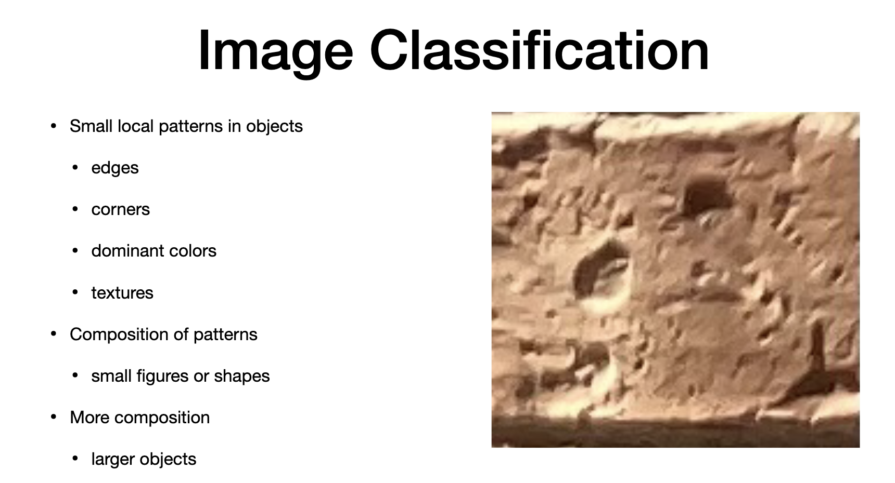
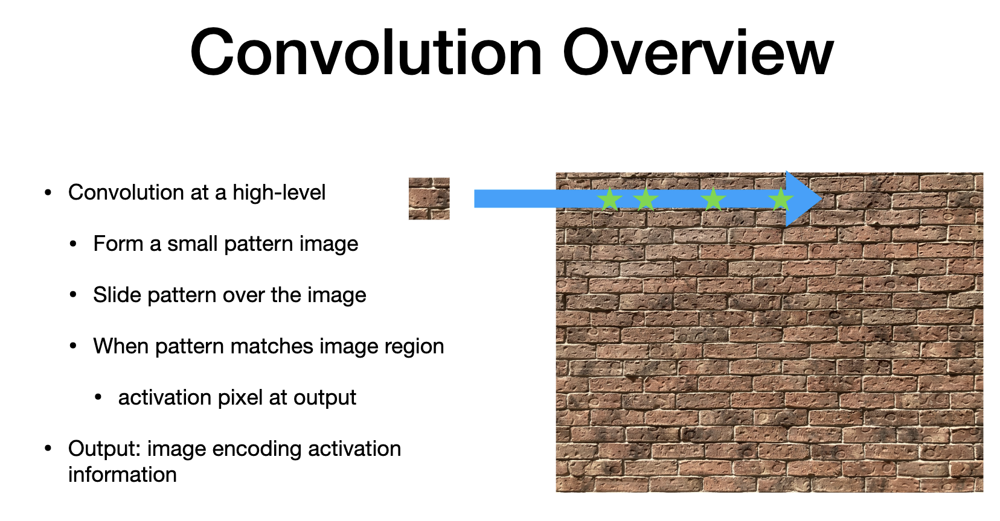
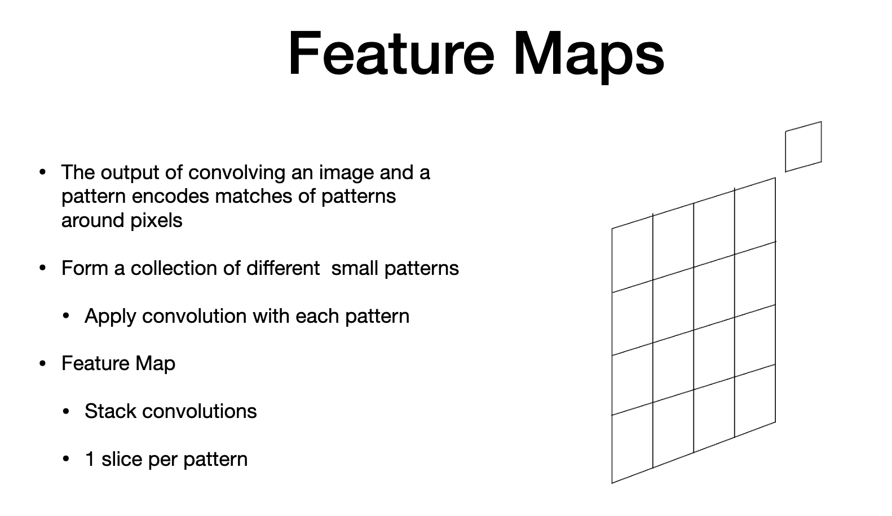
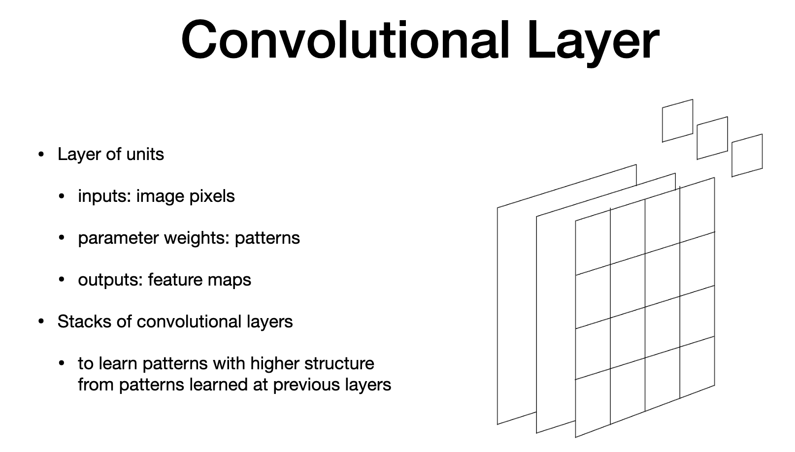

# Agenda - Convoutional Layers

> - describe object in images can be characterized as patterns 
> - with different scale and complexity
> - use convolutional operator to identify patterns and build convolutional layer
> - describe feature map and how it is used
> 

# Image classification

> - main use  of neural - classifying iamges
> - images can be persona, animal, pattern
> - image can be one place or person or many
> - to see what is in image, we use pattern to identify
> - when looking closely, curves, corners, textures can be seen
> - two images - images to identify and image to pattern
> - detect location in image to match pattern
> - make several poattern and map to image
> - feature map - include location where each pattern is activated
> - images as images, patterns as weights so they are parameters to learn
> - patterns usually used to identify corners, edges , they are be used on inputs to identyf patterns
> - when we look closely on image, we see detail patterns
> - we move away , we put simple pattern into complex patterns
> - So we use stacking convultional layers to achieve from simple to complex patterns
> 

# Information in Images

> - images have many pixels
> - easy to interpret with human
> - as data, we look at intensity
> - pixels are not algorithmically useful.
> - we need to know the place, who appears in image and what it depicts.
> - usally image is depicted as 5MB
> - this is classification problem and we deal with whole image
> - larger object is depicted with few bites
> - training set - number of sample images of objects
> - sampluong dataset is annotated
> - the object of interest is covering most of the image
> - image may contain many objects. we can use subsection to label each object in the image
> - 

# Image Classification

> -  close lok
> -  reveals less on object itself
> - show details, curves, corners
> - illumination is not uniform. colors might change time of day
> - 

# Convolution Overview

> - if we move away , we have full view.
> - we can see full picture
> 1. form pattern images (using small patterns)
> 2. search pattern over image - slide pattern on image 
> 3. outout this computation as activation
> - used in signal and image processing, denoising
> - 

# Feature Maps

> - output at top - small square is a pattern
> - the plane represents the encoded output pixels

# Convoutional Layers

> - we can collect many output and stack convolution output to form feature maps
> - in this case, 3 patterns, feature map is the collection  of the 3 output planes
>  - Note the input/output and parameter
> - 

# The end