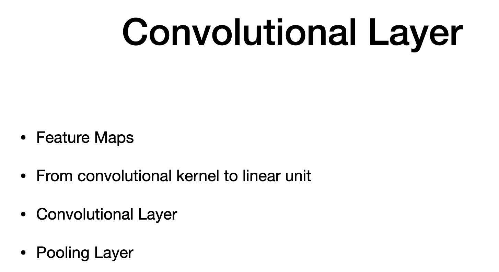
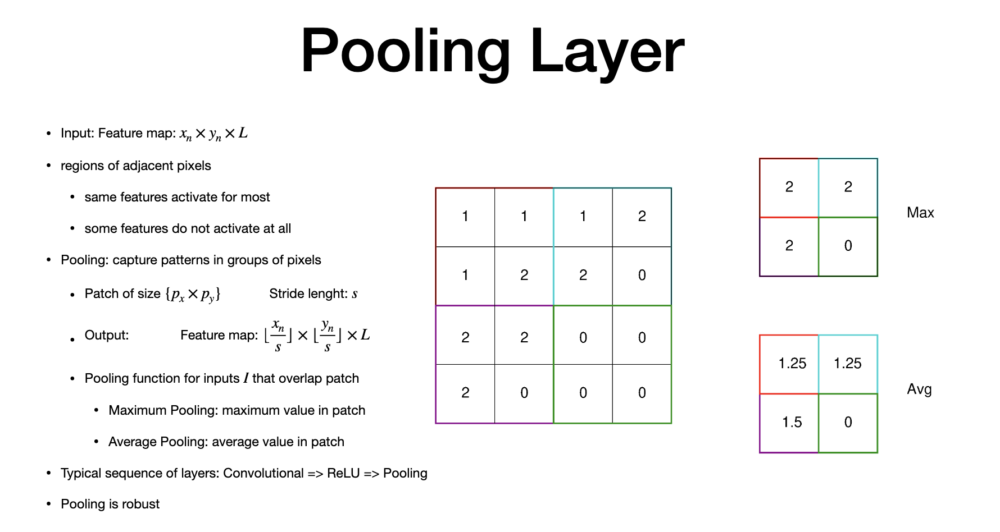

# Agenda

> - to produce feature maps
> - convolutional layer kernel with weights in a linear unit
> - structure of convulitional and pooling layer

# 3D Convolution

> - color image in 3 planar channel - red, green and blue intensity
> - 1 slice per channel
> - this is 3D convolutional
> - Kernels - > 3D array with 1 planar for red, blue, green separately (so total 3) - (Not window kernel)
> - "N" - weighted sum of pixels defined by 3D kernel around pixel (u,v) - centering and calcualting weighted sum
> - weight applied to each pixel in image = equivalent to one of overlapping kernels
>  concolvtion output = every pixel + the information around the kernel applied on top of the input image pixel
> - result is still 2-D (with response of pixel) - encoded kernels to pixel in image
> - same properties of 2D applied to 3D
> - All are same (strids/padding) except they account for the whole 3D block.

# Feature Map

> - Feature Map - when we apply multiple Kernel to same inout image
> - stack of concotiona oputput
> - D - D layers (3 layers for Inout)
> - if inout has one channel , then D=3
> - for RGB, D=3
> - collection of "K" kernels 
> - stack - "L" different featyre vector
> - so 4 dimension 
> - 4th dimension - specific 3d vector featyre vector
> - output = stack of "L" responses 
> - Kernel = pattern to detect (oytput is a response to a pattern)
> - output - x,y are activation location (size of x, y depends on stride and padding)
> - 3rd dim is response to a particular pattern

# Convolutional Layer

> - Linear unit - for full connected network where all inputs are connected to the units, it is weighted sum of "x" + Bias
>  - RelU output = poisitive only (this is a non linear unit)
> - Convolution:
> -linear component is used to calculate convolutuon
> - weight of kernel is the weight in the linear unit
> - output is positive if weight of a location is similar to the kernel
> - bias - is to tune the activation
> - "More negative the bias" => higher the similarity to have "Positive output",
> - otherwise, output is zero (as no negative)
> - trained to learn kernel weights
> 

# Convolutional Layer -II

> - "D" - number of channel
> -inout - 640 * 480 and three channels
> -  "x by y by l" - 
> - "kerenal" = feature detection
> - 20 channel from figure
> - outout - donth= have dimensionality to include "D" channel
> - the reduction by half in the outut is not because of the "padding", but strides  of 2(meaning it only consider one pixel for every 2 pixels)
> - output of convolution is sually connection to "RELU" which is non linear

# Pooling Layer

> - "L", - number of features to identify
> - "L" - can be obtained as output of convolutional layer or series of convolutional layer
> - adjacent pixels can have similar activation or no activation
> - "Pooling" - capture activation os pixels in groups
> - reduce the size of representatuon of output
> - Pooling works similarly to covolution (overlaying pattern on inpout and getting weighted sum of patterns)
> - inout = 4 * 4
> - patch = 2 b y 2
> - strides - 2
> for pooling
> each patch is different color border
> - output pixels encodes pixel "i" that overlap patch 
> - stride length has fraction of each inout
> - thats why (x/s). size of strides is divided to get dimesnionality
> - two poling
> 1. Max  Pooling - (max value of all pixel in each patch)
> 2. Avg. Pooling
- avg. value of all pixels in the patch
> - pooling layer - has no parameters to learned (stride and patch are configured in advacned)
> - pooling is roubust - not sensitive to parts of the window being output the input
> - it also changes little for smaller translation in input.

# Recap

# The end
