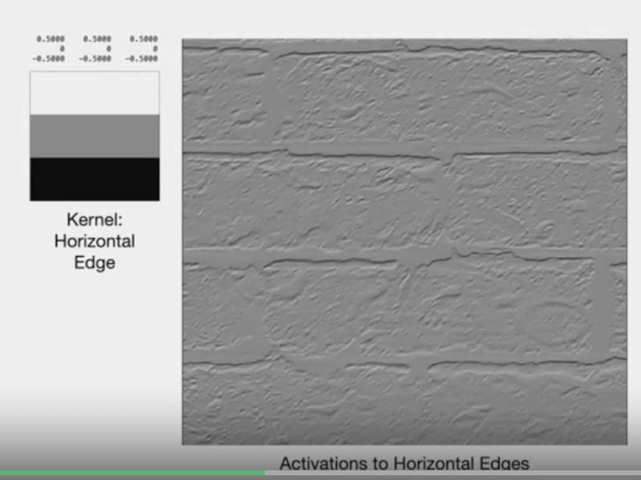

# Convolutional layers - Contd.

# Image Convolution - Agenda

> - convultuion for image processing
> - pattern through convulation
> - deal with invalid vonvultion
> - math property of operator

# Image Classification

> - previous example
> -  object is not clear, but have details

# Pattern detection

> - clustering - dimensionality reducing options (AND IDENTify features)
> - encode through featURE MAPS

# Image processing

> - Image processing tool for local patterns
> - top right - level fo gray - brick wall
> - pixel is arranged as matrix "I" (level of grey)
> - "u" - horz. axis , "v" - vertical axis
> - kernel - usally haveodd number of rows and columns to fix same number of rows and column on eaach side
> "K"  - is weigth - 3 rows and 3 columsn (vertical bars)
> 

# Convolution

> - slide K over I
> "K" - orange box - 3 * 3
> center of image overlays on center of  "K"
> - blue box is highlighted
> - center of kernel is (0,0)
> - once aligned, weighted sum around u,v is performed with summation
> - weights are stored in "k"
> - The arrow represent multiplication of "I" over "K".The multiplied "I" * "K" is saved as "N"
> computed for all pixel (so expensive operation)
> - resemblance of weighted sum (linear comnbination of input in neural netwrok)
> - note representation of convolution (circle and times sign)
> - what happens when part of kernel is outside image - later

# Pattern detection through Convolution

> - pattern detection
> - dot product of "I" and "K"
> - single vector "i" and single vector "k"
> - change to 1-D vector while preserving alignment
> - i=k , large positive value
> - i= -k , large negatvei value
> - sum is activation value for pattern

# Pattern detection through Convolution -II

> - subset of wall picture , scale of grays
> - kernel for vertical edges (darker to lighter on right)
> - postive at right column and negative in left
> - Lets look at "Horizontal" edges
> 
> - darker at bootm, lighter at top
> - negative at bottom row and positive at top
> - note we have some activation across horizontal direction
> - two kernels designed edges (both are directional, horizontal vs. vertical)
> - "instead of simulating kernel", we can learn them
> - using weight of convultional layer
> - learned through gradient descent (kernel paramters)

# Kernel outside Image

> - K is aligned with "I".
> - but top of the "K" and left of "k" is outside the iamge
> - convolution of 1,1 is outside
> - This can be handled 2 different ways
> 1. Valid convolution
> > - only through valid area
> > - computing convolutiomn only for valid area (K pixel inside the window)
> > - output has 2k column less than opriginal image (both row and column)
> 2. Padding
> > - expading image of each side by "k" (all 4 sides)
> > - one pixel each side for our example
> > - new rows assigned value of 0
> > - reuslt output same soze as original image

# Redundancy reduction - Strides

> - weighted sum for every pixel
> - assuming padding, we can same size as input
> - output can have redudant size
> -  down sampluong to reduce size of poutput
> - only subset of input pixel is what we get convolution
> -  "Strides" of some size
> -  number of pixel by which windows is moved each time
> - stride of "1" , scalcuate every pixel (outpout  - same size of original image)
> - strides of "2" , skips 1 pixel is each direction - approx. half the size
> - 5 input size is reduced to "3" for output for stride "2"
> - ceiling of "i/s" and "j/s" for row and column is used
> - though we are using same stride size for row and column, we can use different stride size for row and column

# Properties of convoilution

> - Math property
> - commutative - order doesnt order
> - linear  and then scalara
> - invariant to spaitla shift - useful for pattern

# Recap

---
# The end