# Convolutional layers - Contd.

# Image Convolution - Agenda
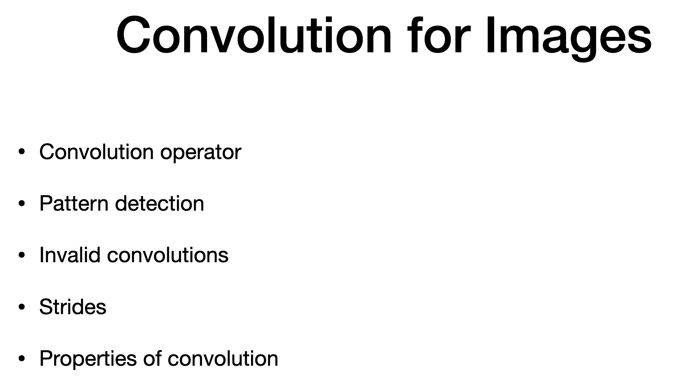

# Image Classification
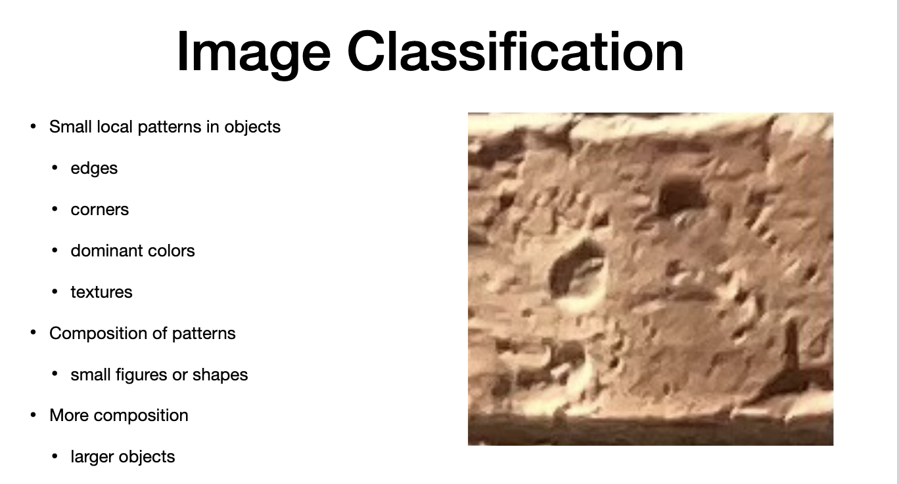

# Pattern detection
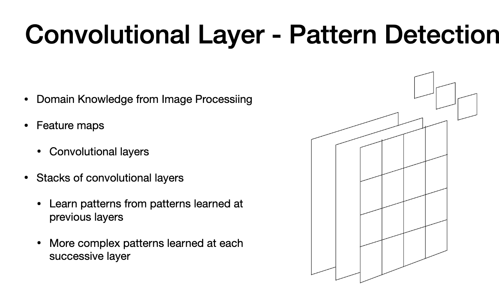

# Image processing
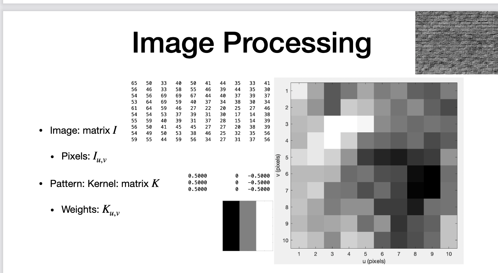

# Convolution
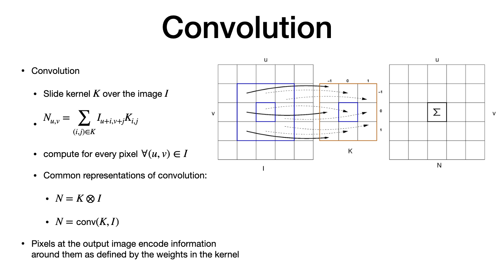

# Pattern detection through Convolution
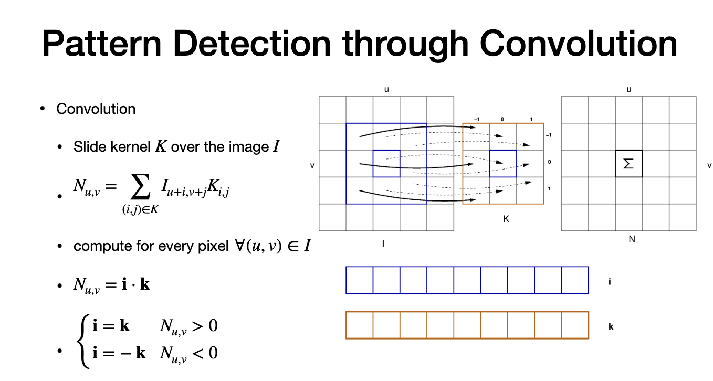

# Pattern detection through Convolution -II

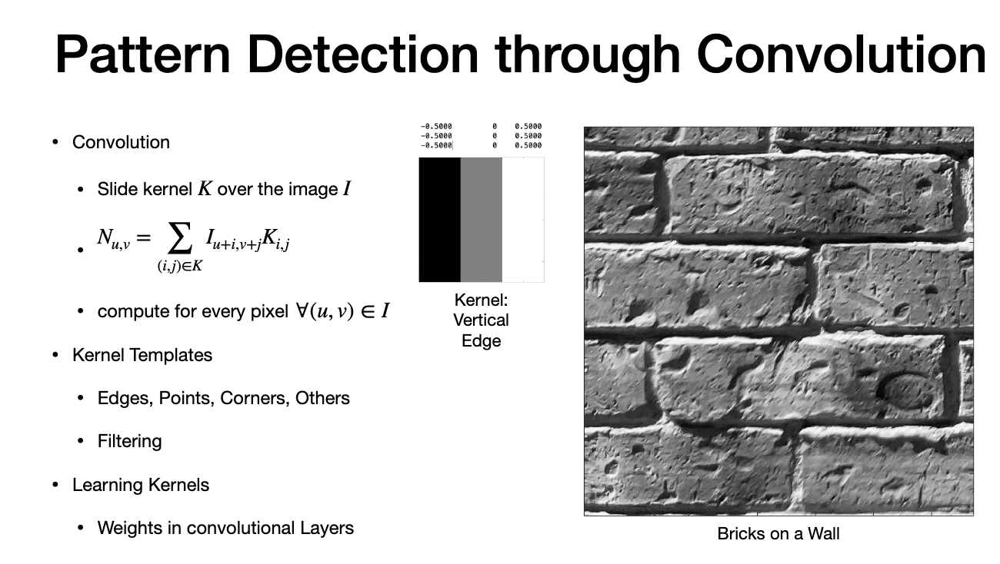

# Kernel outside Image
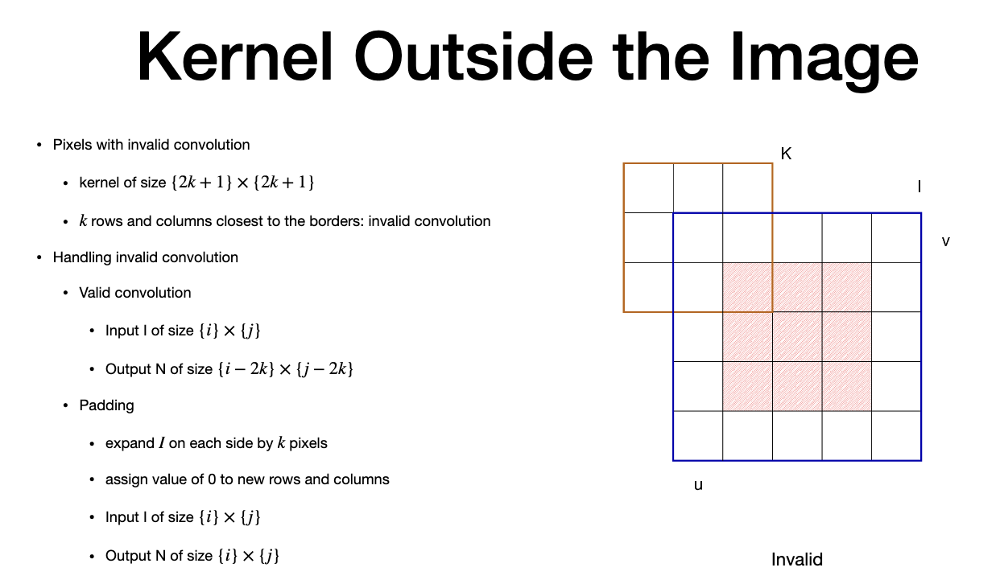

# Redundancy reduction - Strides
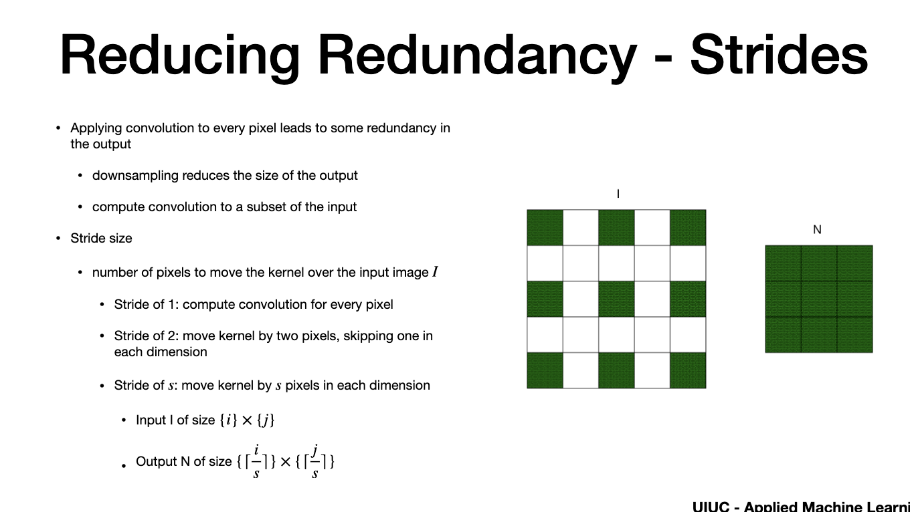

# Properties of convoilution
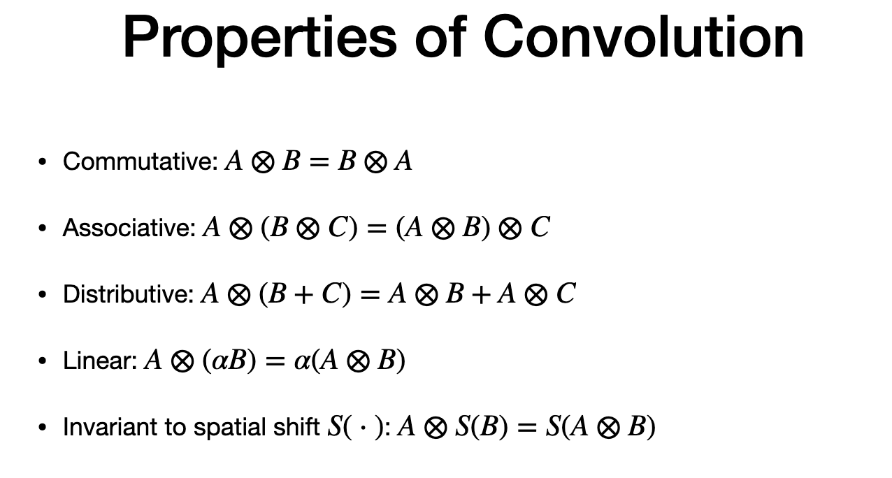

# Recap
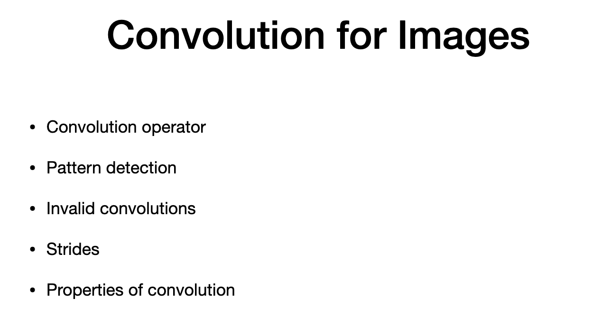