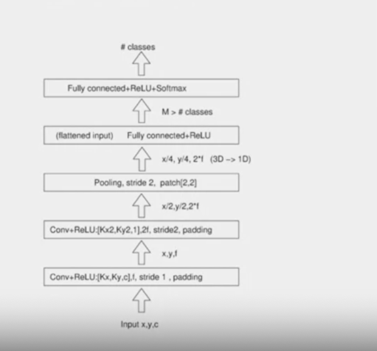

# Agenda

> - stacking layers achieves recognition of patterns
> - how parameters affect the receptive fields
> - to construct stack of layers and parameters for image classification
> - pre-processing operations before training

# Stacking layers

> - recap
> - resolution - naer input (small areas)
> - receptive field propagate
> - resolution increase in firther layers
> - Number of channel donot affect receptive field
> - **Layer 1:**
> - Convolutional + Relu
> - number of output at ReLU = same as convolutional layer
> - output size depends on strides length
> - strides = 3 
> - 1 kernel, 1 layers
> - feature map = inversely proportional to stride length
> - size of receptive = same as kernel size
> - **Layer 2:**
> - second square is layer 2
> - strides =2
> - **Receptive  Field**
> - each pixel at layer = involves kernel size
> - layer 1 : receptive layer =3(Same as stride)
> - receptive field - start small near input. gather more local integrated patterns and builds in the next layers
> - each layer receptive field - dependant on previous layers stride and receptive field
> 

# Receptive Fields

> - receptive length changes at pooling
> -common
> - strides = 1 at first layer
> -  next layer increase strides to 2 and increase number of feature more
> - No formula - follow similar process to dietnify them

# Image Classification

> - c = channel
> - image =grey, only 1 channel
> - intermediate layers can be diverse
> - since stride =2, it divide the dimesnionality
> - pooling- square patch 2 by 2
> - twice more feature
> - before outout layer, there is a fully conneced layer - to flatten to vector(input to output laer)
> - "M" is usally larger then number of classes
> - OUTPUT:
> - has dropout probability
> 
> - also connected to softmax layerss

# Image Classification - II

> - large dataset
> - PRE- Processing
> - image size needs to be noralized
> number of channel - grey or color
> -  normalized for brightness
> - images has dominant color (black on white background) - helpful t compute mean value 
> - GPU - graphic processing unit - comute output in parallel - accelerates execution
> - size of network

# Recap

# The end