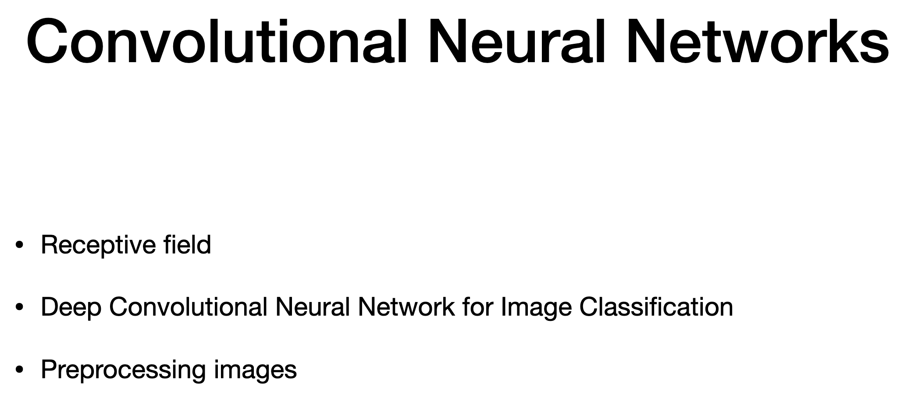
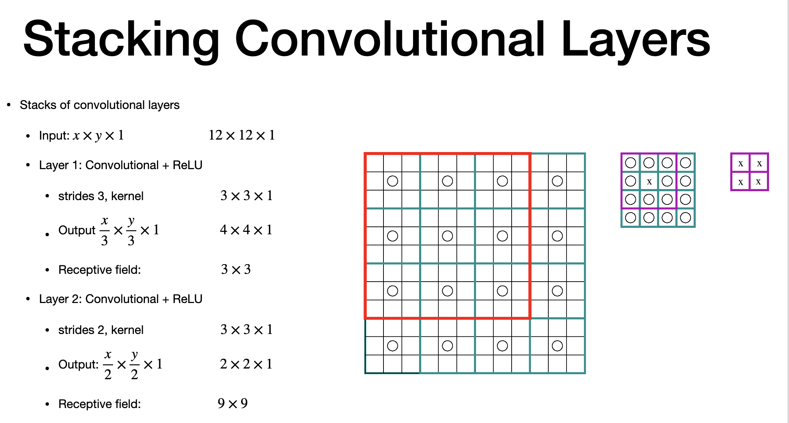
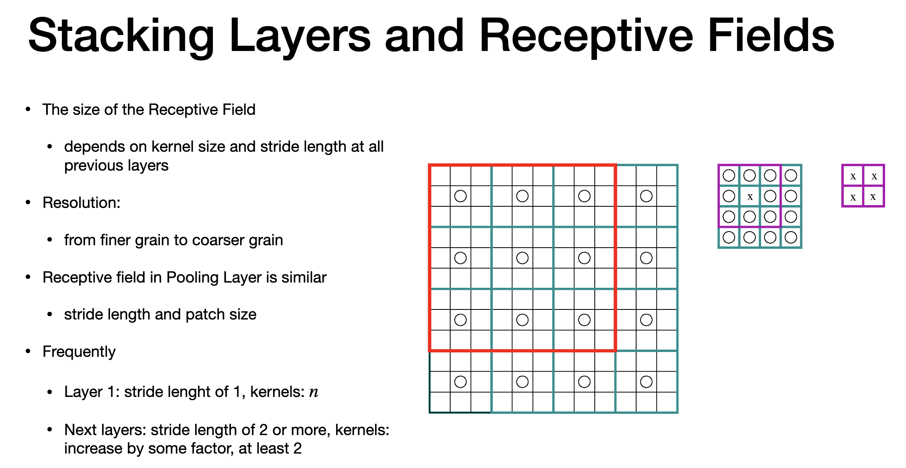
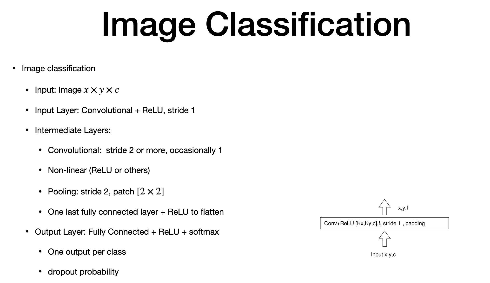
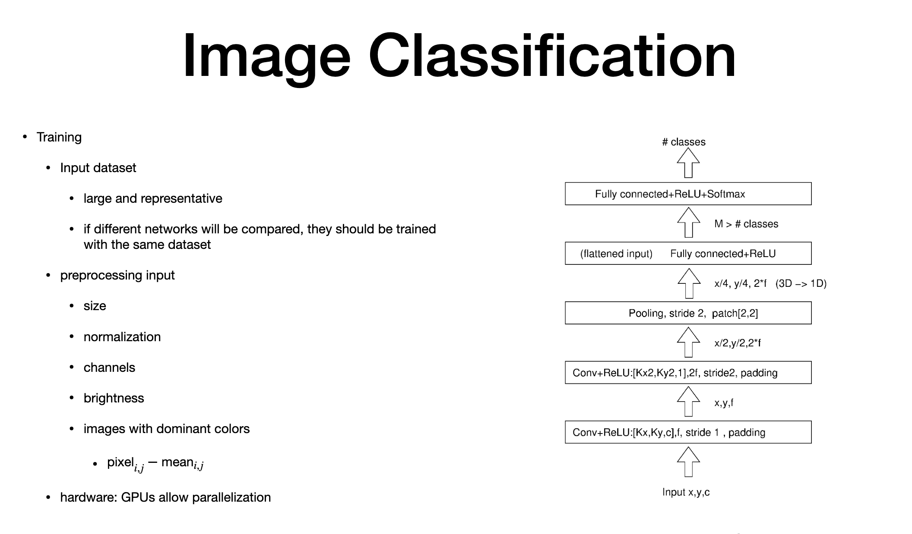
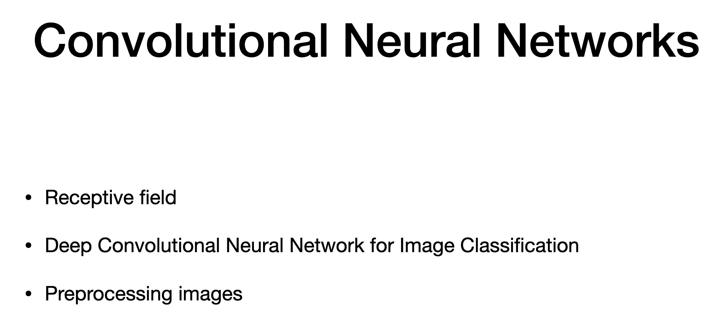

# Agenda

> - stacking layers achieves recognition of patterns
> - how parameters affect the receptive fields
> - to construct stack of layers and parameters for image classification
> - pre-processing operations before training

# Stacking layers

> - recap
> - resolution - naer input (small areas)
> - receptive field propagate
> - 

# Receptive Fields

> - 
> 
# Image Classification

# Image Classification - II

# Recap
