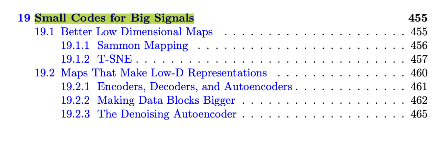
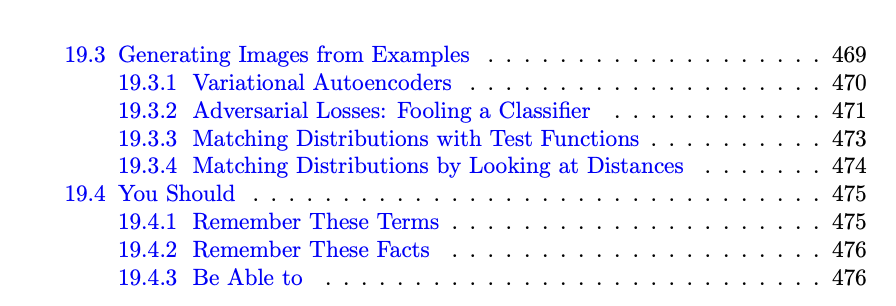

Textbook References

Generally, the AML textbook's Chapter 19 on Small Codes for Big Signals (Pages 455-476) covers this week's topic.

Specifically, see the following section breakdown for each of the lecture videos:

Lec 14.1 Deep Neural Networks III - Section 19.2 Maps That Make Low-D Representations (Pages 460-469)

Lec 14.2 Low Dimensional Embeddings - Section 19.2 Maps That Make Low-D Representations (Pages 460-469)

Lec 14.3 Autoencoders - Section 8.2 Section 19.2 Maps That Make Low-D Representations (Pages 460-469)

Lec 14.4 Denoising Autoencoders - Section 19.2 Maps That Make Low-D Representations (Pages 460-469)

Lec 14.5 Autoencoders - Codes from Probability Distributions - Section 19.3 Generating Images from Examples (Pages 469-475)

