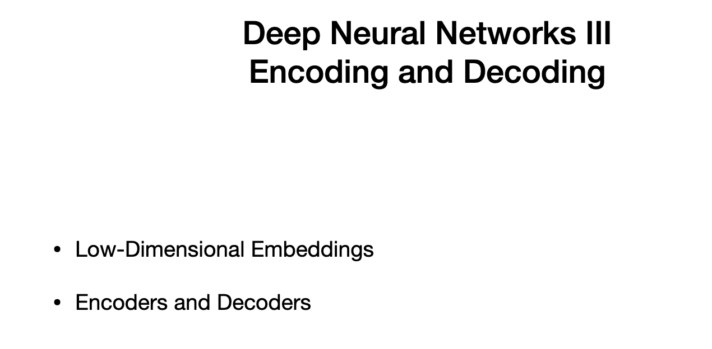
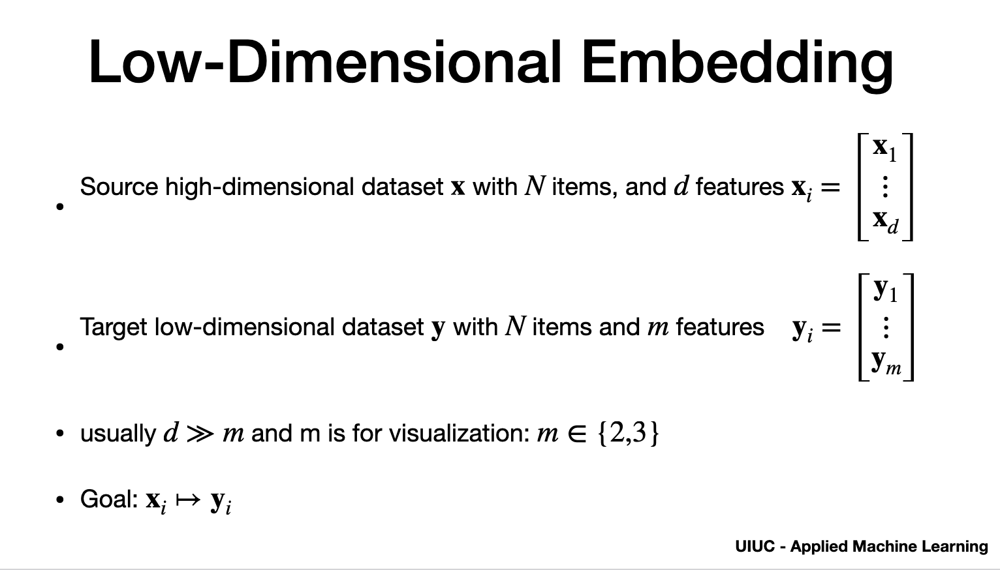
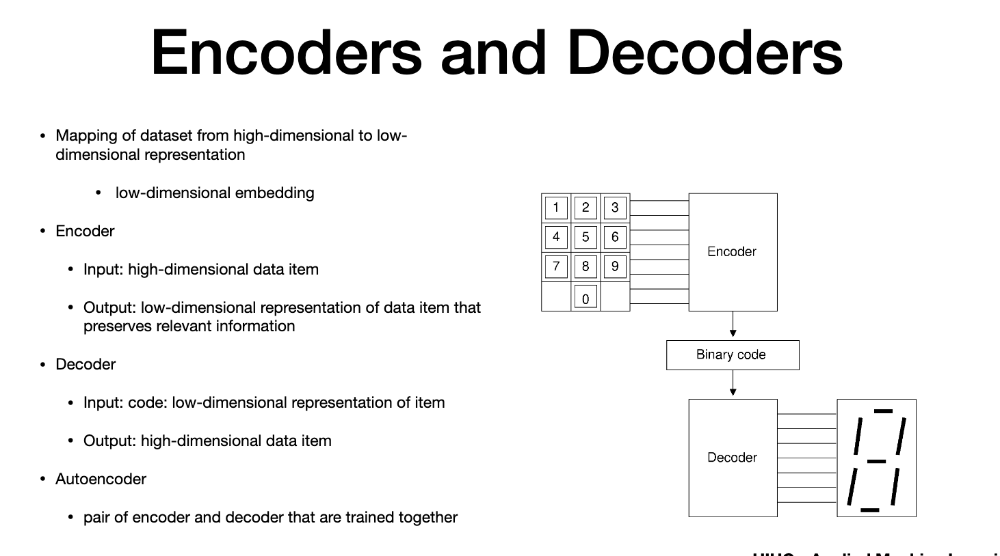

# Agenda

> - deep learning used for low dimensional embeddings

# Low Dimension Embedding

> - pca for low dim embedding
> - assume source hi-dim dataset "x". 
> - "N" items and "d" featyres
> - "i" is from 1 to "d"
> - target "y" , "m" features
> - "d" >> "m" - much bigger than "m"
> - "m" = 2 for plotd in place or "3" for 3-d plots
> goal to build each "x" to "Y"
> - useful to identify similar groups,highlight similarity and difference
> - low dim. representation of images will keep only what is common to that class
> 

# Encoders and Decoders

> - outout of "7" bit LED diplay - usual in digital clock
> - numerical keyboard is connected to Encoder using 8 wires whose coltages depends on the button pressed
> - wires connect to encoder whose output is 4 bit binary code
> - the binary code fed to decoder has one output per led on the 7-segment display
> - Notice binary code is "4" that is output of Encoder which is less than 8 wires send as input to encoder and "7" led display output from decoder
> - this is low dimension representation

### Neural 
> - earlier capture, we studied neural netwrok
> - reduce dimensionality of output w.r.t input by taking strides greater than 1.
> - "Encoder" part of Neural network receives high dimension data item and output low dim dataset
> - "decoding"component of neural network receives code which is lo- dim representation of data item and output original data item
> - in our case, the numeric input is changed to led inout (output is similar to original data item)
> - "AUTO ENCODER" - conencts Encoder and Decoder and train them together
# Recap

# End