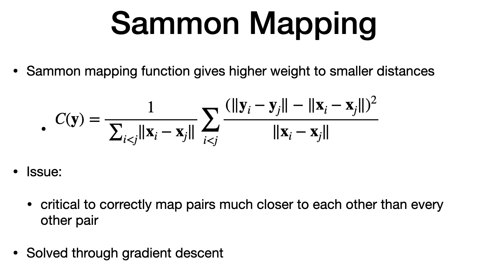

# Agenda

> - pcoa
> - sammon mapping -0 based ond sitance
> stoachatic neightbor embedding SNE - use probability instead of distances

# Low dim embedding

> - hi dim "x" to lo dim "y"
> - "d" is hi dim feature
> - "m" - features of lo dim features
> goadl reduce "d" to "m"

# PCOA

> - prev lecture
> - pcoa - low di 
> - preserves ratio
> - square distance between items in each set
> - selection of item in "y' should minimise cost function (distsance between pair of element)
> - CONS : points too far from each other has more distance. 
> - 2. long distance impact the overall model
> - it can break some cluster otherwise would be a single cluster
> - 

# Sammon Maping

> - alternate mehthod to PCOA is sammon
> - "cost" fucntion that gives more weigh to smaller distance
> - each pair of distance with output to input is divided by distance from original set
> - "factor before sum" - is constant for original set to simplify computation of gradient
> - CONS:
>  if two pairs are very close and not mapped correctly, cost function will NOT reach a low value.

> - minimsation of cost function  is through gradient descent

# Stochastic neighbour Embedding (SNE)

> - SNE - another approach to find low embedding
> - probability of neighbords
> - instead of distance, use prob dista
> - if two data points are neighbours in source, they should be neighbor in target
> - We need two models
> - prob of hi dim in source to be neighbor
> - prob of low dim in target to be neighbor

# SNE Model for High dimension model

> - prob of "i" picked by "j" as neighbour is gaussian
>- variance is sigma
> - sigma square = variance
> - sigma is expanded in dense region and reduced in sparse region
> - prob of "i" and "j" to be neighbour is defined by user defined perplexity "PP
> - perplexity is through entropy
> - sigma - through binary search
> - until user defined perplxity is achieved
> - entropy measures diversity.also length of encoding required for distributuion
> - **SIGMA impacts neighbours**
> - more neighbours around "i", radius is big,
> - full failure of sigma, high entropy
> - thus high perplexity

> - we are ready to define probability of poiunts "i" and "j" to be neighbor.
> - TWO CASES
> - 1. assigns zero probability for item to be its own neighbour
> - 2. for everything else,mutually pucking a neighbour
> "N" => number of elements, "P (ij)" stored in N by N matrix

# SNE Model for Low dimension model

> - low dim model for two data items to be neighbour
> - "CROWDING PROBLEM" - model to account for reduction in distance w.r.t. high dimension dataset.
> - model with high tial makes the prob is neighbors "NOT" to drop quickly. facilitates reducing the crowding in low - dim representation
> - This method is called "T-SNE"
> - this use student' distribution
> - similar to normal distrbution, but have heavy tial tht gives higher probaility far from the mean
> - Student "T SNE - use degree of freedom parameter "Nu" =1
> -     we can store probaility computing this way.
> COMBINING two prob. models
> - We want two prob. models to be similar
> - KL Divergence as similarity matrix for prob. dist.

# SNE Cost & Gradient

> - KL Divergence beween P and Q is the Integral
>  Apply as cost function to minimize
> - solve the minimization fo cost through gradient descent
> - gradinet - the numerator means point in embedding spoace
> - the low-dimensional one, are clustered in an inverse proportion to their square distances. T
> - resemables gravitational force
> -  attraction force between objects is in inverse proportion to their squares distances.
> - 
# Recap

> - 

# The end