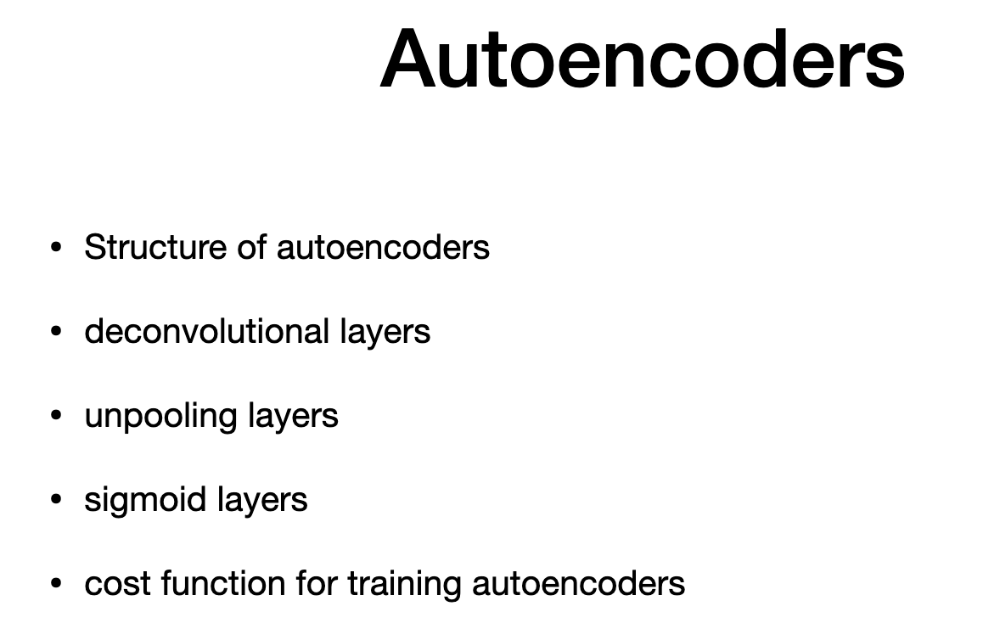

# Agenda

> - structure of autoencoder

# Encoders & Decoders

> - consider signal
> - it can be an image
> - encoded and deconding to eleimnate redudancy
> - better use of storage
> - encoder and decoding is harder with hi dim signal
> - Goal: encoder that preserves relevant info
> - CNN - can be used as encoder
> -  map milion of ixels to calsses
> - dimensionality is reduced if strides > 1 
> - decoder- read above (Reverse mapping)
> - modified to NN (neural netwrok) - to achive coding

# Auto encoders -I

> - autoencoder is a pair of encoder and decoder trained together
> -  Encode "E" maps to code "z" . function of x
> - Decode D)(output of encoder)
> - X (output -s close to x(inpout))

# Autoencoders - II

> - useful in unsupervised learning
> - feature set from unlabel images
> - feaure set formed by output of encoder
> - after training the encoder, we can pass to full connected classification to deal with labeled featyre set
> - Autoencoders can be used for clustreing
> - The output of the encoder represent cluster distributions and the clusters are validated at the output of the decoder
> - popular application of autoencoders is image generation
> -  The output of the encoder represent image distributions
> - and the output of the decoder is ever constructed image.

# Autoencoders for Image

> - wider input, narrow code and wider output
> - called "Hourglass network"
> - grey have "1" channel .so last dimension is 1
> - parameter - theta - bias and weigths
> - output code - much smaller than utput
> - decoder - mirrow encoder
> - pooling in convultional is mirrored by unpooling in decoder
> - they are usually reverse in decoder

# Deconvolutional Layers

> - "transposed"
> - "complemtary to concultionary"
> - increase the dimensionality
> - dim - (2 *3)
> - form output feature map
> - for stride length =2 
> - output feature map - will have new pixel inserted between strides
> - for diemnsionality of the output feature map is given in formula
> -  input vs. output is shown below
> 
> - colors show what values are copied where
> - blank is replaced with interpolation or blanks (shown in white)
> - last step is kernel (odd number of rows and columsn)
> - (3 by 3) kernel is common choice
> - After kernel addition, the output is changed as below
> 
> - (4*6) excluding padding

# Unpooling Layer

> - use patch of same size as pooling layer
> - make output feature map with "0"
> - non overlapping patches
> - For average unpolling
> 
> - 2 pixel per choice - common choise
> - unpooling gives 4 by 4 from 2 by 2 input
> - **Maximum**
> - 2 maps are used
> - one map - result from max pool by normal
> - another map - contains location from where the max pooling
> - lcopies only pixels from same location, leaves other pixel untouched
> - 
> - the output with yellow dot has max value and others are zero. note the location in the figure

# Sigmoid Layer

> - last layer of decoder
> - pixel value is 0 ti 255
> - or normalizated value 0 to 1
> - ReLU layer not appropriate (only higher than 0)
> - so signmodi function
> - output is 0 to 1 and can be mapped to 0 -255
> - sigmoid si non linear unit
> - to facilitate trainign input of encoder and output of decoder needs to be in same sclae (may be 0-1)

# Training autoencoder

> - cost function at decoder
> - minimie square difference of decoder ouput and inout 
> - CONS WOTH COST: SENESITIVE TO CHANGES TO INPIT
> - HANDLES NOISE POORLY (fute lesson to handle it better)

# Recap

- pooling
- unpooling 
- sigmoid

---

# The end