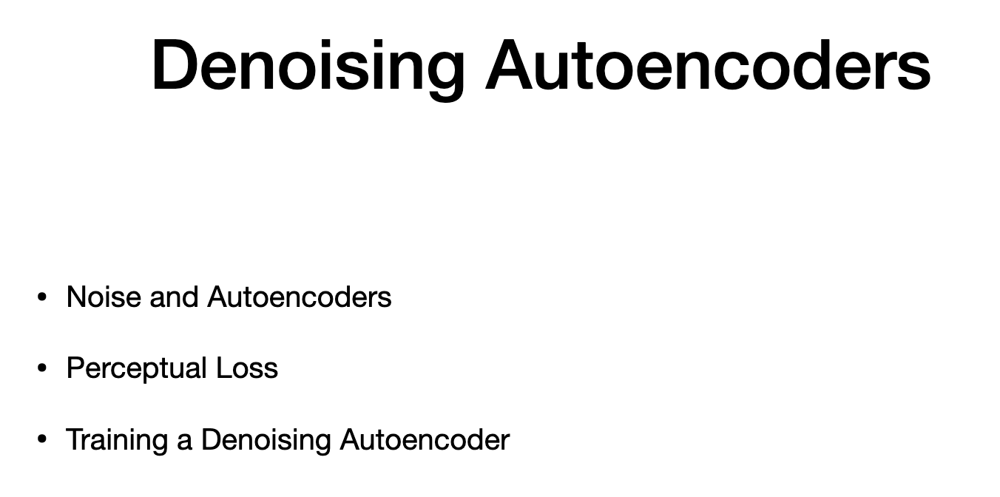
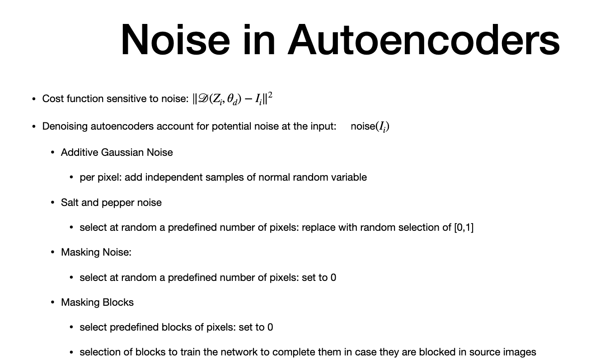

# Agenda

> - denoising
> - perceptual loss to train noisy encoder

# Noise in Autoencoders

> - prev video - cost
> - If an input that was used in training the autoencoder is fed with noise, we would expect that the output of the autoencoder still was the original input image
> -  One way to make a **more robust autoencoder **is to train it to minimize the loss function when fitting images from the data set with wind noise. 
> - **We apply noise to the input image i**
> - training is trained with loss
> - differnet ways to intro noise for denosiing autoencoders
> 1. additive gaussian noise
> 2. salt and pepper noise (darkest and brightest values with 0 and 1 )
> 3. masking noise - select at uniform dist and set to 0
> 4. masking blocks - instead of pixels, we apply 0 to continous blocks of pixels (used when cover face when people wearing sunglasses). This is also called "PAINTING AUTOENCODER"
> 

# Loss

> - Loss should account for perceptual changes
> - regardless of distribution, loss should be small
> - small error have small impact on frequency changes (such as flat surface in image)
> - more noticeable changes in higher frequency impacts (borders in image)
> - errors due to displacement have high cost than errors due to smoothing
> - smoothing is preferred
> -  so image appears blurry
**PERCEPTUAL LOSS**
> - output loss
> - image i at inoutm output layer = D (diemnsion W column, H columsn, F is featyres)
> - flattened - number of compon ents in figure (W * H * F)
> - loss at layers = L2 NORm 
> - types of edge and edge pattern between kernesl
> - loss is reduced when detected same type of pattern
> - more likely to happen earluer layer
> -  weighted sum of each of layer = loss
> w is set for each layter
>
> - lambda - dependent on type opf noise added
> - when noise is added to a subset of image,better to give least weightage to predict missing labels

# Training

> - noisy version of iamge - noise (I)
> - outut at encoder = Z
> - decoder operates on Z
> - training using SGD

--

# The end