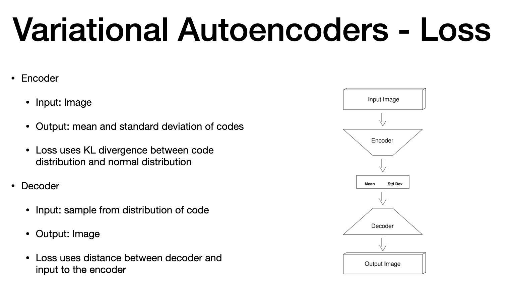

# Agenda

> - prob dist
> - structure of two classes of netwrok
> - codes are drawan from prodist
> - two classes are 
> - 1. variational encoder
> - 2. generative adversial network

# Variational Encoders

> - encoder so far is deterministic node
> - we can build variationa encoder  whcih generates prob. dist
> - outout are code from prob. dist.
> - when we want to determines images that are similar and not same
> - set of mean and std. dev that characteristic the code
> - one normal per training eg.
> - roubust - decoder can generate family of code set that are not in trianing set, but similar ones

# Loss

> - use KL at encoder to see difffnernce between output generated distribution and normal dist.
> - decoder compares input image to network vs. output from decoder
> - CONS of VARIATONAL ENCODERS - not as sharp image as the input

# Generative Adversial network

> - class of network that produces sharp image as Generative Adversial network (GAN)
> - generator  and discrimator - act as adversaries
> - generator - produces synthetic images (aims to fool discrimanator)
> - discriminator - classify the images (aims not to be fooled)

# Gen - Cost Function

> - cost in generative network
> - generator " from code set Z, it generates synthetic image G(x)
> - first term of cost = ability of discrimanator to identify "real" images
> - first term of cost = ability of discrimanator to identify "SYNTHETIC" images
> - **Goal**:
> > - 1. generator "G" that reduces Cost "c"
> > - 2. discriminator that maximises cost "C"
> - combination of "ascent" and descent"
> - fix "G" and use ascend directions
> - fix "D" and use descend directions

**CONS:**
- discrimator is good and generator is not good, NO descend to follow

-- end with recap
# The end