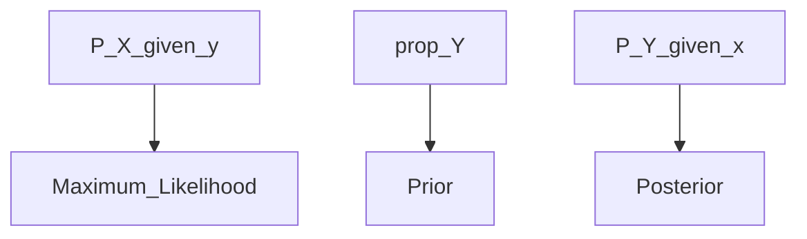

# Naive Bayes
> Lecture 2.3 Naive Bayes 
> Section 1.3 Naive Bayes (p10-p16) 

---
> Classifier is Probability model

- P (Y |x) - cannot be obtained
- use Bayes Theorem to obtain
  

> Consider all features of X and assuming the features are **independant (NAIVE assumption)**

> Combining the above

- Note: p(x) = ignore it as the p(x) is **not dependant** on "Y"

**GOAL**

- As probability will be 0-1 and product might be too small.
- So use log . Log changes product to sum. So new equation below

> Notice that the logarithm function has one nice property: it is **monotonic**, 
> meaning that **a > b is equivalent to log a > log b**

 > The usual way to find a model of p(y) is to **count the number of training examples in each class, then divide by the number of classes.**

 # Distribution Options
 ## Normal distribution
  - use a normal distribution for each x(j) in turn, for each possible value of y, using the training data. 
  - The parameters of this normal distribution are chosen using** maximum likelihood. **
  -  If one of the x(j)’s was a **count**, we might fit a **Poisson** distribution (again, using maximum likelihood). 
  -  If it was a **0-1 variable**, we might fit a **Bernoulli** distribution.
  -   If it was a **discrete** variable, then we might use a **multinomial** model. 
  -   Even if the x(j) is **continuous**, we can use a **multinomial** model by **quantizing** to some **fixed set of values**; this can be quite effective.

**NOTE:**
> This doesn’t require a good model of p(x|y), or even of p(y|x).
> -  All that needs to happen is that, at any x, the score for the **right class is higher than the score for all other classes.**

**Example**

# Missing Data

## Nearest neighbour
> nearest neighbor has no real way of proceeding if some components of the feature vector are unknown. 
> If there are **relatively few incomplete feature** vectors, one could **just drop them** from the dataset and proceed, but this should strike you as **inefficient**.

## Naive Bayes
- **good** at handling data where there are many **incomplete feature vector**
- Example: if it uses Normal/gaussian distribution,MEAN can be based in just "**KNOWN**" values
- 
**Missing data Two options**
1. Independant of Class:
We can’t evaluate p(xi|y) if the value of that feature is missing—but it is **missing for each class.** We can **just leave that term out** of the sum, and proceed. This procedure is fine if data is missing as a result of “noise” (meaning that the missing terms are** independent of class)**. 

2. Dependant of Class:
If the **missing terms depend on the class**, there is much more we could do—for example, we might **build a model of the class-conditional density of missing terms.**

**Missing Discrete values**

__SCENARIO:
 if some values of a discrete feature xi don’t appear for some class, you could end up with a model of p(xi|y) that had zeros for some value
 __FIX:
 A simple, but useful, fix is to **add one to all small counts.**

# Summary
- good for high dimensional data as well

---
### Fade out..