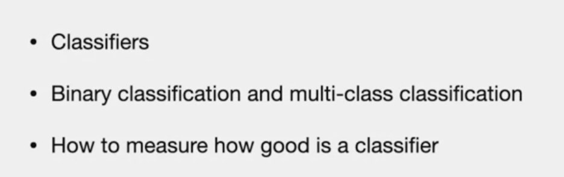
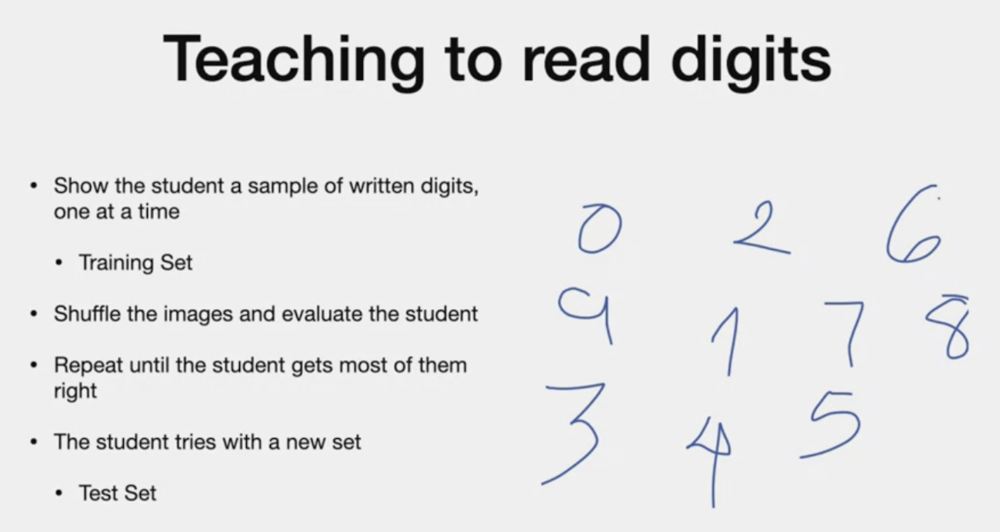
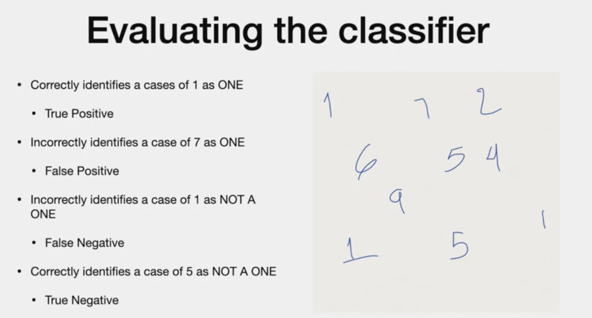
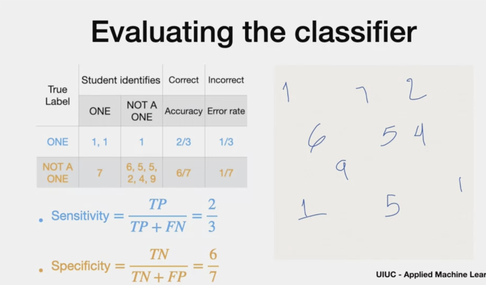
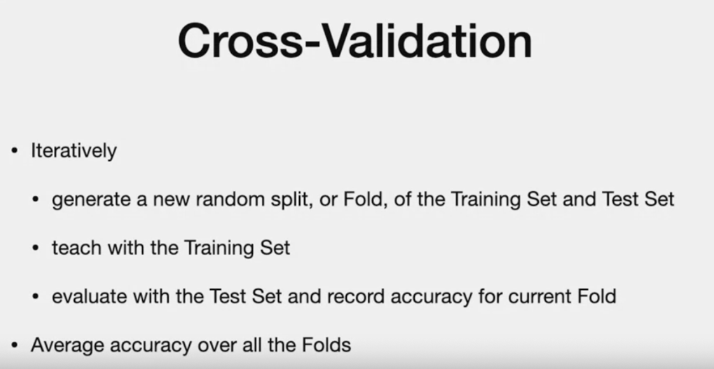
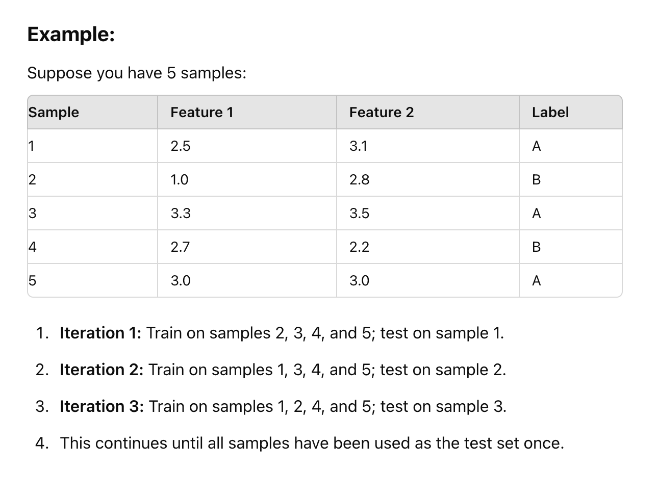
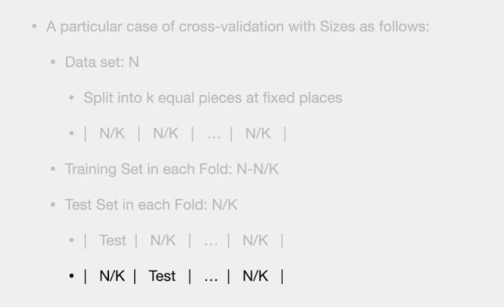
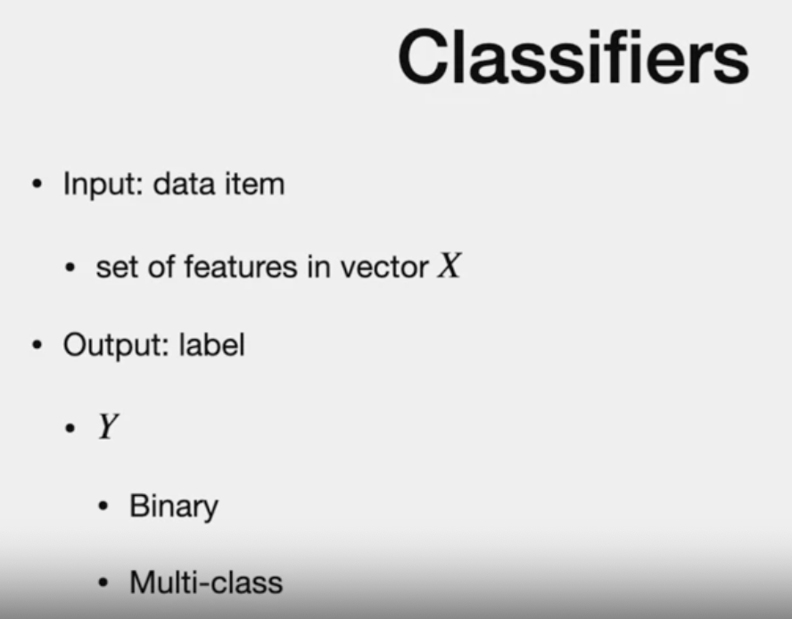
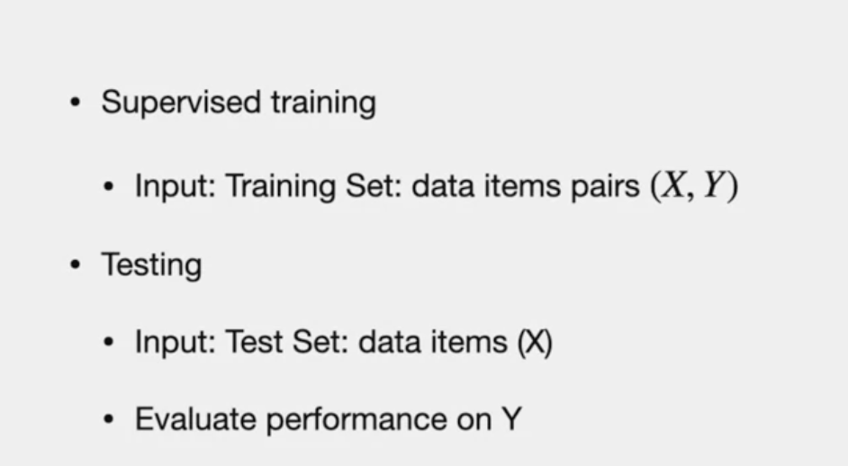

# Classification

# Agenda

# Classification
- same as teaching students digits

- once the above process is finished, they build on it to combine digits.
- This is a classification problem
- The digit "1" is associated to Label "1", digit 0 to label "zero"..

# Binary Classification
- teach student number "1"
- 

# Evaluating Classifier

# Confusion matrix and metrics

> Accuracy
> > - rate of correctness 
> > = True(s) / Total =  (True positive+True negative)/Total

> Error rate
> > - rate of error
> > - False/Total
> > = ( False Positive+False Negative) / Total

# Each case in more detail..
 

> **Sensitivity**
> a.k.a "Recall", "Heat Rate" or "true Positive rate"
> This is the Accurary of "ONE" Class
> TP / (TP +FN)

> **Specificity**
> a.k.a "Selectivity", "Heat Rate" or "true Negative rate"
> This is the Accurary of NOT "ONE" Class
> TN / (TN +FP)

---
# Multi-Class Classification

> Performance based on "test" set that student have never seen before

- true label are "rows" | sstudent identification is columns
- Diagonal shows Correct ones (True positives)
 In this case, False negatives is not possible as there is no NOT condition.
- Accuracy = sum of diagonal/total cases
- Class error by row  = wrong/row total

# Training and Testing
- Although learning involves only training set, goal is to have student perform well in validation or test data

> Overfitting/Selection bias 
- performs well in "training" and not on "test"
- Bigger issue when exposed to new data

# Cross - validation
- to avoid using one "Fixed" set for training and other "Fixed" set for testing, we can use Cross-validation

- repeat the accuracy for each folds

# Leave One Out Cross Validation

*sample:*

# K- Fold Cross validation
*sample*

*say, n=100 | K=5*

> PARTITION:
>> - n/k = 20 in each fold

>TRAINING SET:
>> - (n-n/k) =100-20 =80 (Training set) which is (k-1) fold.
>> - Each Iteration has different folds

> TEST SET
>> - (n/k) = 100/5 =20 samples 

# Classifiers

- Algorithm with input "x" and outout "y"
- features are encoded in vector "x" - called "feature vector"
- Features : about eh digits, how cuvy, has lines,etc..
- In ml, we can use pixel as classifiers

(performance on y includes accuracy, error rate, sensitivity and specificity)

# Applications

- Entertainemnet - movie interesting to watch

---
#### *fade out..*