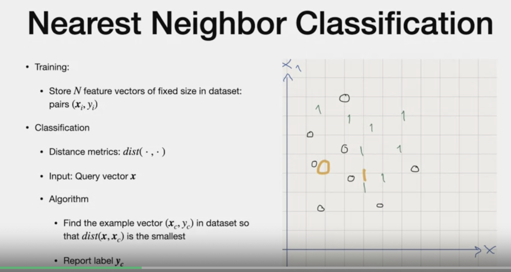
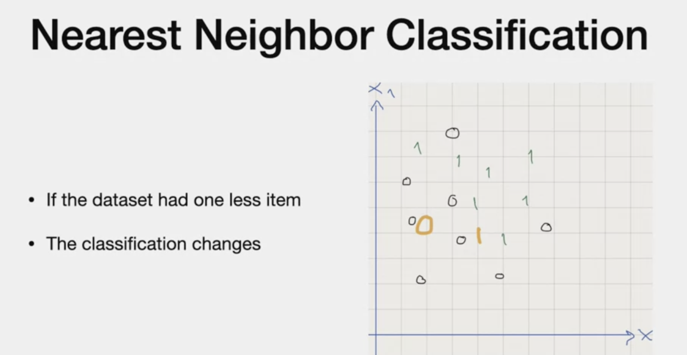
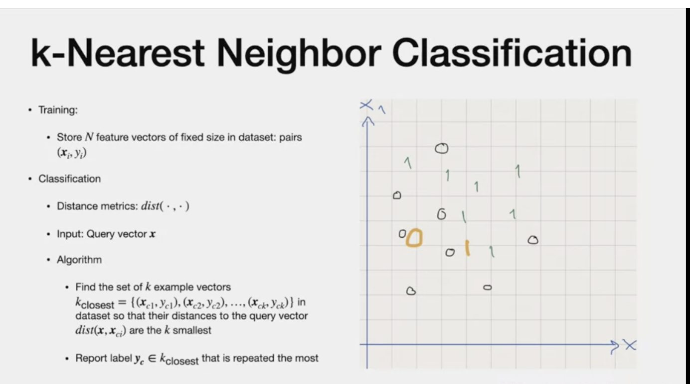
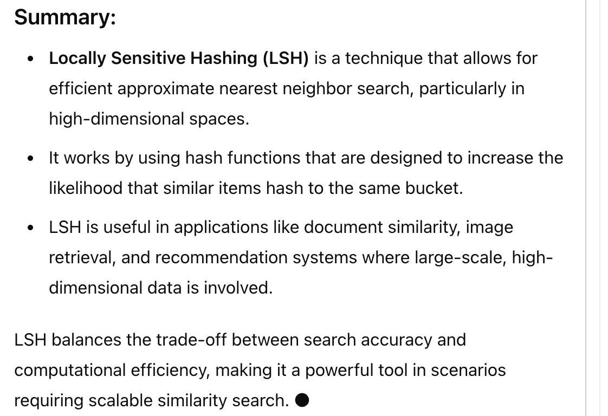

# Nearest Neighbour Classification

# Reference
- Instance Learning.md (High storage,Non fixed model function, associated based on proximity, lazy computing only when data arrives)

# Agenda

## Idea

- store training set of feature vector and label
- use this feature vector only when data presents itself
- defer pre-processing until a new data point arrives
- when data point arrives, computes distance of stored data and report label closet to the new data.

In our example, hand written digits could have may digits, lets say x0 and x1.
- when new data point arrives, closet to that data point is the label.

- new data point is in orange

## Nearest Neighbour

- x = feature vector
- y = label
- represent the (x,y) in Euclidean space
- Input if vector "x". Find a  vector  (x(c), y(c)) , s.t the distance between "x" and x(c) is the smallest.
- the label of the x(c), y(c) vector is what is reported

#  CONS
1. Too sensitive to distribution of data
2. If data item is missing, label changes

- compare with previous scatterplot, "1" is missing and now "orange" 1 is closed to 0 and labeled differently.

# How to address this
- using slighlty different version of nearest neighbour "KNN"

- same input and distance metrics
- Algorithm is different. 
> Instead of getting closet "1" vector, get closest "k" vectors and get the label that is repeated the most

# KNN - Distance Metrics

- if different measurement, one in cm vs. Km there is difference in scale
- To handle this, we need to "Recenter" to 0
- rescale so variance is 1

# Pros and Cons

- These issues can be alleviated with two datastructures

# KD - Tree

# Locally Sensitive Hashing

- splits a space at gradually finer levels of resolution with instances stored at the leaves of a tree and nearby instances are also nearby node
- If follows treemap way of splitting the space
- The search for the closest point would only need to be performed on the hierarchy of the splits
- which is of logarithmic size with respect to the number of splits. 
 (*Why? Log, it splits into half every time and thats like binary sorting. Making it*)

 # Locality Sensitive Hashing
 
 - place data points into buckets and with high probability,plays** similar data points in the same bucket.**
 - we see the splits of this buckets and also, we only need to compute the hash for the data point to see what pocket it falls in

### My Search

# Advantages/disadv of KD Tree , Locality sensitive Hashing
- reduce number of comparisons
- still if data point is in boundary, there could be errors
- The faster computation comes at the cost of approximations.

# Refinement

- Weigh contribution of the k-neighbors according to their distance to the query, giving **more weight to the closest data points**
- since the distance computation is based on all the features for the data, the a**lgorithm is sensitive to potentially irrelevant feature**s which we are unable to tell apart with these algorithm.

---
### Fade Out..