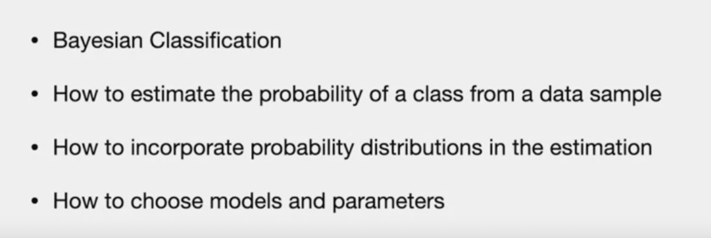
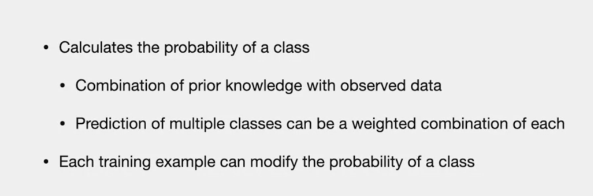
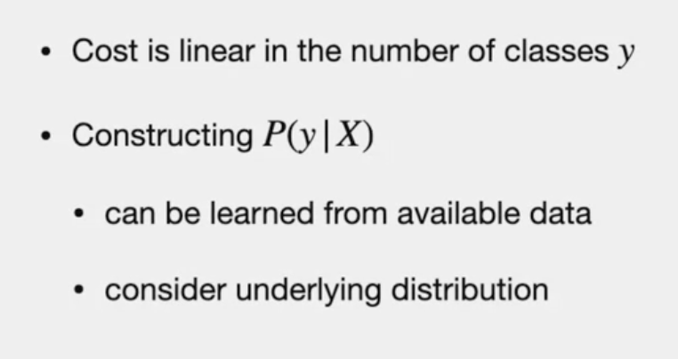
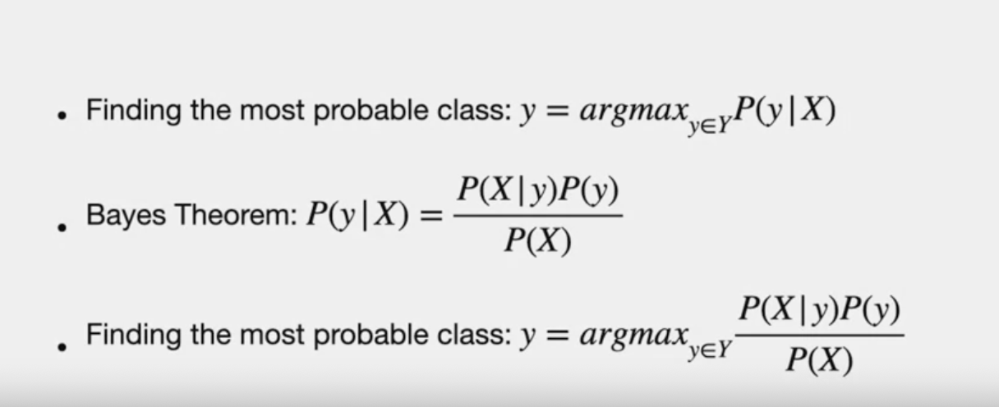
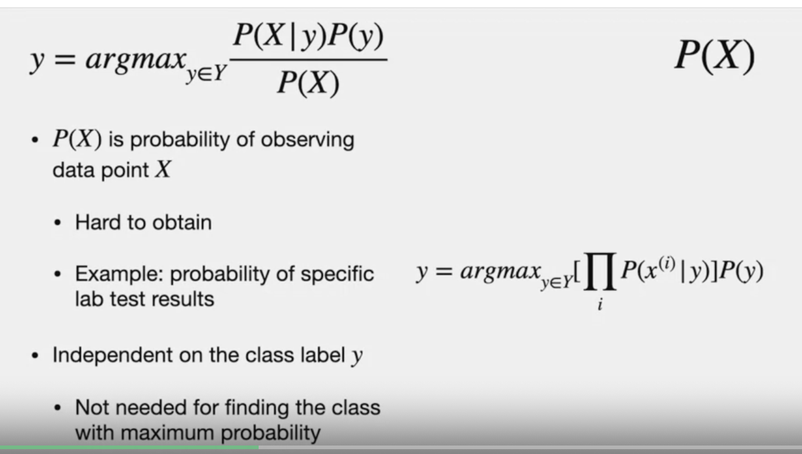
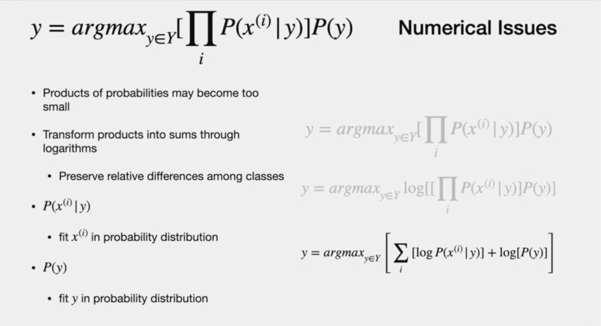
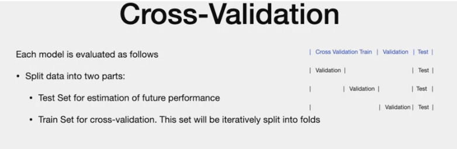

# Naive Bayes

# Agenda

# Intro
- calculating probability of class is pratical
- bayesian does that

# Bayes Classification

- probability of a class given "X" is P(y | X)
- simple report highest probability class

- when calculating probability, make sure the cost is linear 
- We can learn p(y | X) from availoable data 
- also can use distribution..

..more here

# When to use?

# Advantages
- good for high dimensional data
- -competitive to neural network and decision trees

# Math

- learn posterior p( y |X) from Bayes theorem

# Component 1
- P (X | y ) - Given "y", probability the each feature of "x" holds
- i.i.d (features are independant) - Naive assumption
- still good in many places
- product of each feature prob. given "y"

- since "y" has two class , in case of sick/non sick patients , we will get probability of both "y" class (sicka and non sick)

# Component 2
- P(Y)
- This is "PRIOR" of the class 
- independentt of the features

# Component 3
- we call it "Prior" as well
- probability of "x" without any knowledge of "Y"
- probability of many features in lab test is hard to obtain
- it is constant. independenat of "y"
- so "ignore" it.

# Numerical Issues
- product of probabilities is very small (range of 0 and 1) and hard for computers to compute
- use sum of logs
- logs are atomic function and will not change what class produces max probability
- if A is larger than B, log(A) > log(B) as well
- we dont need exact number, we just need numbers for comparison

NOTE:
> - P (X | y) require fitting feature x on a probability distribution that will depend on type of variable

# Fitting P(X|y) in Probability Distribution

- we need to obtain the parameters for the corresponding distribution in order to be able to feed the data.
-  we can use normal/gaussian without overlap..
-  even overlap, we only want to identify what is the class with the highest probability. We're not concerned too much about accurate values for each of the data
  
refence: Picture
-  we have two distribution with good overlap
-  we can obtain the parameters using maximum likelihood estimation
-  example, to feed the lab test measurements for patients that are sick for one distribution and do the same for patients that are not sick. 
-  If there is a significant overlap, we can still use a multinomial model that can be quantized through histograms.
  
  .... so we have options.........

  # Gaussian/Normal distribution
  

  - how to feed  x(i) conditioned on class y on gaussian distribution
  - parameter: mu and std. deviation
  - applying gaussian distribution to p(X | y) will give below
  - 
  
---
..Lets talk different issue
# Incomplete records in record set
-  some features missing
-  patients didnot take particular set
-  missing in "?"
  
  

  - option 1 - reduces data set
  - option 2 - impute
  - option 3 - ignore missing value (it impacts all euqally)
  
  ---
  # Model Selection
  

  - The differences between these options could be based on the data that we have available, 
  - whether we have enough data or not, but we can choose among different distributions to fit a feature
  -  The **histogram** of feature components conditioned under class can help, and **each choice that we consider is a model**
  -  best model - can be choosed by "Cross- validation error"
  
  # Cross validation 
  -  GOAL: compute the cross-validation error and we do this to evaluate each potential model. 

we split our data into two parts: 
> test set for estimation of future performance. 
- Here at the top right, we see the labels on the top in blue and three-folds. 
- We see that the test is the same for all of them. - Cross-validation ignores this test set, and we have a **train set** which is subject of *split during cross-validation.*
- The training set will be split into the **cross-validation training set and a validation set. **
- In the folds in this example, we see how these two sets are different for each fold, so the **cross-validation training set is not shown, we only show here the validation component.**

# Iterative process
- Next, for **each of our candidate models**, we proceed **iteratively to compute their cross-validation error**.
- In this iterations, we generate a new fold from the train set that has the cross-validation training set and the validation set, and we obtained the parameters for the model that we are **testing using the cross-validation train set**, and we **evaluate them through the validation set**
- then we record the error for the current fold,
- then, we average the error over all folds as cross-validation error for the chosen model.

- Now that we have run a cross-validation for all the potential models, we select the one that has the best cross-validation error. 
- The best cross-validation error may mean the one that has the **lowest error**, but we may also want to take into **account the variance on the error**. 
- Now that we have selected what is the model that we are going to use, we need to** re-compute the parameters for that model using the whole training set ** because it was split during cross-validation, and we can estimate the future performance with the original test set. 

---
#### fade out