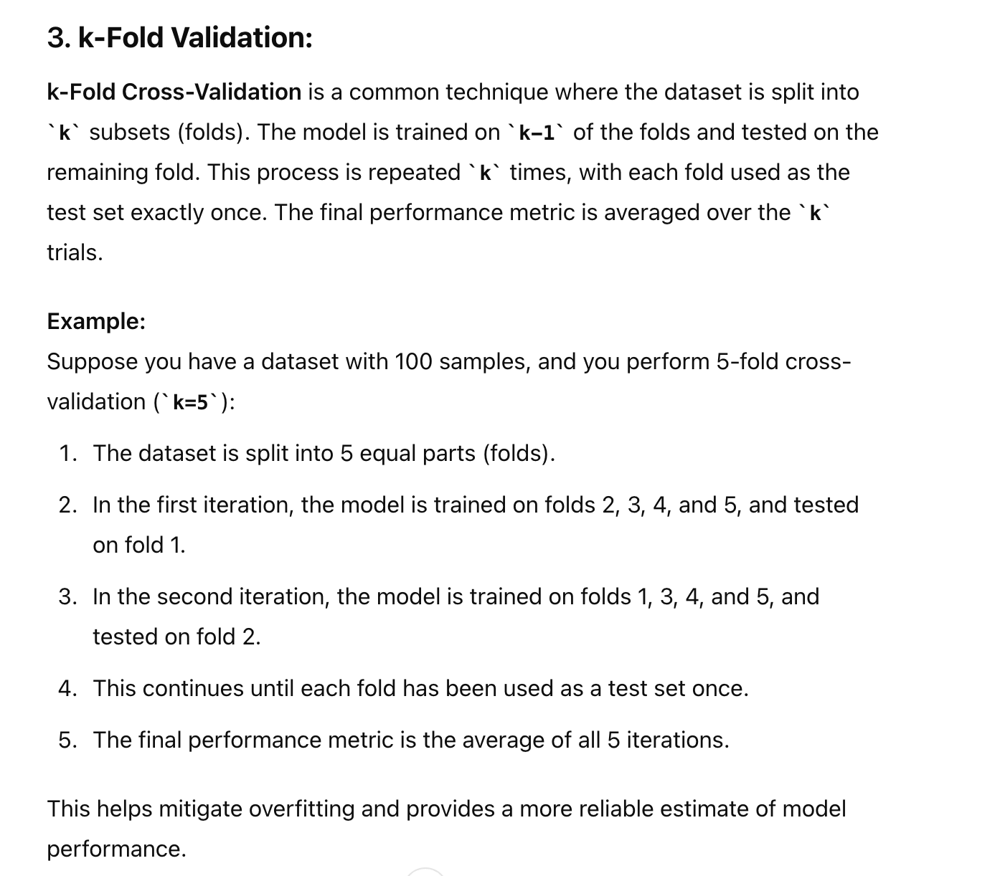
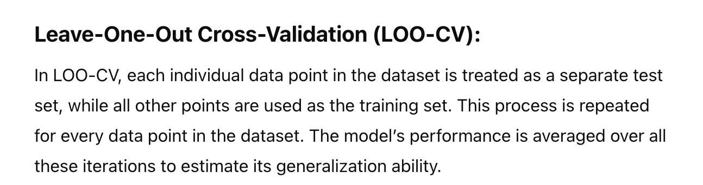

# Folding

## Cross validation

**From Lectures**

## K Folding
n=100
K=5

PARTITION:
n/k = 20 in each fold
TRAINING SET:
- (n-n/k) =100-20 =80 (Training set) which is (k-1) fold.
- Each Iteration has different folds
TEST SET
- (n/k) = 100/5 =20 samples 

#### from lectures

---
# Leave One out Cross validation

*Sample*

**From Lectures**
