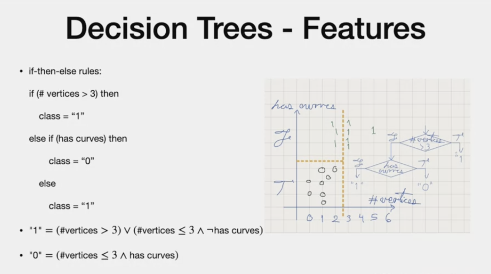
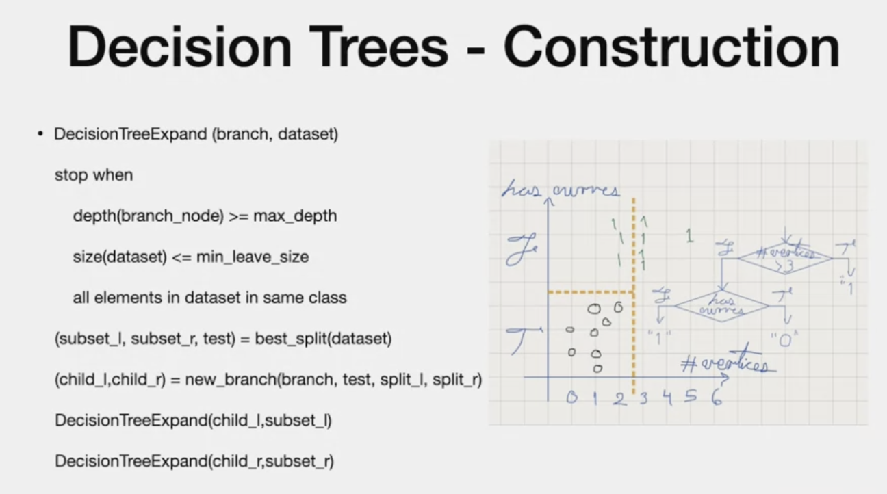
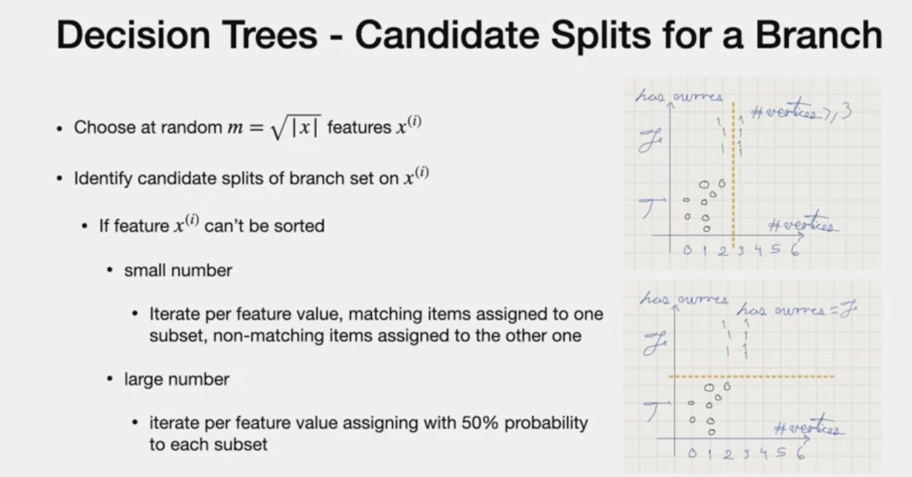
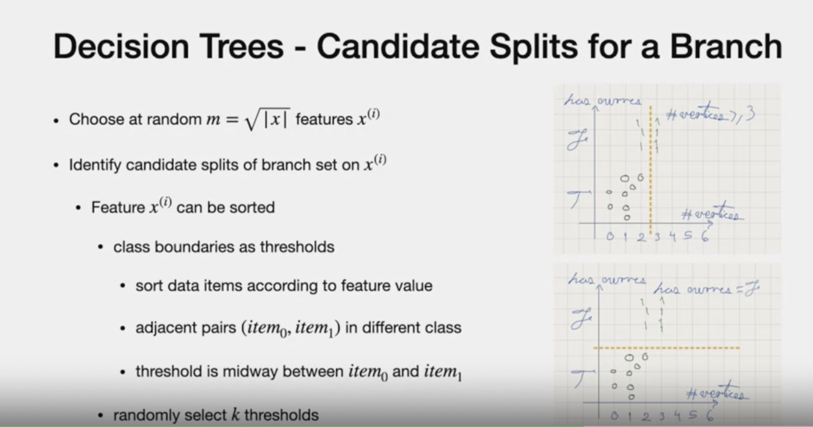
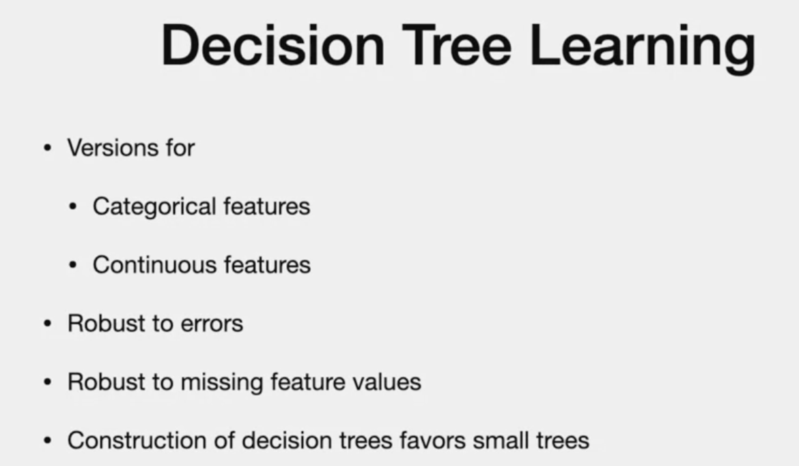
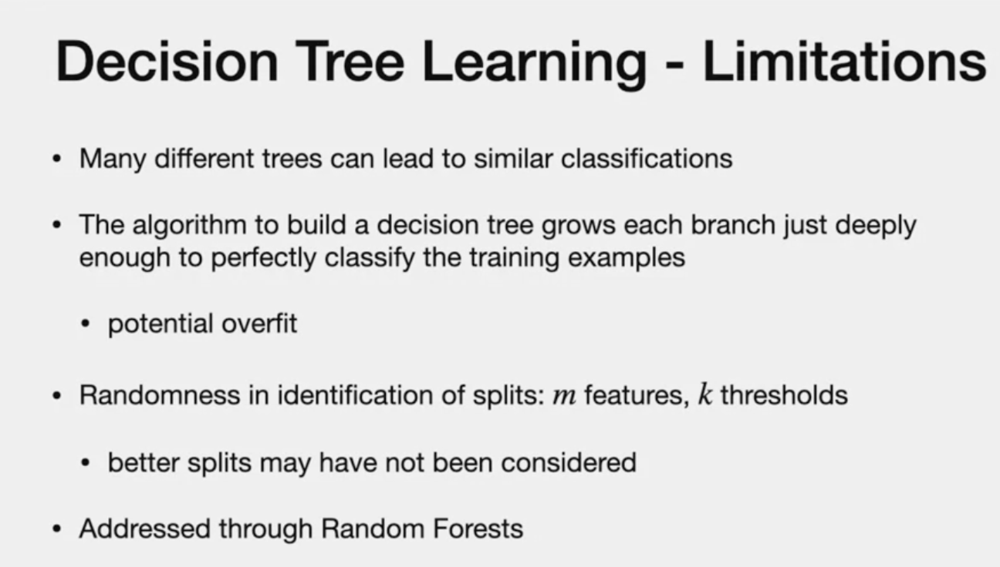
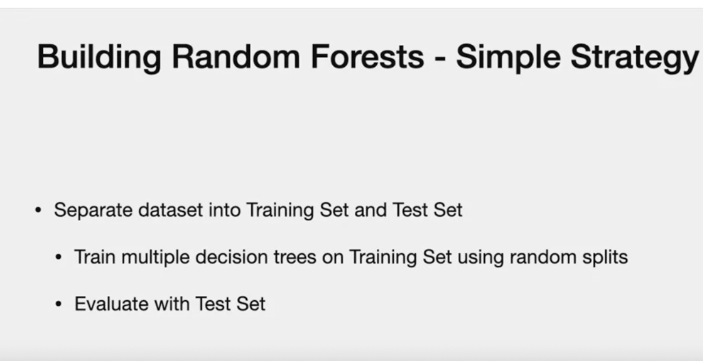
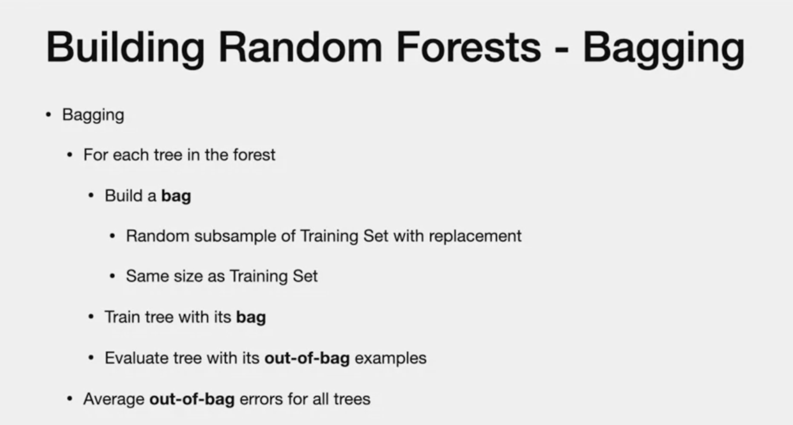

# Random Forest

# Agenda
- Classification with Decision Trees

# Intro

- Two features
- One is a binary feature that tells whether the image has curves or not, 
- the other indicates the number of vertices/corners in the image.
- Figure shows that we are using ONLY "has curves" to decide if image is 0 or 1.
 
 - There may by two trees that includes second feature "# of vertices"
 - This tree is deeper
  
  # Decision Tree
  
  - Label of the leaf node gives the "class" for a given input
  
  # Classification as If then else rules
  

  # Construction
  - It is recursive
  - We stop when
  - 1. depth > max depth (dont want tree to be too deep)
  - 2. size data < min leaf size (we dont want overfitting)
  - 3. All elements are in same class

  
- Subset l and subset r = best split determined by algorithm (statistic test)
- children node is created based on split and each branch will have only subset that passed the test from the parent node.
- Once algorithm moved forward, it doesnt back track to re-consider the earlier choices

# Best Split
dataset = S
feature = Xi

- based on feature. find subset that has more information gain
- Information gain is higher when classes have memebers from one class and less when it is diverse
(concept is Entropy)

- bottom has higher Information gain
- we compute information gain with respect to subsets and comparing it to the original set.

# Which Feature and What is the feature value?
## Cannot be sorted

- choose m = number of featues
- m  < total number of featues
- We select the feature and based on if the members can be sorted or not, we follow two approaches
- If small number of feature, check if it is within the threshold and if value matches the one subset, assign it here..remaining go to the second subset
- If Large, using normal distribution, assign half of the probable values to one subset and remaining goes to the other
- Example: weather, raining, sunny, snow

## Features that can be SORTED

- there may be many thresholds.
- In example above on top, threshold is at 2.5. 
- It can be at 1.5
- boundary is the threshold
- set of "k" examples, there is k-1 splits
- we choose them at random. common choice for random forest.

# Learning
- target is dataset assigned to class

# Limitation

- overfitting is training samples isnt large enough

# Random Foreset

# Building Random Forests- simple strategy

## Bagging

---
# Fade Out