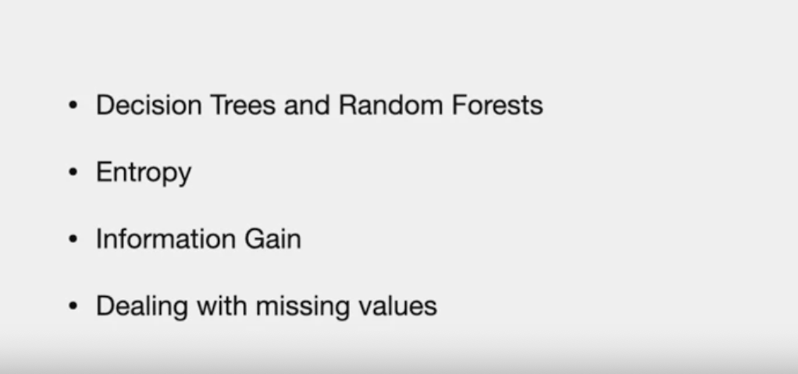
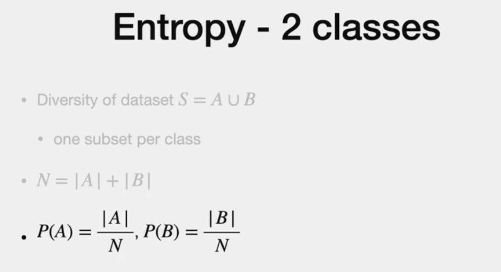
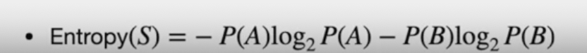
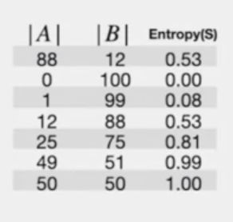

# Agenda:

# Decision tree

# Construction
-recursive alogorithm

# Entropy
- data set S  can be in one of two classes A or B
- A : could be set of 1s
- B: could be st of 0s
- N: sum of elements in A and B
- Proportion of A and B (same of poabblity of A and B)

# Entropy

- when same number of elements in A and B, Entropy is max(1)
- As and when more elements are in one class than other, entropy reduces

**Sample**

- 100 elements
- Even when A switch to B, the entropy remains the same
**MORE..**

- note Proportion of B = 1 - P(A)
- base of log is "2". but, depends on application

# General case with more class
-  "C" different possible Classes
  

> More Entropy, More diverse set
> Goal is to reduce Entropy

  # Information gain
  - we want the Entropy of the split set to be less diverse than Entropy of the original set
  - "Information gain" - Informational Theory

- Note , The proportion for right and left subset provides weightage of that subset which is used to multiple with the Entropy of the respective subset to calcualte the overall Entropy (After split)
..Generalising to "n" subsets

# Comparative study

# Dealing with Missing value

---
### Fade Out..