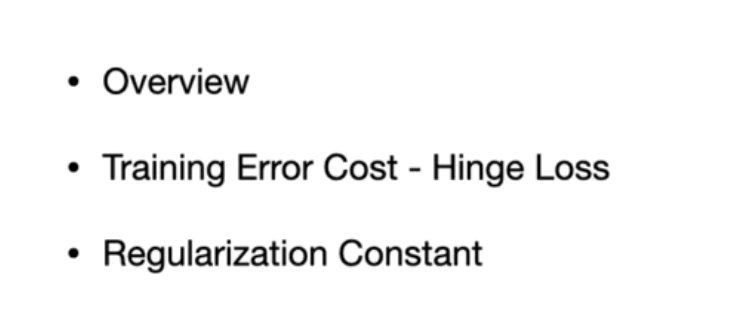
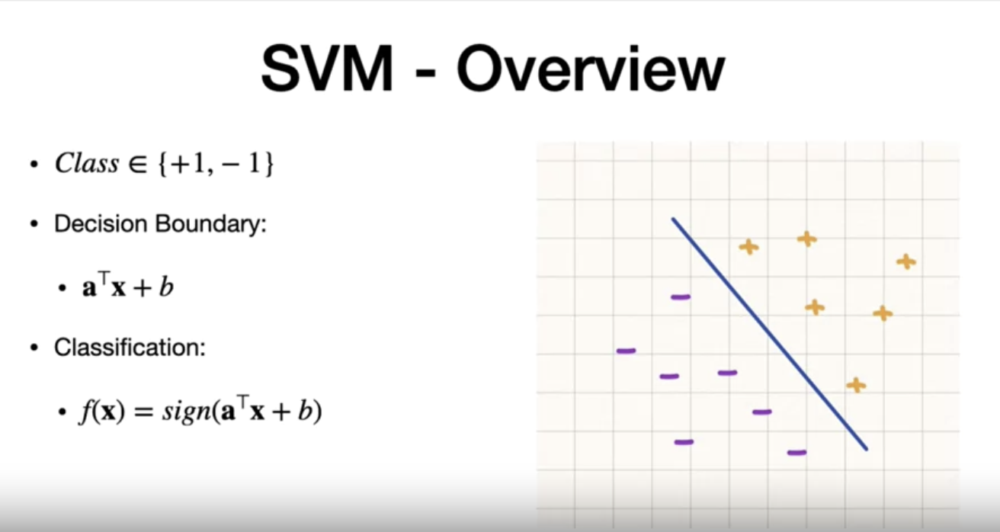
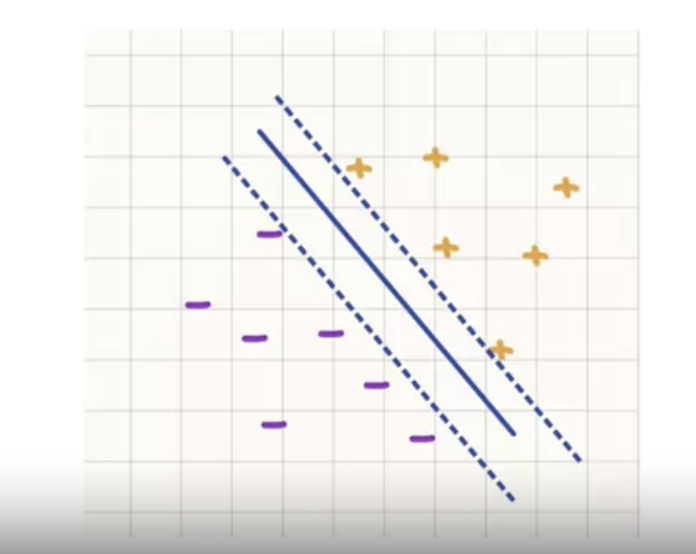
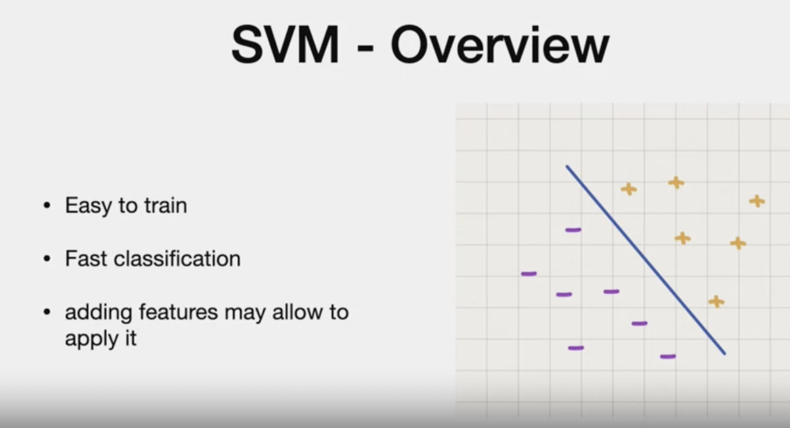
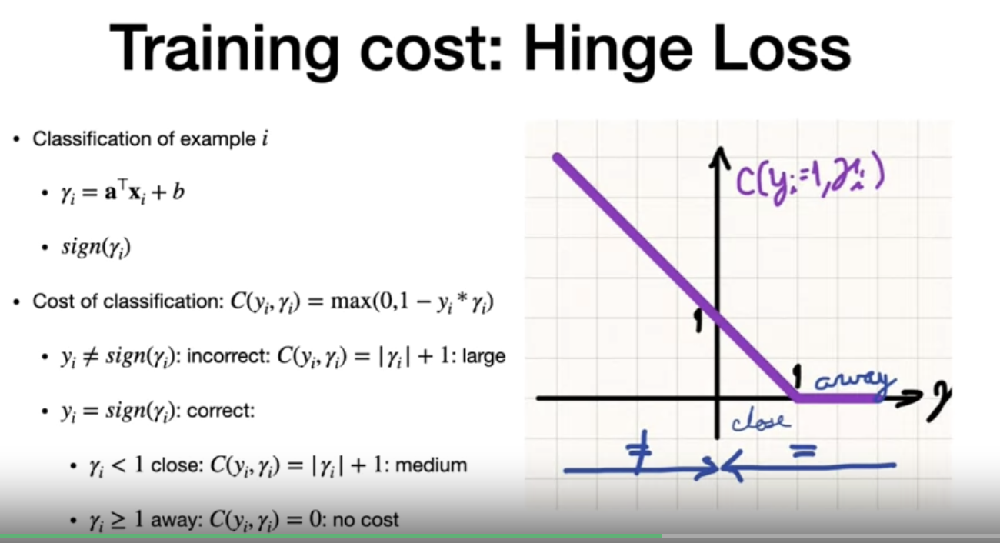

# SVM

# Agenda

- binary classifier

- more when actual and prediction is different
- zero when actual and prediction is same
- less near the boundary

# Limitation

# Overview

- same function positive  right of the boundary
- and left in the left qof the boundary
- Note "a" is vector with same size of "x"
- "b" ; scalar

# margin

- more robust 

When margin is less/narrow margin, its less robust to error

 > Cost
 

 - penalty is regularization to penalize the large error
  
# Goal
- reduce cost function
- minimize the error , so wider margin
  
# One feature
a,b are scalars

- This is straightforward
  
# Two features
- a is vector
- b is scalar

**Note**
- Y-intercept  = -b/a1
- slope(mx+b) = -A0/A1

# Generalization : K features
N - pairs

# Find Training error
Gamma(i) = predicted label
Yi = actual label

> *(gamma i is large, it is away from boundary (when sign of gamma is same as y, then it is a confident predict)*

# Hinge Loss
- if sign of actual and predict is different 
 

*Reference*

# Finding a and b

# Penalty Cost

- bigger the "A", larger the margin around "boundary"
- we need to keep it large "ENOUGH" just to classify the training examples to the correct side of the classification
- penalty - aTranspose * A /2.
- A Transpose X A = A squared

# Full Cost function

- we need to minimise it.
- We will use stochastic gradient to minimise it
  

# SVM Overview
  

Note:
- If digits curve feature is not sufficient for MNIST dataset, we can use pixel of image as a new feature
- We will see this in homework
- add feature to add is distance from origin to each of the features
- this allows features not separable to be separate
---
# Campuswire

When actual sign and predicted value sign is different, shouldnt this be actual X precit +1. Shouldnt it include output "y" as it is in the product?
why is it magnitude of gamma+1?

---