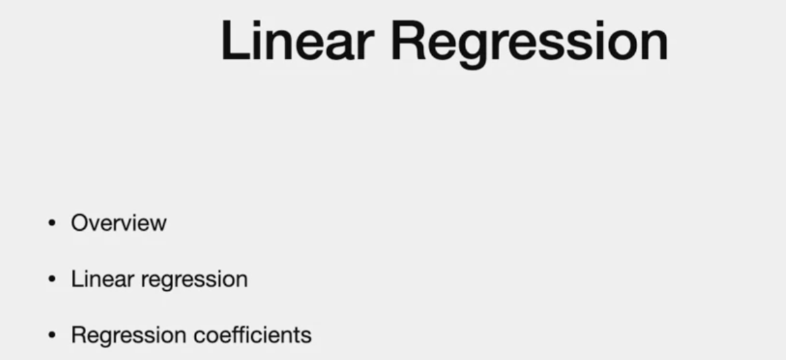
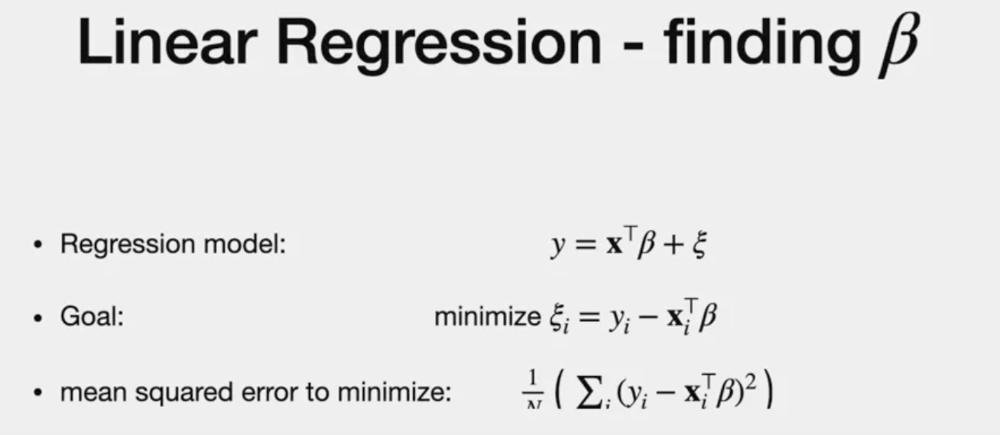
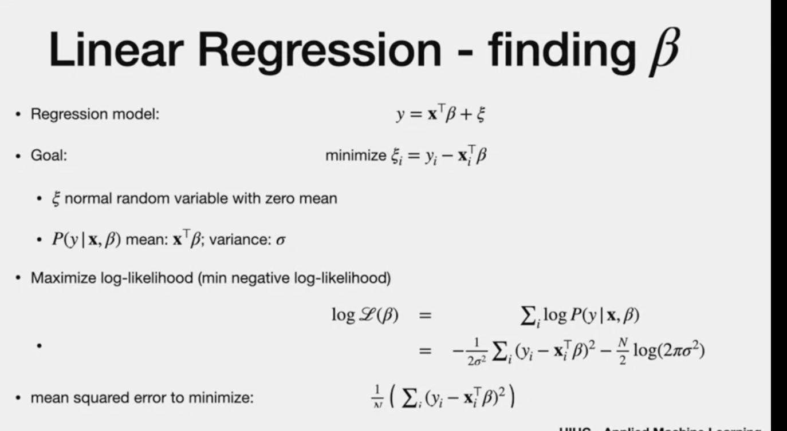
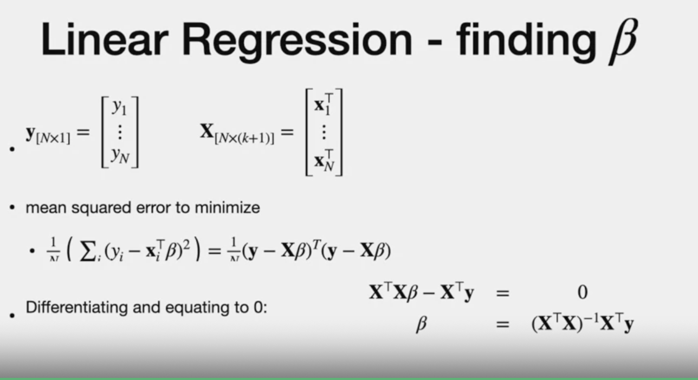

# Linear Regression

# Overview
Feature vector : many features
"y" => **Numeric value**

- Feature => Explanatory variable
- Regressing dependant variable (y) on explanatory variable.

**vs. classification**
- classification is small set and output os categorical
- regressio  predicts "numeric value"
- "Classification" can be seen as subset of "Regression" where each class is +1 or -1.

### Assumption
- We are using probabilistic regression and test and training have the same probability distribution
- They are i.i.d

# Applications
- In addition to predicting data, it can be used to get "TRENDS" in data
- using info in one process, we can predict trends in other process
- if the two process are not related, there could be issues due to unexpected bias

# Example 
- data set in dots in blue
- resulting regression line in dotted line 
- "Residual = actual - pred"

- above example have all dots closer to line. So small residuals
  
  # Note
  - value of y can be different for the same feature value
  - Due to
  - 1. randomness /Noise
  - 2. Y is not function of x(y is subjective values)
  (same item, different store, different prices)

  # What we are doing
  - Instead of finding True value of "y" given "x", we find expected value of "y" **conditioned** on x
  - we consider randomness as a joint distribution  wih x.
  

  Yi  is a sample from p(Y | X for Xi)

  # Simple Model
  > - the sign is "he"
  > - beta = co-eff /weight of each feature
  > - he = random error/noise (Normal distribution with zero mean)

  * to avoid y=0 when x=o, we add Y-intercept "1" in x feature set.
  - posiiton doesnt matter as long as they are same for training and test
  
  

  - we know noise "he" has mean of zero. so we wont consider that in the prediction.
  
  # LR - 1 variable
  - Note - since we have x* as two features x and 1, we have two co-efficients beta 1 and beta2
  - we ignore "he"
  

  > beta 1 = slope
  > beta 2 = y-interept

  # Finding Beta co-efficients
  
  
  - both share the same resuts
  # 1.Direct Approach
  - minimise mean square error to minimise "he"
  - N - number of items
  - i - "each item"
   

 # 1.Probabilistic  Approach
 - Note the mean below
 - maximising log likelihood is equiavalent to minimising negative log log likelihood

- one over sigma squared is independant of beta . so can be ignored.

- we reach back to MSE and minimise it to get a good beta co-efficient

# Solve for MSE
> y- vector 
> x - matrix with each row is a vector of feature set
> x This includes "1" feature vector so there is y-intercept
> k - number of feature

**Dimensionality**
- y =(N by 1)
- x = (N by K+1)

**Note**
- generallt xTx = sum of the square of each items
- same logic is applies here
  
  - diferentiating by beta and then equating to zero (why zero, because they are orthonormal vectors, Details - refer book notes)
- solve for Beta

*Solving xTX needs to be inversed. which means it needs **Full Rank.**(Meaning columns of X are independant and they donot have any redudant features)

- There are other methods if xTx is NOT full rank

---
#The end